# Closing Balance & Close Period

**Closing Balance** คือ การตรวจนับสินค้าคงเหลือเพื่อปิดระบบสินค้าคงคลัง (ใช้กับ Location ประเภท Enter Count Stock) โดยมีขั้นตอนในการทำงานดังต่อไปนี้
1.	เอา cursor ไปวางที่ “Material” และเลือก Procedure จากนั้น Click เมนู “Closing Balance”
2.	Click ปุ่ม Create เพื่อสร้างเอกสารตรวจนับ (Physical count)
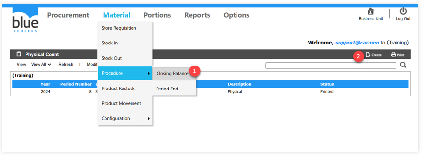 

3.	“Store” ระบุ Location สำหรับตรวจนับ
4.	“Date” ระบุวันที่สำหรับการตรวจนับ
5.	“Description” ระบุสาระสำคัญหรือรายละเอียดในการตรวจนับ 
6.	“Print” Click เมนู Print เพื่อพิมพ์เอกสารตรวจนับ
7.	“Back” Click คำสั่ง Back เพื่อยกเลิก
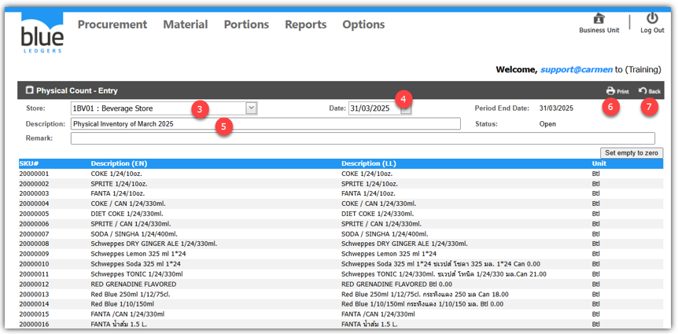

**การบันทึกข้อมูลการนับสินค้าคงคลังเข้าสู่ระบบสามารถทำได้ 2 วิธี คือ**

•	Manual เป็นการบันทึกข้อมูลการตรวจนับผ่านหน้าจอระบบ

•	Export and Import เป็นการบันทึกข้อมูลการตรวจนับผ่าน Excel และนำ file เข้าระบบ

8.	การบันทึกข้อมูลแบบ Manual

Click “Edit” เพื่อเริ่มกรอกข้อมูลการตรวจนับ

กรอกจำนวนสินค้าคงเหลือลงในช่อง “Balance Qty”

ในกรณีที่สินค้าดังกล่าวไม่มีการนับ หรือ มีคงเหลือเท่ากับ 0 สามารถปล่อยเป็นค่าว่างเอาไว้ได้
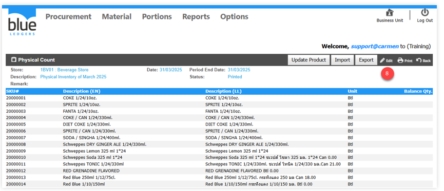

8.1	Click เมนู “Set empty to zero” เพื่อกำหนดให้ทุกรายการสินค้าที่ Quantity เป็นค่าว่าง ให้มี “Quantity” 
เท่ากับ 0 เพื่อช่วยลดเวลาและข้อผิดพลาดจากการระบุจำนวนสินค้าที่ตรวจนับ (ในกรณีไม่มีสินค้าคงเหลือให้ระบุในช่องว่าเป็น 0 เสมอ) 

8.2	เมื่อระบุยอดตรวจนับเสร็จสิ้นแล้วให้ Click ปุ่ม “Save”
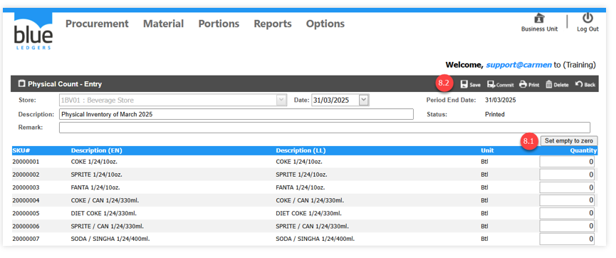 

8.3	Click ปุ่ม OK เพื่อยืนยันการบันทึกข้อมูล
 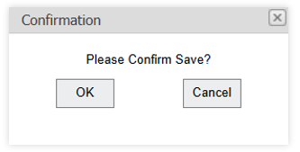

8.4	เมื่อตรวจสอบเอกสารครบถ้วนแล้วให้ Click คำสั่ง ”Commit” เพื่ออนุมัติเอกสาร
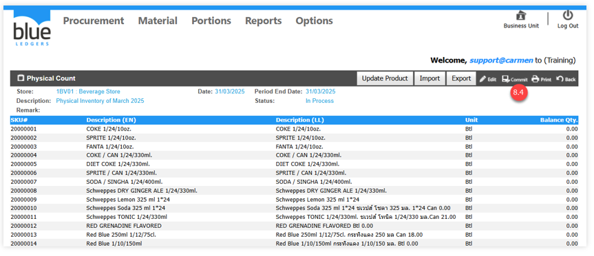

9.	การบันทึกข้อมูลการตรวจนับผ่าน Excel และนำ file เข้าระบบ
Click “Export” เพื่อ export รายการสินค้าของ location นี้ เพื่อไปกรอกใน Excel
โดยจะได้ file เป็นนามสกุล .csv
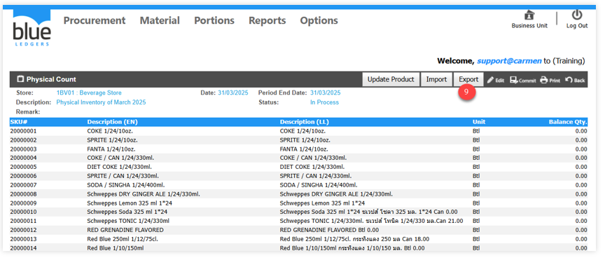

10.	บันทึกข้อมูลตรวจนับใน Excel file ใน Column F เสร็จสิ้นแล้วให้ทำการ Save ข้อมูล โดยนามสกุลของ file จะต้องเป็น .csv
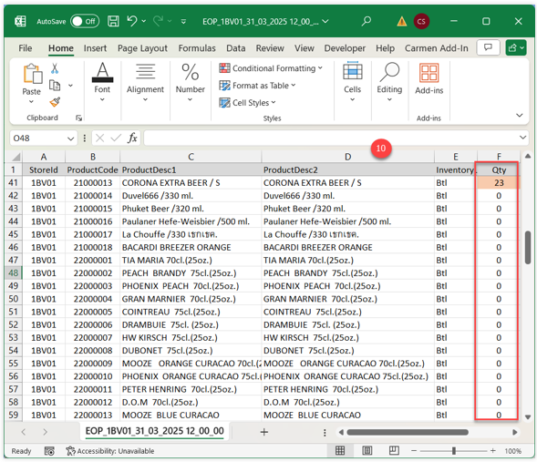
11.	Click ปุ่ม ”Import” เพื่อนำเข้าข้อมูลตรวจนับจาก Excel โดย file จะต้องมีนามสกุล .csv เท่านั้น
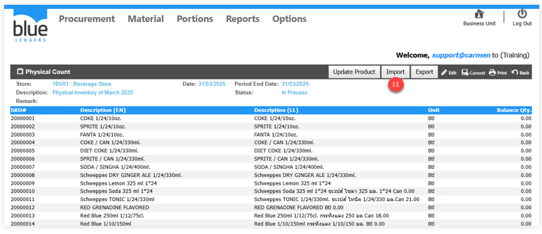
12.	Click ปุ่ม ”Choose File” และเลือก Excel file นำเข้าข้อมูล
13.	เลือกไฟล์แล้ว Click ปุ่ม ”Open”
14.	Click ปุ่ม ”Import” เพื่อนำเข้าข้อมูล
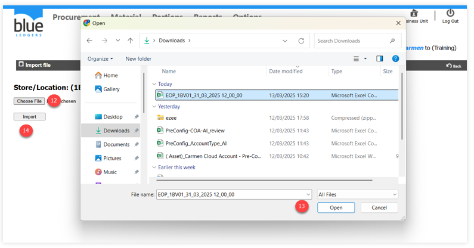
15.	ระบบจะแจ้งผลการนำเข้าข้อมูล ให้ Click ปุ่ม “OK”
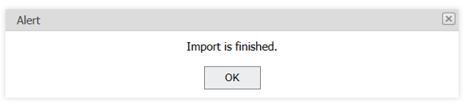
16.	เมื่อตรวจสอบเอกสารครบถ้วนแล้วให้ Click คำสั่ง “Commit” เพื่ออนุมัติเอกสาร

**Close Period** คือการปิดรอบบัญชีในระบบสินค้าคงคลัง 
ขั้นตอนการ Close Period มีส่วนประกอบอยู่ 2 ส่วน คือ
1.	Pending Receiving จะต้องไม่มีรายการรับสินค้าที่อยู่ในสถานะ Pending หรือสถานะ Saved ในระบบ Receiving หากมีรายการ Receiving ค้างอยู่ ระบบจะแสดงเลขที่เอกสารให้ทราบ และจะต้องทำการ Commit เอกสารดังกล่าวให้เรียบร้อยก่อน close period
2.	Pending Closing Balance (EOP) การตรวจนับของ Location ประเภท Enter counted Stock จะต้องทำการ commit ให้เสร็จสิ้นก่อนจึงจะสามารถ Close Period ได้
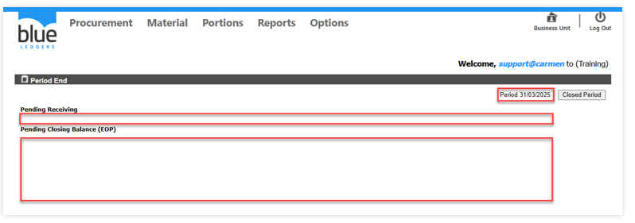
 
3.	เมื่อไม่มีข้อมูล Pending ค้างทั้งใน Receiving และ Closing Balance (EOP) ให้ Click ปุ่ม Close Period และให้สังเกต รอบบัญชี (Period) ในกรอบสีแดงว่ารอบบัญชีที่ถูกต้องหรือไม่

