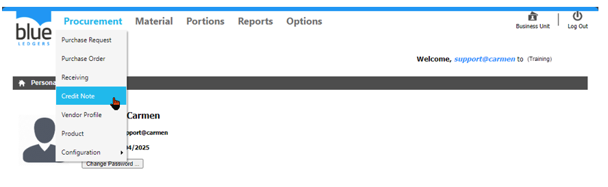
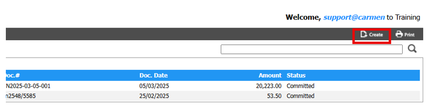
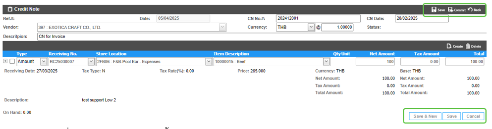
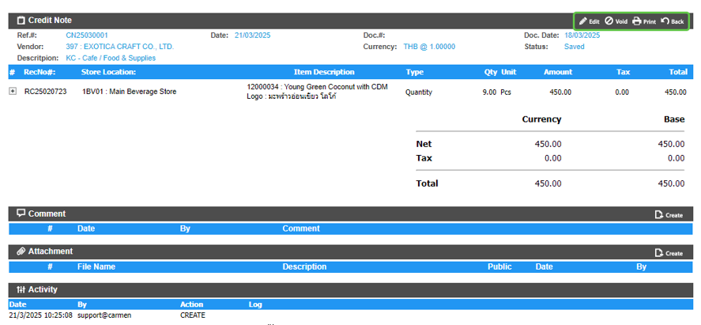
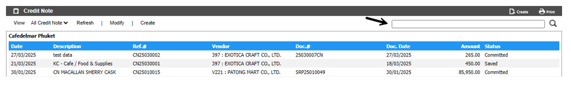
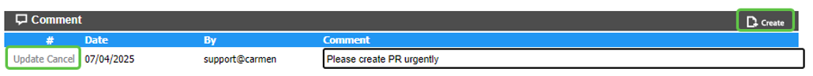
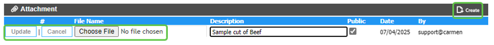

# Credit Note (ใบลดหนี้)
Credit Note (ใบลดหนี้) คือ Function ในการสร้าง ใบลดหนี้ ในระบบ โดยเอกสารใบลดหนี้จะต้องมีเอกสาร receiving ที่สามารถอ้างอิงได้เท่านั้น

สามารถเข้าถึง function นี้โดยไปที่ “Procurement” จากนั้น click “Credit Note”

1.	ขั้นตอนการสร้าง Credit Note

Click “Create” เพื่อ สร้าง ใบลดหนี้

กรอกข้อมูลในส่วนของ header ดังนี้

หมายเหตุ เครื่องหมาย * คือช่องที่จำเป็นต้องระบุ
-	“Ref.#” คือเลข running number ของเอกสาร CN ที่ระบบจะสร้างขึ้นเมื่อ Save
-	*“Date” วันที่ สร้างใบลดหนี้   
-	*“CN No.#” เลขที่ ของ ใบลดหนี้ ตามเอกสารที่ได้รับมาจาก Vendor หลีกเลี่ยงการบันทึกเลขที่ซ้ำกับเอกสาร Receiving เนื่องจากระบบไม่อนุญาตให้ Post เข้าระบบ AP Invoice เนื่องจากเลขที่เอกสารซ้ำกัน
-	*“CN Date” วันที่ ของ ใบลดหนี้ ตามเอกสารที่ได้รับมาจาก Vendor
-	*“Vendor” เลือก Vendor ที่ต้องการทำใบลดหนี้
-	*“Currency” เลือกสกุลเงินของใบลดหนี้ และกำหนด Currency Rate
-	“Status” สถานะของเอกสาร (Save หรือ Committed)
-	“Description” ใส่คำอธิบายให้กับเอกสาร CN
กรอกข้อมูลในส่วนของ detail ดังนี้
-	Click “Create” เพื่อ สร้างสินค้าที่ต้องการ ลดหนี้
-	*“Type” ใช้กำหนดรูปแบบของการลดหนี้ (Quantity หรือ Amount)
-	*“Receiving No.” เลือกเอกสาร Receiving ที่จะทำการลดหนี้ หากไม่มีจะไม่สามารถทำ CN ได้
-	*“Store Location” เลือก Location ที่จะทำการลดหนี้
-	*“Item Description” เลือกสินค้าที่จะทำการลดหนี้
-	*ขึ้นอยู่กับ “Type” ของการลดหนี้
- “Qty” กำหนดจำนวน ตาม Inventory unit ที่ต้องการลดหนี้ (สามารถกรอกได้เมื่อกำหนด Type แบบ “Quantity”)
- “Net Amount” กำหนดมูลค่ารวมก่อน Vat ที่ต้องการลดหนี้ สามารถกรอกได้เมื่อกำหนด Type แบบ “Amount”)
-	“Tax Amount” ระบบจะคำนวณให้ตามการตั้งค่าใน Receiving
-	“Total” จำนวนเงินรวมทั้งหมดของสินค้านี้

-	การบันทึกสินค้า

o	Click “Save & New” เพื่อ บันทึก และ เพิ่ม รายการลดหนี้ รายการถัดไป

o	 Click “Save” เพื่อ บันทึก และ สิ้นสุดการเพิ่ม รายการลดหนี้

o	Click “Cancel” เพื่อ ยกเลิก

-	การบันทึกเอกสาร CN

o	Click “Save” เพื่อ บันทึก ใบลดหนี้ (ยังไม่มีผลในระบบ สามารถกลับมา Edit หรือ Void ได้)

o	Click “Back” เพื่อยกเลิกการบันทึก CN
-	การ Commit เอกสาร CN
o	Click “Commit” เพื่อ เปลี่ยน สถานะ ใบลดหนี้ เป็น “Committed” (เพื่อให้มีผลในระบบ)

2.	  Function อื่น ๆ ของเอกสารใบลดหนี้

2.1.	“Edit” ใช้สำหรับแก้ไขเอกสาร CN ที่มี Status = Save

2.2.	“Void” ใช้สำหรับ Void เอกสาร CN ที่มี Status = Save

2.3.	“Print” ใช้สำหรับ print แบบฟอร์ม CN.ในระบบ

3.	การค้นหา และ View เอกสารใบลดหนี้

3.1.	หลังจากที่เข้ามาในหน้า CN แล้วสามารถค้นหา ใบลดหนี้ ที่ต้องการ โดย พิมพ์ค้นหา ในช่อง Search

3.2.	การ View เอกสาร CN ทำได้โดยการเลือกเอกสารใบลดหนี้ ที่ต้องการ เพื่อ แสดงรายละเอียดของ ใบลดหนี้ นั้นๆ
         

4.	การ Comment หรือ แนบไฟล์ Attachment ในเอกสาร Receiving

4.1.	การเพิ่ม Comment ในเอกสาร ใบขอซื้อเพื่อเป็นการสื่อสารภายใน
-	Click “Create” ที่หัวข้อ “Comment”
-	ใส่ “Comment” ที่ต้องการ
-	Click “Update” เพื่อ บันทึก หรือ “Cancel” เพื่อ ยกเลิก

4.2.	การแนบไฟล์ Attachment ในเอกสาร ใบขอซื้อ เพื่อแนบเอกสารประกอบการขอซื้อ
-	“Create” ที่หัวข้อ “Attachment”
-	ใส่ “Description” ที่ต้องการ
-	เลือก “Choose File” เพื่อเลือก File ที่ต้องการแนบ
-	Click “Update” เพื่อ บันทึก หรือ “Cancel” เพื่อ ยกเลิก

