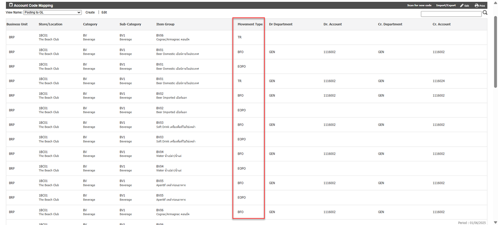

# Movement Type
ความหมายของ Movement Type ในหน้า Account Code Mapping 

<table style="width: 100%; border-collapse: collapse; font-family: 'Segoe UI', Tahoma, Geneva, Verdana, sans-serif;">
  <thead>
    <tr style="background-color: #f2f2f2;">
      <th style="border: 1px solid #ccc; padding: 10px; text-align: center;">ตัวย่อ (Code)</th>
      <th style="border: 1px solid #ccc; padding: 10px; text-align: center;">ชื่อเต็ม (Movement Type)</th>
      <th style="border: 1px solid #ccc; padding: 10px; text-align: center;">คำอธิบาย</th>
      <th style="border: 1px solid #ccc; padding: 10px; text-align: center;">ตัวอย่าง</th>
    </tr>
  </thead>
  <tbody>
    <tr>
      <td style="border: 1px solid #ccc; padding: 10px; text-align: center;"><strong>TR</strong></td>
      <td style="border: 1px solid #ccc; padding: 10px;">Transfer</td>
      <td style="border: 1px solid #ccc; padding: 10px;">การโอนย้ายสินค้าจากสถานที่หนึ่งไปยังอีกสถานที่หนึ่ง โดยยังคงสถานะเป็นสินค้าคงคลัง (Inventory)</td>
      <td style="border: 1px solid #ccc; padding: 10px;">ย้ายสินค้าจาก Store A ไป Store B</td>
    </tr>
    <tr style="background-color: #fafafa;">
      <td style="border: 1px solid #ccc; padding: 10px; text-align: center;"><strong>SI</strong></td>
      <td style="border: 1px solid #ccc; padding: 10px;">Stock In</td>
      <td style="border: 1px solid #ccc; padding: 10px;">การปรับปรุงยอดเพิ่มของจำนวนสินค้าและราคาในคลังสินค้า</td>
      <td style="border: 1px solid #ccc; padding: 10px;">Inventory มีของไม่ครบ ต้องปรับเพิ่มให้ตรงกับของจริง</td>
    </tr>
    <tr>
      <td style="border: 1px solid #ccc; padding: 10px; text-align: center;"><strong>SO</strong></td>
      <td style="border: 1px solid #ccc; padding: 10px;">Stock Out</td>
      <td style="border: 1px solid #ccc; padding: 10px;">การปรับปรุงเพื่อลดยอดจำนวนสินค้าในคลังสินค้า</td>
      <td style="border: 1px solid #ccc; padding: 10px;">Inventory มีของเกิน ต้องปรับลดให้ตรงกับของจริง</td>
    </tr>
    <tr style="background-color: #fafafa;">
      <td style="border: 1px solid #ccc; padding: 10px; text-align: center;"><strong>SR</strong></td>
      <td style="border: 1px solid #ccc; padding: 10px;">Issues</td>
      <td style="border: 1px solid #ccc; padding: 10px;">เบิกสินค้าและตัดเป็นค่าใช้จ่าย</td>
      <td style="border: 1px solid #ccc; padding: 10px;">เบิกของจาก Store Inventory ไปยัง Store Expenses</td>
    </tr>
    <tr>
      <td style="border: 1px solid #ccc; padding: 10px; text-align: center;"><strong>EOPI</strong></td>
      <td style="border: 1px solid #ccc; padding: 10px;">End of Period In</td>
      <td style="border: 1px solid #ccc; padding: 10px;">ปรับยอดเพิ่มเมื่อจำนวนสินค้าจริงมากกว่าที่ระบบแสดง</td>
      <td style="border: 1px solid #ccc; padding: 10px;">ตอนทำ Physical Count Inventory ในระบบมี 10 หยอดของที่นับจริงได้ 15 จะมีรายการ EOPI = 5 </td>
    </tr>
    <tr style="background-color: #fafafa;">
      <td style="border: 1px solid #ccc; padding: 10px; text-align: center;"><strong>EOPO</strong></td>
      <td style="border: 1px solid #ccc; padding: 10px;">End of Period Out</td>
      <td style="border: 1px solid #ccc; padding: 10px;">ปรับยอดลดเมื่อจำนวนสินค้าจริงน้อยกว่าที่ระบบแสดง</td>
      <td style="border: 1px solid #ccc; padding: 10px;">ตอนทำ Physical Count Inventory ในระบบมี 20 หยอดของที่นับจริงได้ 15 จะมีรายการ EOPO = 5</td>
    </tr>
  </tbody>
</table>
