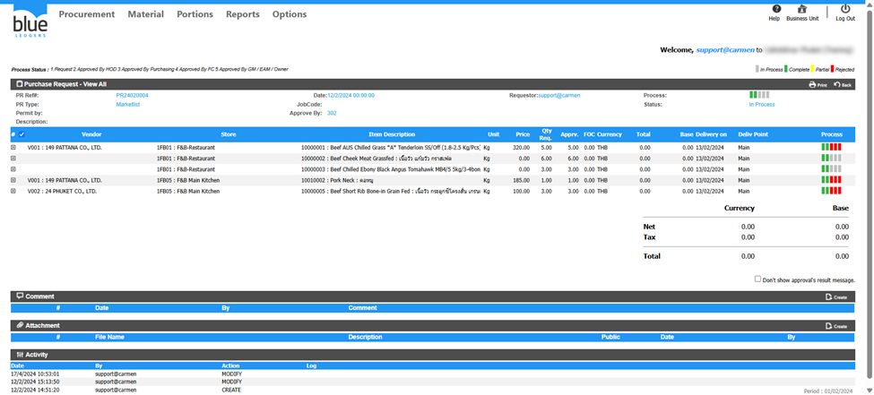
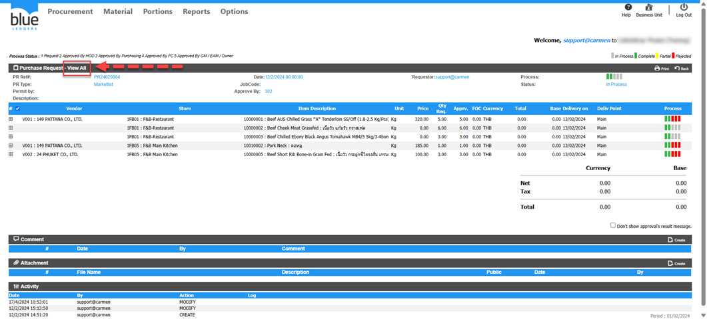
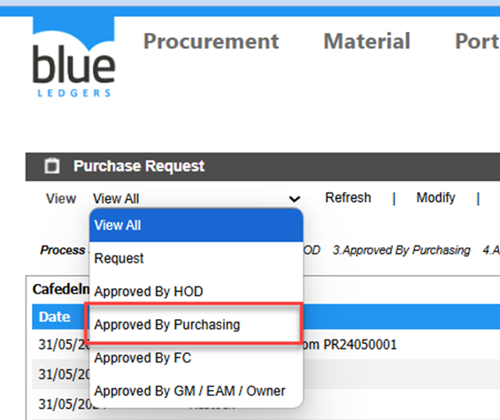
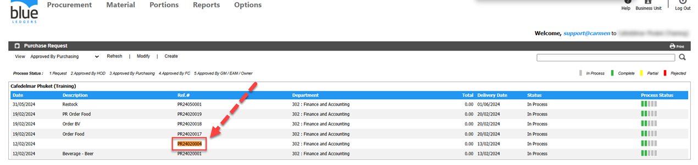
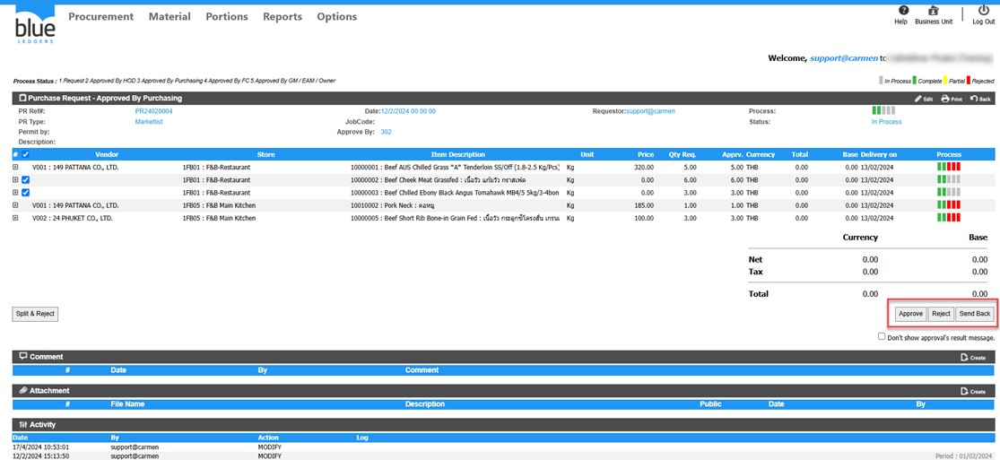
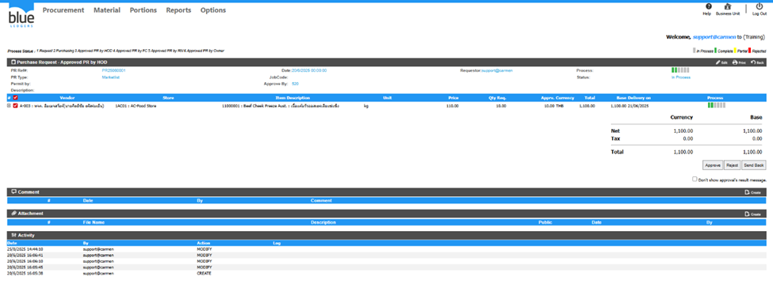
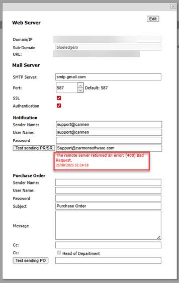
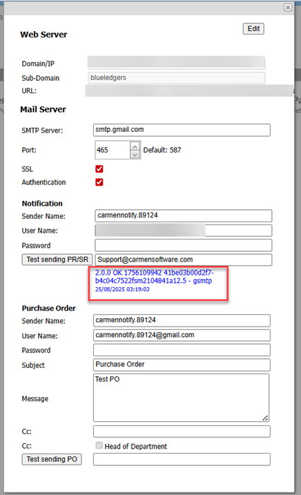
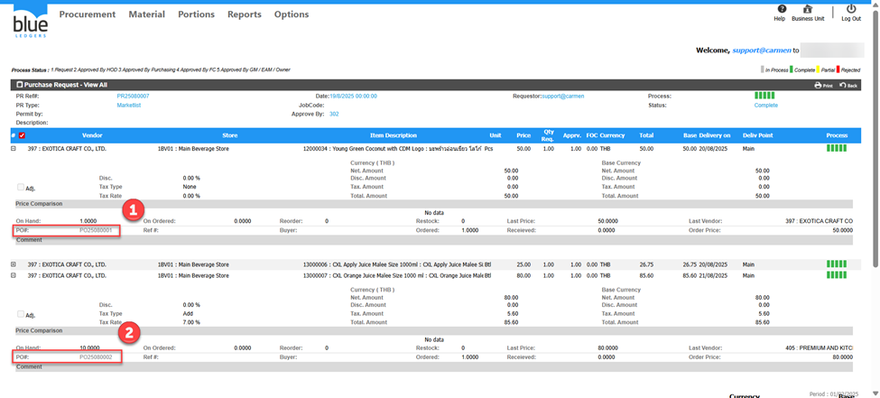
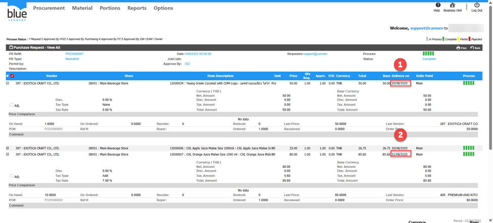

# Troubleshoot Guide PR
## กดApproved PR ไม่ได้ แก้ไขอย่างไร
ตัวอย่าง PR24020004 กดเข้ามาแล้วไม่พบปุ่มปุ่ม Approved/Reject/Send Back ให้กด

สาเหตุเกิดจากอยู่ในหัวข้อ View All ทำให้ไม่สามารถแก้ไขได้

ไปที่หัวข้อ View  หรือตามView Step เอกสารPR ของลูกค้า

ทำการคลิกที่PR24020004หรือหมายเลขPR ของลูกค้า

จะพบว่าปุ่ม Approved/Reject/Send Back ปรากฏขึ้นมาแล้วตามรูปภาพ

## Approve PR ช้า

ตัวอย่าง กด Approve PR25060001 ช้าผิดปกติ

สาเหตุ มีการตั่งค่า Web & Mail Server แต่ Mail Server ไม่สามารถส่งEmail ได้และมีการเลือก Receive Notification Via Email ในหัวข้อการ Approved ใน Workflow Configuration 

Solution:

1.ไปที่ Options> System Setting>Web & Mail Server 

2.ทดสอบ กดปุ่มTest sending PR/SR หรือ PO เพื่อดูว่าระบบสามารถส่งEmail ได้หรือไม่

จากตัวอย่าง พบError : (400) Bad Request.

3.ให้ทำการแก้ไข Setting Mail Server ให้ถูกต้อง ก็จะสามารถแก้ไขการ Approve ช้า ได้ครับซึ่งสามารถดูได้ที่
คู่มือการตั่งค่าMail Setting

 

## PR 1ใบ Gen PO ได้ 2 PO

ตัวอย่าง PR25080007 Gen แล้วได้ PO 2 ใบ คือ PO25080001 และ PO25080002

สาเหตุเกิดจาก มี Delivery on 2 วัน คือ 20/08/2025 และ 21/08/2025 ทำให้ระบบแยกเป็น2 PO
ระบบจับจาก Vendor และ Delivery on 

Solution: ไม่สามารถรวมเป็น 1 PO ได้เนื่องจากระบบจับจาก Vendor และ Delivery on หากต้องการรวมต้องแก้ไข Delivery on และ Close PO และทำ PR ใบใหม่ครับ

