## การโอนย้ายข้อมูลใบแนบ ภ.ง.ด.53 ผ่านโปรแกรม RDPrep

การโอนย้ายข้อมูลใบแนบ ภ.ง.ด.53 ผ่านโปรแกรม RDPrep 

1. เปิดโปรแกรมโอนย้ายข้อมูล RDPrep

2. กด โอนย้ายข้อมูล

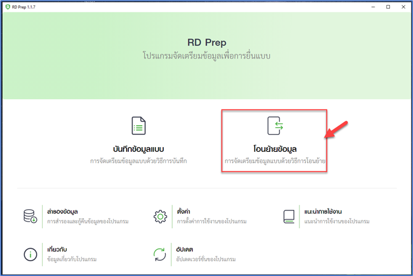

3. เลือกประเภท โอนย้ายข้อมูล ภ.ง.ด. 53 กด 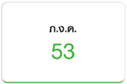

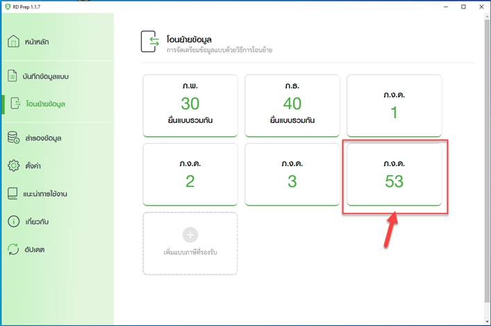

โปรแกรมแสดงหน้าจอ “โอนย้ายข้อมูลแบบยื่นรายการภาษีเงินได้หัก ณ ที่จ่าย ภ.ง.ด.53”

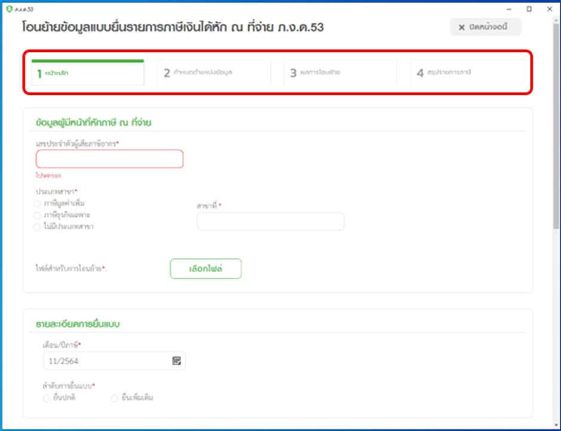

จากหน้าจอ “โอนย้ายข้อมูลแบบยื่นรายการภาษีเงินได้หัก ณ ที่จ่าย ภ.ง.ด.53” แบ่งขั้นตอน

การทำงานออกเป็น 4 ขั้นตอน ดังนี้

ขั้นตอนที่ 1 หน้าหลัก

ขั้นตอนที่ 2 กำหนดตำแหน่งข้อมูล

ขั้นตอนที่ 3 ผลการโอนย้าย

ขั้นตอนที่ 4 สรุปรายการภาษี

## ขั้นตอนที่ 1 หน้าหลัก

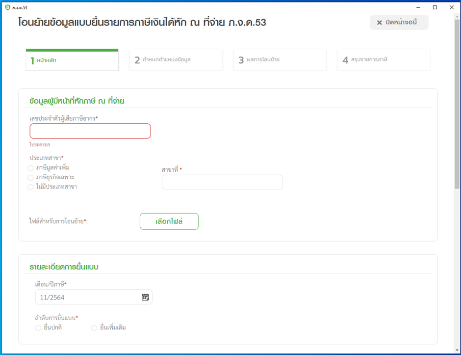

ข้อมูลผู้มีหน้าที่หักภาษี ณ ที่จ่าย

1. ระบุ เลขประจำตัวผู้เสียภาษีอากร

2. กดเลือก ประเภทสาขา อย่างใดอย่างหนึ่ง จากรายการโปรแกรมดังนี้

   2.1) ภาษีมูลค่าเพิ่ม

   2.2) ภาษีธุรกิจเฉพาะ

   2.3) ไม่มีประเภทสาขา

   ให้ผู้ใช้งานทำเครื่องหมาย  ลงหน้ารายการที่ต้องการเลือก

3. ระบุ สาขาที่
4. ไฟล์สำหรับการโอนย้าย กด 

   \*\*\*ไฟล์นี้สามารถ export ได้จากระบบ Carmen ด้วย function Withholding Tax Reconciliation ใน Account Payable Module

**รายละเอียดการยื่นแบบ**

5. กดเลือก “เดือน/ปี ภาษี”

6. กดเลือก “ยื่นปกติ” หรือ “ยื่นเพิ่มเติม” กรณียื่นเพิ่มเติมระบุครั้งที่ยื่น

**นำส่งภาษีตาม**

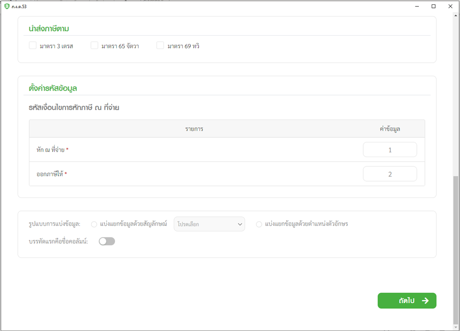

7. กดเลือก “นำส่งภาษีตาม” อย่างใดอย่างหนึ่งจากรายการระบบ

   7.1) มาตรา 3 เตรส

   7.2) มาตรา 48 ทวิ

   7.3) มาตรา 50 (3) (4) (5)

ให้ผู้ใช้งานทำเครื่องหมาย ✓ หน้ารายการที่ต้องการ

**ตั้งค่ารหัสข้อมูล**

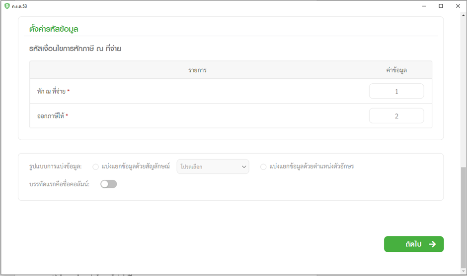

8. กำหนดรหัสเงื่อนไขการหักภาษี ณ ที่จ่าย

| หัก ณ ที่จ่าย | ค่าข้อมูล | 1   |
| ------------- | --------- | --- |
| ออกภาษีให้    | ค่าข้อมูล | 2   |

9. กำหนดรูปแบบการแบ่งข้อมูล แบ่งแยกด้วยสัญลักษณ์ Pie (|)

10. เมื่อกำหนดรหัสข้อมูลเรียบร้อยแล้ว กดปุ่ม  เพื่อเข้าสู่ ขั้นตอนที่ 2 กำหนดตำแหน่งข้อมูล

## ขั้นตอนที่ 2 กำหนดตำแหน่งข้อมูล

1.) กำหนดตำแหน่งข้อมูล ดังต่อไปนี้

**ข้อมูลผู้มีเงินได้**
| รายการ | ตำแหน่งข้อมูล |
| ---------------------------------- | ------------------ |
| เลขประจำตัวผู้เสียภาษีอากร (13) \* | ตำแหน่งข้อมูล Col2 |
| ชื่อ (100) \* ตำแหน่งข้อมูล | ตำแหน่งข้อมูล Col4 |
| ชื่ออาคาร (100) | ตำแหน่งข้อมูล Col5 |

**รายละเอียดการจ่ายเงิน รายการที่ 1**

| รายการ                                     | ตำแหน่งข้อมูล       |
| ------------------------------------------ | ------------------- |
| วันเดือนปีที่จ่าย \* กำหนด ค.ศ. dd/mm/yyyy | ตำแหน่งข้อมูล Col6  |
| ประเภทเงินได้ (200) \*                     | ตำแหน่งข้อมูล Col7  |
| อัตราภาษี (4.2) \*                         | ตำแหน่งข้อมูล Col8  |
| จำนวนเงินได้ที่จ่าย (15,2) \*              | ตำแหน่งข้อมูล Col9  |
| จำนวนภาษีที่หัก (15,2) \*                  | ตำแหน่งข้อมูล Col10 |
| เงื่อนไขการหักภาษี (1) \*                  | ตำแหน่งข้อมูล Col11 |

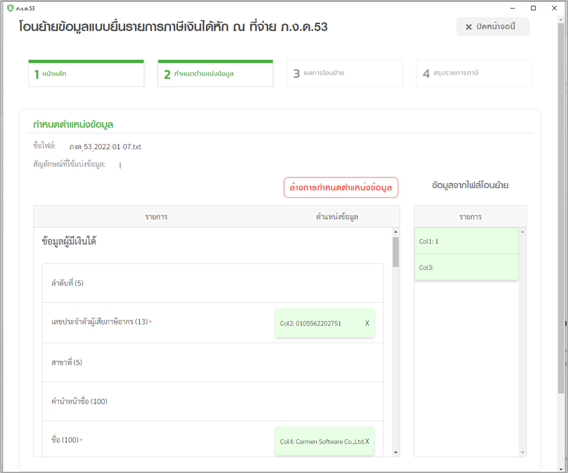

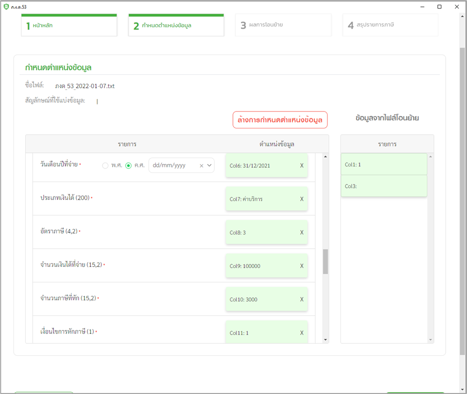

2.) เมื่อกำหนดตำแหน่งข้อมูลเรียบร้อยแล้วให้กดปุ่ม  เพื่อเข้าสู่ ขั้นตอนที่ 3 ผลการโอนย้าย

## ขั้นตอนที่ 3 ผลการโอนย้าย

โปรแกรมจะทำการตรวจสอบข้อมูลและแสดงผลการโอนย้ายให้ตรวจสอบข้อมูล หากถูกต้องให้กดปุ่ม  เพื่อเข้าสู่ ขั้นตอนที่ 4 สรุปรายการภาษี

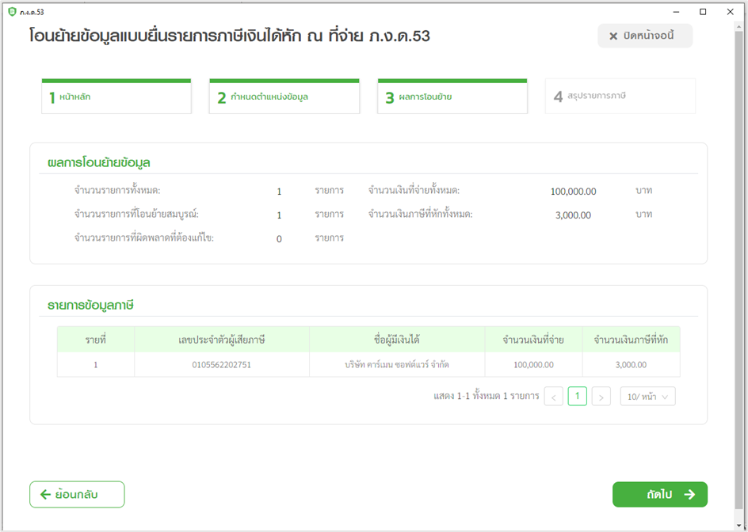

## ขั้นตอนที่ 4 สรุปรายการภาษี

1. โปรแกรมจะทำการคำนวณ สรุปรายการภาษีที่นำส่งมาแสดงให้โดยอัตโนมัติ โดยมีข้อมูลดังนี้
   1.1) ประเภทสาขา

   1.2) สาขาที่

   1.3) ลำดับการยื่นแบบ

   1.4) เดือน/ปี ภาษี

   1.5) ภาษีที่นำส่งทั้งสิ้น

2. ผู้ใช้งานสามารถพิมพ์ใบแนบที่บันทึกลงโปรแกรมได้ โดยกดปุ่ม 

3. ผู้ใช้งานสามารถพิมพ์แบบได้ โดยกดปุ่ม 

4. กรณีที่ผู้ใช้งานยังบันทึกข้อมูลใบแนบไม่ครบถ้วน และต้องการบันทึกข้อมูลใบแนบที่บันทึก
   เบื้องต้นไว้ก่อน ให้กดปุ่ม 

5. กรณีที่ผู้ใช้งานบันทึกข้อมูลใบแนบครบถ้วนแล้ว และต้องการสร้างไฟล์ข้อมูล ให้กดปุ่ม 

   โปรแกรมแสดงกล่องข้อความ “บันทึกข้อมูลเรียบร้อยแล้ว”

   

6. กดปุ่ม 

   โปรแกรมแสดงหน้าจอการดาวน์โหลดไฟล์แบบ

   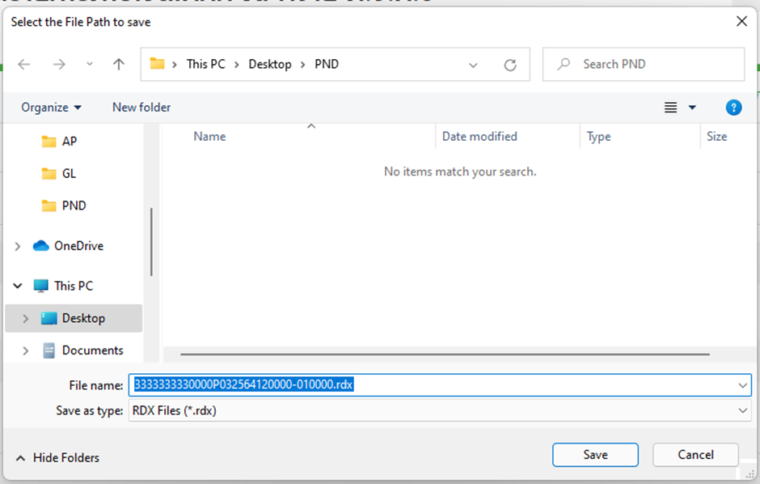

7. จากนั้นเลือก Directory ที่ใช้จัดเก็บไฟล์แบบฯ ไว้ในเครื่องคอมพิวเตอร์

8. ชื่อไฟล์แบบ

9. กดปุ่ม save
   ระบบจะจัดเก็บไฟล์ที่บันทึกแล้วในรูปแบบนามสกุล .RDX ผู้ใช้งานสามารถสามารถนำไฟล์นี้ไป
   ยื่นแบบผ่านเว็บไซต์ E-FILING ด้วยวิธีการอัปโหลดไฟล์ข้อมูลได้ทันที
10. กดปุ่ม 

สามารถเข้าไปดาวน์โหลดแอพพลิเคชั่น RDPrep และดูข้อมูลเพิ่มเติมได้ที่ เว็บไชต์กรมสรรพกร
https://www.rd.go.th
https://efiling.rd.go.th
