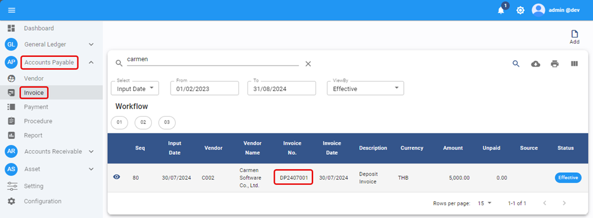
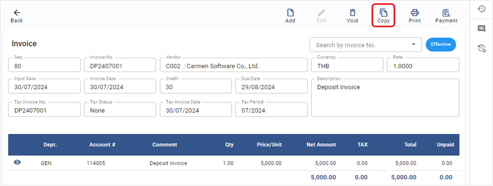
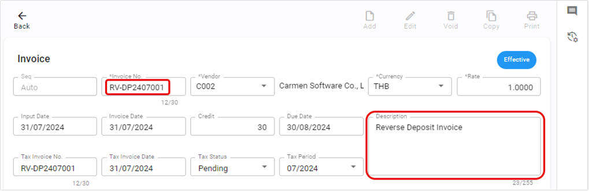
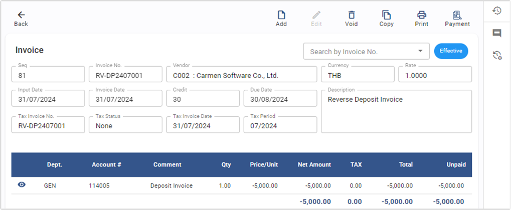
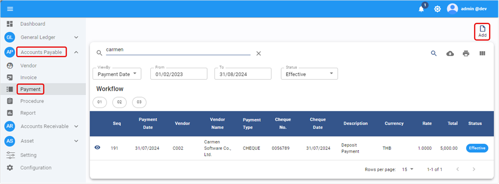
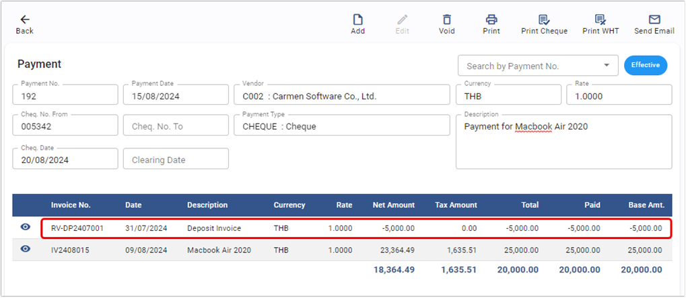

# Apply Deposit with Invoice

การนำ Deposit หรือเงินมัดจำมาลดยอด Invoice เมื่อได้รับสินค้าหรือบริการแล้วจะต้องมีการนำ Deposit มาใช้เพื่อลดยอดหนี้ก่อนชำระเงิน

## การสร้าง A/P Invoice เพื่อล้าง Deposit ที่ตั้งไว้

ขั้นตอนนี้ใช้สำหรับสร้าง Invoice เพื่อล้าง Deposit และ ลดยอดหนี้ของสินค้าหรือบริการ

1. สร้าง A/P Invoice เพื่อล้าง Deposit และลอดยอดหนี้

   1.1. Click เข้าสู่ Account Payable Module

   1.2. เลือกฟังก์ชัน Invoice

   1.3. เลือก Deposit Invoice ที่ตั้งเอาไว้ก่อนหน้านี้ 

   1.4. กด Copy เพื่อนำข้อมูลของ Deposit มาใช้ 

   1.5. Invoice ที่ copy นี้เป็นเอกสารภายในเพื่อใช้ในการล้างยอด Deposit ที่ตั้งเอาไว้ และลดยอดหนี้ของสินค้าหรือบริการที่ได้รับมา

   1.6. ในส่วนของ Header สามารถใส่เลขที่ invoice เพื่อ running เอกสารภายใน และใส่ description เพื่อเพิ่มการอธิบาย 

   1.7. การบันทึกบัญชีโดย Debit ด้วย Deposit และ Credit ด้วยเจ้าหนี้ เหมือนกับ Invoice ที่ Copy มา

   1.8. แก้ไขจำนวนเงินให้เป็นติดลบเพื่อลดยอดบัญชี Deposit ที่ตั้งไว้ และลดยอดหนี้

   1.9. กด **OK** เพื่อเสร็จสิ้นขั้นตอน 

   1.10. เมื่อบันทึก detail ครบแล้วให้กด **SAVE**

   1.11. ระบบจะแสดง Invoice ที่เสร็จสิ้น

   

## การสร้าง Payment โดยนำ Deposit มาใช้

2. การสร้าง Payment โดยนำ Deposit มาใช้คู่กับ Invoice ของสินค้าหรือบริการที่ได้รับ

   2.1. Click เข้าสู่ Account Payable Module

   2.2. เลือกฟังก์ชัน Payment

   2.3. กดปุ่ม Add  ระบบจะแสดงหน้า AP Payment 

   2.4. บันทึกข้อมูล Payment ตามปกติ

   2.5. เลือก Deposit ที่ตั้งไว้ พร้อมกันกับ Invoice จากสินค้าหรือบริการที่ได้รับมาเพื่อลดยอดเจ้าหนี้ลง จึงทำให้จำนวนเงินที่จะต้องชำระลดลง

   2.6. กด **OK** เพื่อเสร็จสิ้นขั้นตอน 

## หมายเหตุ

- Debit Deposit ที่ตั้งเอาไว้ก่อนหน้านี้จะถูกล้างออกในขั้นตอน “การสร้าง A/P Invoice เพื่อล้าง Deposit ที่ตั้งไว้”
