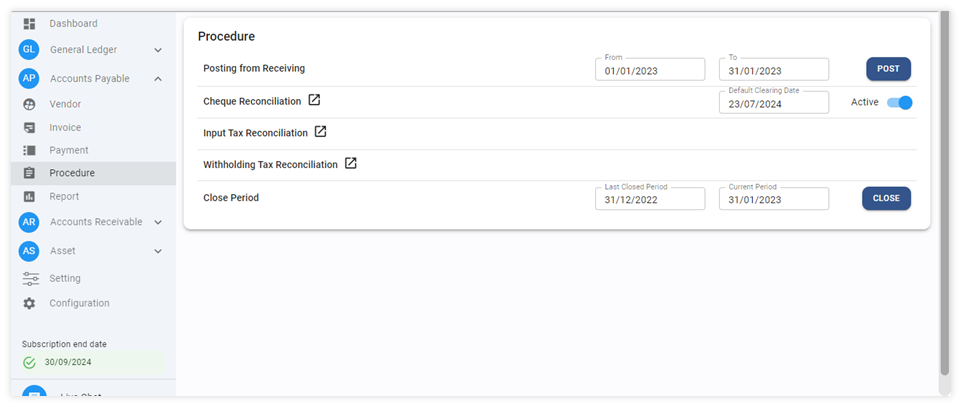
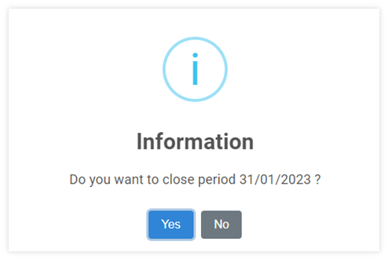
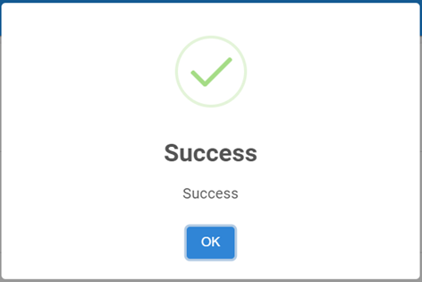

# Close Period for Account Payable Module

ขั้นตอนการปิดรอบบัญชีของ Account Payable

เมื่อเสร็จสิ้นการทำงานในแต่ละรอบบัญชี ผู้ใช้งานได้ทำการตรวจสอบข้อมูลเรียบร้อยแล้ว และเพื่อป้องกันการแก้ไขข้อมูลในระบบ ให้ดำเนินการปิดรอบบัญชี (Close Period) โดยมีขั้นตอนดำเนินการในระบบ ดังต่อไปนี้

1. Click เข้าสู่ Account Payable Module

2. เข้าฟังก์ชัน Procedure

3. กดปุ่ม Close Period

4. ระบบจะแสดงหน้าต่างให้ยืนยันการปิด Period

- กด “Yes” เพื่อยืนยัน
- กด “No” เพื่อยกเลิก

    

5. กด OK เพื่อเสร็จสิ้นขั้นตอน

    

**หมายเหตุ :**

1.) การปิดรอบบัญชีในแต่ละ Module จะทำให้ไม่สามารถ เพิ่มเติมรายการ หรือ แก้ไขข้อมูลในเดือนที่ปิดไปแล้วได้อีก ดังนั้นก่อนการ Close Period ในระบบโปรดตรวจสอบให้แน่ใจว่า ข้อมูล ครบถ้วนและถูกต้อง

2.) การปิดบัญชีนี้ เป็นการปิดรอบบัญชีในส่วนของ Account Payable Module เท่านั้น แต่ยังคงสามารถโอนข้อมูลไปบันทึกบัญชีที่ General Ledger ได้อยู่ (หาก Period ใน General Ledger Module ยังไม่ถูกปิด)

3.) หากต้องการเปิด Period ให้ FC, Account Manger หรือผู้มีอำนาจส่ง E-Mail ถึง Support เพื่อทำการขอเปิด Period
