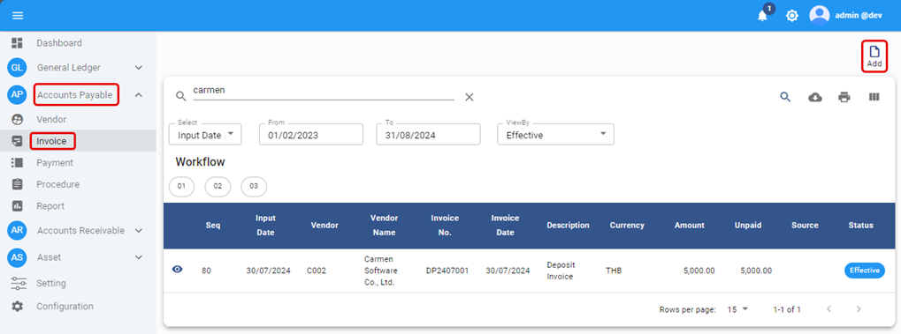
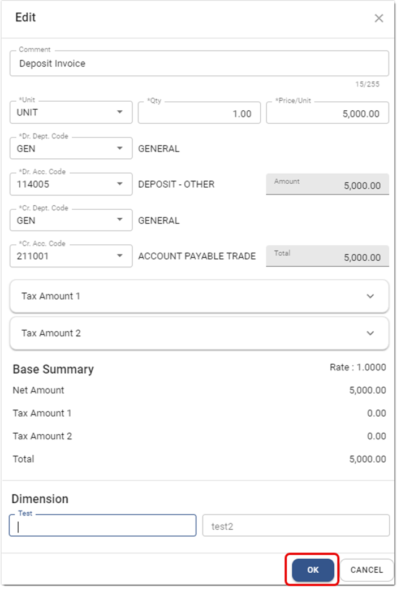
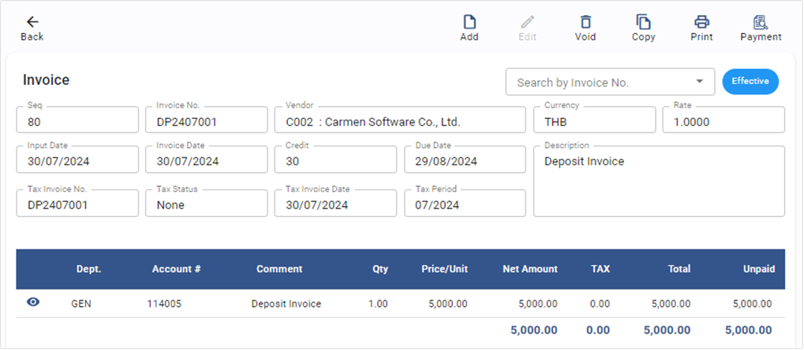
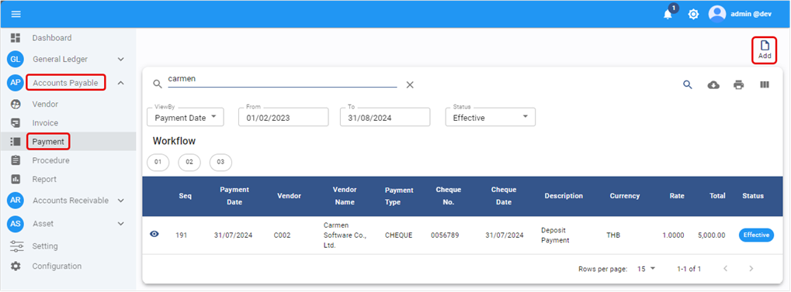
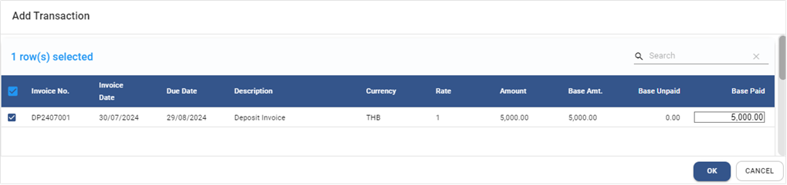
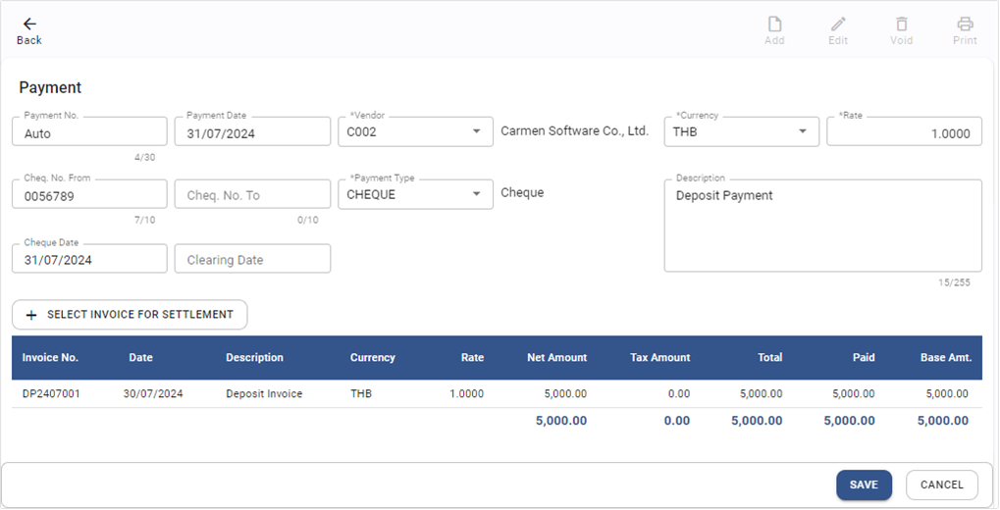

# Deposit Payment

การทำ Deposit Payment หรือจ่ายเงินมัดจำในระบบ

## การสร้าง A/P Invoice สำหรับทำ Deposit Payment

ขั้นตอนนี้ใช้สำหรับสร้าง Invoice เพื่อรองรับการทำ Deposit Payment

1. สร้าง A/P Invoice เพื่อรองรับการทำ Payment ของ Deposit

   1.1. Click เข้าสู่ Account Payable Module

   1.2. เลือกฟังก์ชัน Invoice

   1.3. กดปุ่ม Add  ระบบจะแสดงหน้า AP Invoice 

   1.4. บันทึกข้อมูลตามขั้นตอนของ Invoice ตามปกติ โดยสร้าง Invoice ตามจำนวนเงิน Deposit ที่ต้องจ่าย

   1.5. บันทึกบัญชีโดย Debit ด้วย Deposit และ Credit ด้วยเจ้าหนี้ และกด OK เพื่อเสร็จสิ้นขั้นตอน 

   1.6. เมื่อบันทึก detail ครบแล้วให้กด **SAVE**

   1.7. ระบบจะแสดง Invoice ที่เสร็จสิ้น 

## การสร้าง Payment เพื่อชำระ Deposit

2. สร้าง Payment โดยนำ Deposit Invoice มาชำระ

   2.1. Click เข้าสู่ Account Payable Module

   2.2. เลือกฟังก์ชัน Payment

   2.3. กดปุ่ม Add  ระบบจะแสดงหน้า AP Payment 

   2.4. บันทึกข้อมูล Payment ตามปกติ

   2.5. เลือก Deposit Invoice ที่สร้างขึ้น และนำมาชำระ

   2.6. กด **OK** เพื่อเสร็จสิ้นขั้นตอน 

   2.7. กด **SAVE** เพื่อเสร็จสิ้นการบันทึก Payment 

## หมายเหตุ

- หลังจากเสร็จสิ้นขั้นตอนข้างต้น จะทำให้ Deposit หรือเงินมัดจำยังคงค้างอยู่ (Debit – Deposit)
- ต้องดำเนินการตามขั้นตอนของ Apply Deposit with Invoice เพื่อล้างยอด Deposit ที่ตั้งเอาไว้
