# Input Tax Reconciliation

Function นี้ใช้สำหรับตรวจสอบใบกำกับภาษี และเลือกรายการเพื่อยืนยันภาษีซื้อ และออกรายงานภาษีซื้อ
สามารถกำหนดให้ระบบทำการบันทึกปรับปรุงยอดภาษีซื้อค้างจ่าย ให้เป็นภาษีซื้อ ใน GL ได้โดยอัตโนมัติ (ในกรณีที่มีการตั้งค่าให้ระบบ Auto Posting Vat Reconcile JV) โดยข้อมูลจะถูกโพสไปบันทึกบัญชีที่ GL เข้า Prefix “TX”

## การยืนยันยอดภาษีซื้อ (Input Tax Reconciliation) (1-5)

1. Click เข้าสู่ Account Payable Module

2. เลือกฟังก์ชัน Procedure ส่วนของ Input Tax Reconciliation 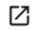

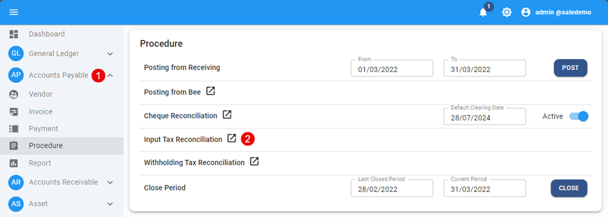

3. กำหนดในส่วนของ Default tax period เพื่อเลือก Period หรือเดือน ที่ต้องการยืนยันยอดภาษีซื้อ

4. ระบบจะแสดงใบกำกับภาษีทั้งหมดที่ยังไม่ถูกยื่นภาษี หรือ Tax Status เป็น Pending เพื่อให้ผู้ใช้งานทำการตรวจสอบและกระทบยอด (ดูตัวอย่างจากภาพด้านล่าง) ด้วยวิธีการดังต่อไปนี้

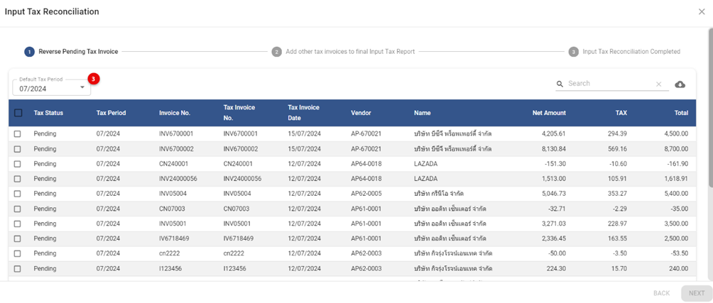

4.1. เลือกใบกำกับภาษี โดยการ ☑️ ติ๊กเครื่องหมายถูก ที่ช่องด้านหน้าสุด รายการที่ต้องการยื่นภาษีใน Period หรือ เดือนที่เลือกไว้
ผู้ใช้งานจะสามารถทำการ Update และ แก้ไขข้อมูลใบกำกับภาษีได้ดังต่อไปนี้

- Tax Status > ระบบจะเปลี่ยนจาก Pending ให้เป็น Confirm โดยอัตโนมัติเมื่อติ๊กเครื่องหมายถูก
- Tax Period > ระบบจะเปลี่ยนตาม Default Tax Period ให้โดยอัตโนมัติเมื่อติ๊กเครื่องหมายถูก
- Tax Invoice No. > หมายเลขใบกำกับภาษี หากไม่ถูกต้อง สามารถแก้ไขได้
- Tax Invoice Date > วันที่ใบกำกับภาษี หากไม่ถูกต้อง สามารถแก้ไขได้

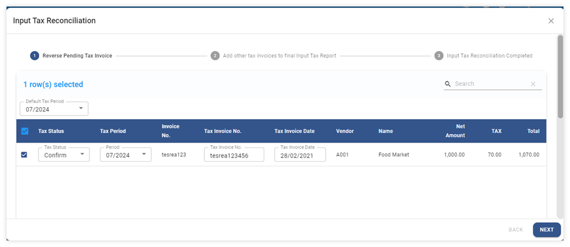

4.2. กดปุ่ม **NEXT** เพื่อดำเนินการต่อในขั้นตอนถัดไป

## การกลับบัญชี Input Tax – Undue ใน JV

4.3. ในกรณีที่มีการตั้งค่าให้ระบบ Auto Posting Vat Reconcile JV ระบบจะแสดงข้อความให้ทราบว่า ระบบจะทำการสร้าง JV ที่ Prefix “TX” เพื่อบันทึกปรับปรุงยอดภาษีซื้อค้างจ่าย ให้เป็นภาษีซื้อ ใน GL ได้โดยอัตโนมัติ

- กด **OK** เพื่อยืนยัน
- กด Cancel เพื่อยกเลิก ในกรณีที่ต้องการกลับไปแก้ไขรายการ

## ตัวอย่าง JV จากการกลับบัญชีของระบบ

- ระบบจะบันทึกข้อมูลลงที่ Prefix “TX” ใน GL โดยอัตโนมัติ
- การบันทึกบัญชีนั้นระบบจะ Debit ด้วย Account code ตามการตั้งค่าและ Credit เพื่อกลับบัญชีด้วย Account code ที่บันทึกเอาไว้ในใบกำกับภาษีแต่ละใบ
- การกลับบัญชีจะมีผลกับใบกำกับภาษีที่บันทึกบน A/P Invoice เท่านั้น

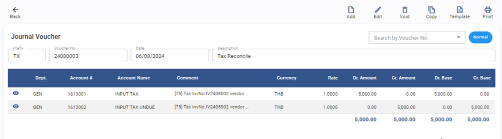

4.4. ระบบจะแสดงข้อความเพื่อยืนยันจำนวนใบกำกับภาษีซื้อตาม Status ที่ถูกเลือก
Found Updated data: - transactions จำนวนใบกำกับภาษีทั้งหมดที่ระบบจะทำการอัพเดตข้อมูล
โดยแบ่ง ตาม Status ดังต่อไปนี้นี้
• (Y) Confirm: หมายถึง จำนวน ใบกำกับภาษีที่จะถูกนำส่ง และ ออกรายงานภาษีใน Period หรือ เดือนที่เลือกไว้
• (N) Not confirm: หมายถึง จำนวน ใบกำกับภาษีที่ยังไม่ได้ถูกนำส่ง
• (U) Unclaim: หมายถึง จำนวน ใบกำกับภาษีที่ไม่สามารถยื่นภาษีได้

- กด **OK** เพื่อยืนยัน
- กด Cancel เพื่อยกเลิก ในกรณีที่ต้องการกลับไปแก้ไขรายการ

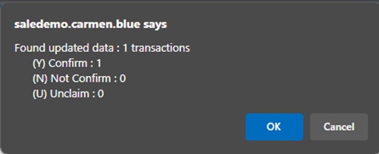

4.5. เมื่อระบบทำการบันทึกข้อมูลเรียบร้อยแล้วจะแสดงข้อความ Success ตามตัวอย่างภาพด้านล่าง

5. กด **OK** เพื่อเสร็จสิ้นขั้นตอน

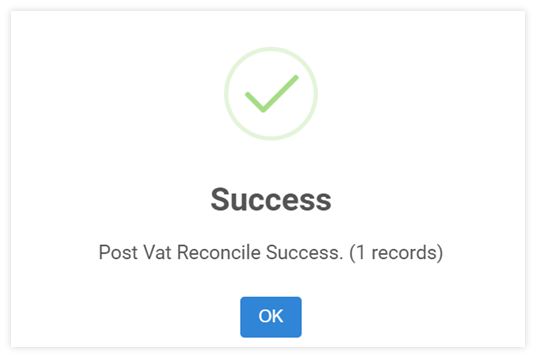

## การบันทึกใบกำกับภาษีซื้อจาก module อื่น ๆ เช่น AR และ GL (6-11)

Function ที่ใช้ในกรณี ต้องการเพิ่มเติมรายการในรายงานภาษีซื้อ (Tax Invoice) ที่มีการสั่งซื้อของ ต่างๆ ของบริษัท แต่บันทึกที่ module อื่น ๆ ของระบบ เช่นใบกำกับภาษีซื้อที่ซื้อด้วยเงินสดย่อย หรือ ภาษีซื้อจาก Credit Card Commission เป็นต้น สามารถนำใบกำกับภาษีมาบันทึกเพื่อนำส่ง และ ออกรายงานภาษีซื้อเป็นชุดเดียวกัน

6. ทำตามขั้นตอน 1 และ 2 อีกครั้ง จากนั้น click 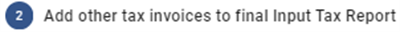

7. เลือก Period หรือเดือนของภาษีซื้อ ที่ต้องการ จะเพิ่มใบกำกับภาษีซื้อ
   ระบบจะแสดงรายการใบกำกับภาษีซื้อที่ถูก Reconcile แล้ว เพื่อเป็นข้อมูลตั้งต้น

8. กดปุ่ม + เพื่อเพิ่มรายการภาษีซื้อ

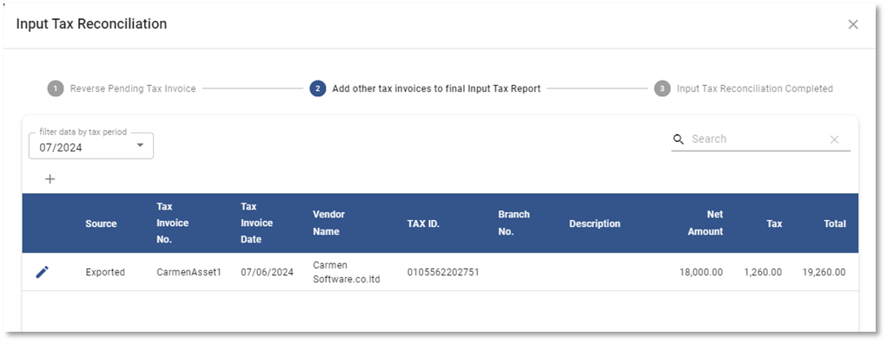

9. การกรอกรายละเอียดใบกำกับภาษีซื้อ

**หมายเหตุ** เครื่องหมาย \*
(สัญลักษณ์ \* ช่องที่จำเป็นต้องระบุ)

- \* Tax Invoice No > เลขที่ใบกำกับภาษี
- \* Tax Invoice Date > วันที่ในใบกำกับภาษี
- \* Tax ID > ระบุหมายเลขประจำตัวผู้เสียภาษีอากร (13 หลัก)
- \* Branch No > ระบุรหัสสาขา (5 หลัก) เช่น 00000 (รหัสสาขาของสำนักงานใหญ่)
- Vendor กำหนดรหัสร้านค้า หากมีข้อมูลอยู่ในระบบ สามารถปล่อยว่างเอาไว้ได้หากไม่มีข้อมูลในระบบ
- \* Vendor Name > ระบุชื่อร้านค้า หรือชื่อผู้ขายตามใบกำกับภาษี
- Description คำอธิบายเพิ่มเติม
- \* Net Amount > จำนวนเงินก่อนภาษีซื้อ
- \* Tax > จำนวนเงินภาษีซื้อ
- Total จำนวนเงินรวมตามใบกำกับภาษีซื้อ

10. กด **OK** เพื่อบันทึกข้อมูล หรือ Cancel เพื่อยกเลิก

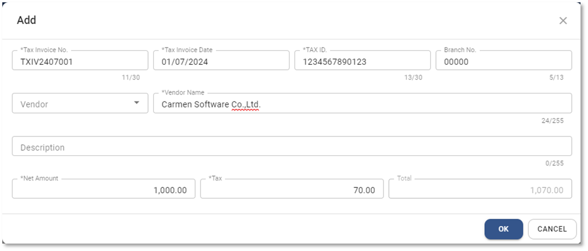

11. กด **FINISH** เพื่อจบขั้นตอนการบันทึกใบกำกับภาษีจาก module อื่น ๆ Source บนหน้าจอใช้ในการระบุแหล่งที่มาของใบกำกับภาษีแต่ละใบโดยแบ่งเป็น 2 รูปแบบ

11.1. Exported คือ ใบกำกับภาษีที่มาจาก A/P Invoice ที่มี Tax Status เป็น Confirm ไม่สามารถลบรายการออกไปได้ แต่สามารถแก้ไขข้อมูลได้บางส่วน และมีวิธีการแก้ไข ดังนี้

- กดที่ช่อง Tax Period เพื่อเลือก Period ที่ต้องการแก้ไข
- กดปุ่ม  หน้ารายการที่ต้องการแก้ไข
- ระบบจะแสดงหน้าต่าง ให้แก้ไขข้อมูลได้บางส่วน ได้แก่ Vendor Name, Tax ID, Branch No

---

11.2. **User** คือ ใบกำกับภาษีที่ ผู้ใช้งานทำการเพิ่มเองในระบบ

## การ Print รายงานภาษีซื้อ (12)

เมื่อทำการบันทึกใบกำกับภาษีซื้อที่จะใช้ในการนำส่งภาษีของเดือนนั้นเสร็จแล้ว สามารถ Print รายงานภาษีซื้อได้จากหน้าจอ Input Tax Reconciliation ตามขั้นตอนดังนี้

12. เมื่อบันทึกข้อมูลใบกำกับภาษีทั้งหมด และกด ปุ่ม**FINISH**  จากข้อ 11 ระบบ จะเปิด tab 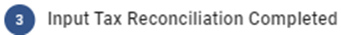เพื่อทำการ Print รายงานภาษีซื้อ โดยมีขั้นตอนดังนี้

    12.1. กำหนด Tax Period ที่ต้องการ Print รายงานภาษีซื้อ

    12.2. เลือก Print Input TAX Report เมื่อต้องการพิมพ์รายงานภาษีซื้อ

    12.3. เลือก Export Input TAX xlsx file เมื่อต้องการ Export ข้อมูลภาษีซื้อเป็นไฟล์ Excel

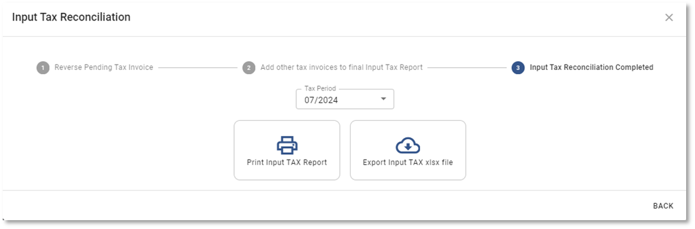

## ตัวอย่างรายงานภาษีซื้อ

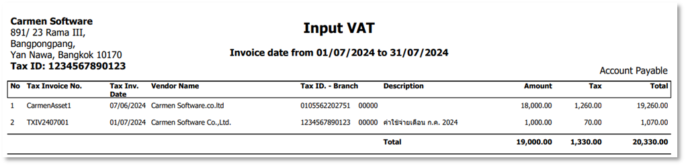
