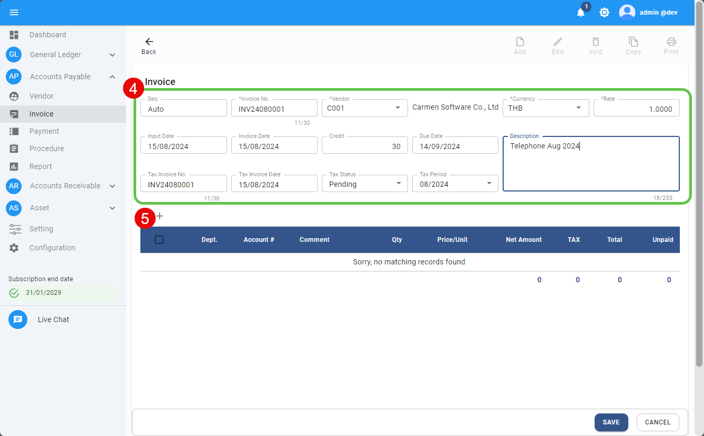
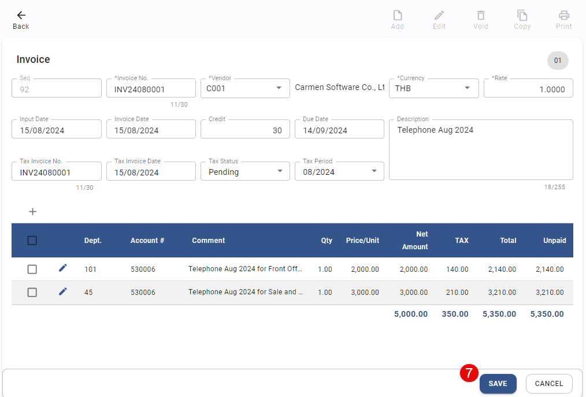
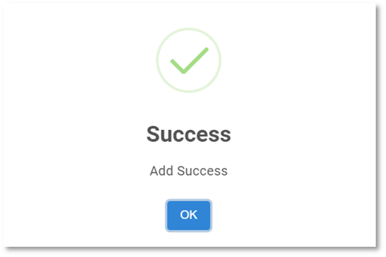
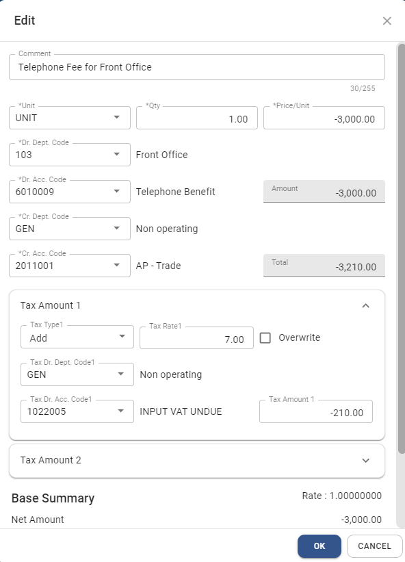
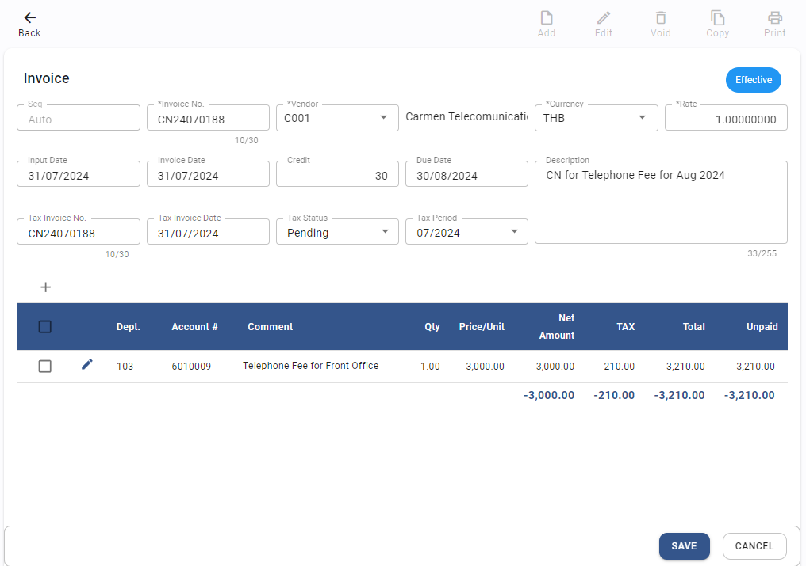

# Invoice

## การสร้าง A/P Invoice (User Manual)

Function นี้ใช้สำหรับการบันทึกใบแจ้งหนี้ หรือ ใบกำกับภาษี และใบลดหนี้ ในระบบ

1. Click เข้าสู่ Account Payable Module

2. เลือกฟังก์ชัน Invoice จากนั้นระบบจะแสดงหน้า AP Invoice

3. กดปุ่ม  เพื่อเพิ่มใบแจ้งหนี้

4. ให้ผู้ใช้งาน ระบุข้อมูลของใบแจ้งหนี้ Invoice Header ดังต่อไปนี้

**หมายเหตุ** เครื่องหมาย \* คือช่องที่จำเป็นต้องระบุ

- Seq No. > เลขลำดับที่ของใบแจ้งหนี้ (ระบบจะกำหนดโดยอัตโนมัติ)
- \* Invoice No > เลขที่ใบแจ้งหนี้ ตามเอกสารที่ได้รับมาจาก Vendor
- \* Vendor > กำหนดรหัสเจ้าหนี้
- \* Currency > กำหนดสกุลเงิน
- \* Rate > อัตราแลกเปลี่ยนเงินตรา
- \* Input Date > วันที่สำหรับการบันทึกข้อมูล ลงในระบบ Carmen
- \* Invoice Date > วันที่ตามที่ระบุไว้ในใบแจ้งหนี้ (สามารถบันทึก เป็นวันที่ก่อน Input date ได้)
- Credit Term > ระยะเวลาการให้สินเชื่อ(วัน) (ระบบจะใช้ข้อมูลจาก Invoice default ใน vendor ที่ตั้งค่าไว้ แต่สามารถแก้ไขได้อีกครั้ง)
- Due Date > วันที่ครบกำหนดชำระเงิน (ระบบจำคำนวณจาก Invoice date + Credit Term)
- Tax Invoice No.> เลขที่ต้นฉบับใบกำกับภาษี ในกรณีที่ได้รับใบกำกับภาษีแล้วในวันที่บันทึกใบแจ้งหนี้ ก็สามารถบันทึกได้ทันที แต่หาก ณ วันที่บันทึกใบแจ้หนี้ยัง ไม่ได้รับต้นฉบับใบกำกับภาษีก็ไม่ต้องบันทึกข้อมูลใด ๆ และสามารถกลับมาบันทึกข้อมูลในภายหลังได้
- Tax invoice Date > วันที่ตามเอกสารต้นฉบับใบกำกับภาษี
- Tax Status > สถานะของใบกำกับภาษี ในระบบจะแบ่งเป็น 4 สถานะได้แก่  
  - Pending > ใบแจ้งหนี้ใบนั้นยังไม่ได้รับ ใบกำกับภาษี หรือใบกำกับภาษีที่ยังไม่ได้ทำการยื่นภาษี
  - Confirm > ภาษีซื้อใบนี้ได้รับการยื่นเรียบร้อยแล้ว และเอกสารภาษีซื้อที่มี status เป็น Confirm เท่านั้นที่จะแสดงบนรายงานภาษีซื้อ
  - Un claim > ใบกำกับภาษีซื้อที่ไม่สามารถขอคืนได้
  - None > ใบแจ้งหนี้ที่ไม่มีภาษีซื้อ
  - Tax Period > กำหนด Period ที่จะยื่นภาษีมูลค่าเพิ่ม
  - Description > ระบุรายละเอียดเพิ่มเติมของใบแจ้งหนี้  

**หมายเหตุ**

- หากลูกค้าต้องการใช้ Input Tax Reconciliation ในระบบ แนะนำให้บันทึกรหัสบัญชีเป็น Dr. ภาษีซื้อตั้งพัก (Input vat – Suspense) เพื่อใช้ความสามารถในการกลับบัญชีอัตโนมัติ
- การเปลี่ยน Status เป็น Confirm และ Period สามารถทำได้บนหน้าจอ Invoice หรือทำ บน Input Tax Reconciliation ก็ได้

5. กดปุ่ม เพื่อเพิ่มข้อมูลในส่วนของInvoice Detail ระบบจะแสดงหน้าต่างขึ้นมาให้ระบุข้อมูลดังต่อไปนี้

- \* Department > กำหนด Department Code ที่จะใช้ในการบันทึกบัญชีที่ GL
- Comment ใส่รายละเอียดรายละเอียดของสินค้า หรือ บริการ
- \* Unit > หน่วยซื้อ
- \* Qty. > จำนวนที่ซื้อ
- \* Price/Unit > ราคาต่อหน่วย
- \* Dr Acc Code > รหัสบัญชีค่าใช้จ่าย
- \* Cr Acc. Code > รหัสบัญชีเจ้าหนี้การค้า

  **Vat 1 คือ ภาษีมูลค่าเพิ่ม**

- **Tax Type 1** กำหนดประเภทภาษีมูลค่าเพิ่มในรายการสินค้า / บริการของร้านค้า ในระบบจะมีให้เลือก 3 ประเภท ได้แก่  
  a) None ไม่มีภาษีมูลค่าเพิ่มในราคาสินค้า หรือ บริการ  
  b) Add บวกภาษีมูลค่าเพิ่ม ในราคาสินค้า หรือ บริการ  
  c) Include มีภาษีมูลค่าเพิ่มรวมอยู่ในนราคาสินค้า หรือ บริการแล้ว  
- Tax Rate 1 ระบุเปอร์เซ็นต์ร้อยละของฐานภาษีมูลค่าเพิ่ม
- Dr. Acc. Code (Tax 1) ระบุรหัสบัญชีสำหรับการบันทึกบัญชีภาษีมูลค่าเพิ่ม
- Overwrite ใช้ในกรณีต้องการแก้ไข ภาษีมูลค่าเพิ่ม ให้ติ๊กเครื่องหมายถูกที่ช่องนี้ กรณีที่ติ๊กเครื่องหมายถูกที่ช่อง Overwrite ให้พิมพ์ ยอดภาษีที่ช่อง Tax Amount 1

  **Vat 2 จะเป็นภาษีที่เกี่ยวกับต่างประเทศ**

6. ตรวจสอบความถูกต้อง เมื่อ เรียบร้อยแล้วกดปุ่ม **SAVE**

7. หากมีมากกว่า 1 รายการ ให้ทำตามขั้นตอนที่ 5-7 จนครบ แล้วกดปุ่ม **SAVE** ด้านล่างขวามือเพื่อบันทึก A/P Invoice

8. กด **OK** เพื่อเสร็จสิ้นขั้นตอน

    

9. เมนูคำสั่งอื่นที่เกี่ยวข้อง  
    สร้าง Invoice  
    แก้ไข Invoice (ทำไม่ได้ หากมีการ Approve, ทำ Payment หรือ อยู่ใน Period ที่ปิดแล้ว)  
    ยกเลิก Invoice (ทำไม่ได้ หากมีการ Approve, ทำ Payment หรือ อยู่ใน Period ที่ปิดแล้ว)  
    พิมพ์ข้อมูล  
    ดู Payment ที่ Invoice ถูกตัดชำระ  

10. การใช้งานปุ่มอื่น ๆ บนหน้าจอ  
    กดปุ่ม  เพื่อค้นหา Invoice  
    กดปุ่ม  เพื่อ Export ข้อมูลออกจากระบบเป็น .csv  
    กดปุ่ม  เพื่อพิมพ์ข้อมูล  

## การสร้าง A/P Invoice ด้วยการ Copy

Function นี้ใช้สำหรับการคัดลอกใบแจ้งหนี้ที่เคยมีอยู่ในระบบ มาสร้างเป็นใบแจ้งหนี้ใบใหม่ ฟังก์ชันนี้จะช่วยให้ผู้ใช้ทำงาน สะดวกและรวดเร็วมากขึ้น โดยในระบบมีวิธีการดังต่อไปนี้

1. เข้าไปที่ A/P Invoice ที่ต้องการจะคัดลอก
2. กดปุ่ม  ด้านบนขวามือ
3. ระบบจะแสดงหน้า Invoice ใบใหม่ ให้ User ตรวจสอบ เพิ่มเติม หรือ แก้ไข ข้อมูลตามที่ต้องการ
4. กดปุ่ม **SAVE** เพื่อบันทึก A/P Invoice

5. กด **OK** เพื่อเสร็จสิ้นขั้นตอน

    

## การสร้างใบลดหนี้

- ในขั้นตอนการบันทึกใบลดหนี้ สามารถบันทึกในระบบได้ โดยการบันทึกข้อมูลต่าง ๆ รวมถึง Debit และ Credit เหมือนการบันทึก Invoice ตามปกติ แต่กรอกจำนวนเงินเป็นติดลบ
- ตัวอย่างการบันทึกบัญชีสำหรับ Credit Note

- ตัวอย่าง CN ในระบบ

