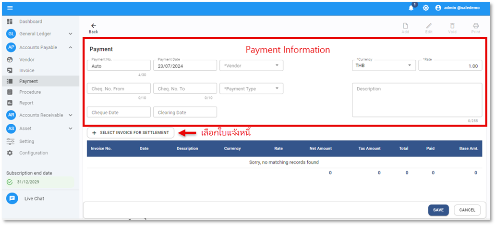

# Payment

Function นี้ใช้สำหรับการชำระเงินให้กับ Vendor ซึ่งรองรับการชำระเต็มจำนวน ชำระบางส่วน รวมถึง การชำระพร้อม CN

## การตัดชำระหนี้ A/P Payment

1. เข้าสู่ Account Payable Module

2. เลือกฟังก์ชัน Payment ระบบจะแสดงหน้าจอ ตามภาพด้านล่าง

3. กดปุ่ม  ระบบจะแสดงหน้าจอ Payment เพื่อให้ระบุข้อมูลการชำระเงิน

4. ให้ผู้ใช้งาน ระบุข้อมูลของ Payment ดังต่อไปนี้

**หมายเหตุ** เครื่องหมาย \* คือช่องที่จำเป็นต้องระบุ

- Payment No > เลขลำดับที่ของใบชำหระหนี้ (ระบบจะกำหนดโดยอัตโนมัติ)
- \* Payment Date > วันที่สร้างเอกสารทำจ่าย (Payment Prepare)
- \* Vendor > ระบุรหัสหรือชื่อเจ้าหนี้ (สามารถพิมพ์รหัส หรือ ชื่อ ลงในช่อง \*Vendor เพื่อค้นหาได้เลย)
- \* Currency > ระบุสกุลเงิน (ระบบจะใช้ข้อมูล Default ตามที่ตั้งค่าไว้ใน Setting)
- \* Rate > ระบุอัตราแลกเปลี่ยนเงินตรา (ระบบจะใช้ข้อมูล Default ตามที่ตั้งค่าไว้ใน Setting)
- Cheque No. From > ระบุเลขที่เช็คเริ่มต้นเมื่อมีการสั่งจ่ายเจ้าหนี้ด้วยเช็คธนาคาร
- Cheque No. To > ระบุเลขที่เช็คสุดท้ายเมื่อมีการสั่งจ่ายเจ้าหนี้ด้วยเช็คธนาคารมากกว่า 1 ใบ
- \* Payment Type > ระบุประเภทการชำระ เช่น Cash, Cheque หรือ Bank Transfer
- Cheque Date > วันที่สั่งจ่ายเช็ค (ให้ระบุวันที่จ่ายทุกประเภทการสั่งจ่ายในช่อง Cheque Date)
- Clearing Date > วันที่เช็คถูกขึ้นเงิน สามารถบันทึกวันที่ เคลียร์ริงเช็คได้ที่ช่องนี้ หรือบันทึกผ่านขั้นตอนการกระทบยอดเช็คจ่าย (Cheque Reconciliation)

5. กดปุ่ม  เพื่อเลือก Invoice ที่จะนำไปตัดจ่าย  
   5.1 ติ๊กเครื่องหมายถูก ☑ หน้ารายการที่จะนำไปจ่าย  
   \*\*\*หากมีการบันทึก CN เป็น Invoice ติดลบไว้ ก็สามารถเลือก CN ใบดังกล่าว เพื่อลดยอดการชำระของ Invoice หลักได้  
   5.2. ตรวจสอบยอดที่จะจ่ายที่ช่อง Base Paid  
   \*\*\*กรณีต้องการจ่ายบางส่วน ให้บันทึกยอดที่ต้องการจ่ายลงไปที่ช่องนี้  
   5.3. กดปุ่ม **OK** ระบบจะนำเอกสารที่เลือกไว้ไปแสดงในหน้า Payment  

## การบันทึกภาษีหัก ณ ที่จ่ายให้กับ Payment

6. การบันทึก Withholding Tax (ภาษีหัก ณ ที่จ่าย) ในกรณีมีภาษีหัก ณ ที่จ่าย ที่ต้องหัก ก่อนชำระเงิน  
   6.1. Click ที่ช่อง Withholding Tax > ระบุข้อมูลดังต่อไปนี้  

   

   6.2. WHT Form > เลือกประเภทการหัก ณ ที่จ่าย เช่น ภงด. 3 หรือ ภงด. 53  
   6.3. Tax ID > ระบุเลขที่ผู้เสียภาษี 13 หลัก (ระบบจะใช้ข้อมูลที่ตั้งค่าไว้ใน Vendor profile มาแสดงผล แต่สามารถแก้ไขได้อีกครั้ง)  
   6.4. Title > ระบุคำนำหน้าชื่อ เช่น นาย นางสาว (กรณีหัก ณ ที่จ่าย ภงด.3)  
   6.5. WHT Name > ระบุชื่อสำหรับจะนำไปยื่นภาษีหัก ณ ที่จ่าย (ระบบจะใช้ข้อมูลที่ตั้งค่าไว้ใน Vendor profile มาแสดงผล แต่สามารถแก้ไขได้อีกครั้ง)  
   6.6. Address > ระบุที่อยู่สำหรับจะนำไปยื่นภาษีหัก ณ ที่จ่าย (ระบบจะใช้ข้อมูลที่ตั้งค่าไว้ใน Vendor profile มาแสดงผล แต่สามารถแก้ไขได้อีกครั้ง)  
   6.7. WHT. No > ระบุเลขที่เอกสาร (เบื้องต้นระบบสร้างเลขที่เอกสารให้อัตโนมัติ)  
   6.8. WHT Condition > ระบุเงื่อนไขการหัก ณ ที่จ่าย  
   6.9. Remark > ระบุข้อมูลรายละเอียด เพิ่มเติม (จะระบุหรือไม่ระบุก็ได้)  
   6.10. Click Menu  เพื่อเพิ่มรายการประเภทการชำระภาษี หัก ณ ที่จ่าย  

ระบบจะแสดงหน้าต่างตามภาพด้านล่าง ให้ระบุข้อมูลดังต่อไปนี้

- \*Code > กำหนดประเภทการชำระภาษีหัก ณ ที่จ่าย เช่น ค่าบริการ, ค่าจ้าง เป็นต้น
- Tax Rate (%) > ระบุอัตราภาษีหัก ณ ที่จ่าย
- Total Base Amount > ระบุยอดที่จะนำไปคำนวณภาษีหัก ณ ที่จ่าย
- Tax Amount > ยอดภาษี หัก ณ ที่จ่าย ระบบจะคำนวณให้อัตโนมัติ หรือ user สามารถคีย์ยอดภาษีหัก ณ ที่จ่ายได้เองที่ช่องนี้
- กด **OK** เพื่อบันทึกรายการ
- หากมีมากกว่า 1 รายการให้ทำตามขั้นตอนในข้อ 2.9) จนครบ

**หมายเหตุ**

- สามารถบันทึกได้สูงสุด 3 รายการ
- หากมีการกำหนด Service type เอาไว้ใน Vendor Profile ระบบจะบันทึก และคำนวณจำนวนเงิน WHT ให้โดยอัตโนมัติ

ระบบจะแสดงหน้าจอ ตัวอย่างตามภาพด้านล่าง

- กด  ในกรณีต้องการแก้ไขข้อมูลประเภท หัก ณ ที่จ่าย
- กด  ในกรณีต้องการ ลบ ข้อมูลประเภท หัก ณ ที่จ่าย

7.  เลื่อน scroll bar ลงที่ด้านล่างสุด ให้กำหนดรหัสผังบัญชีที่จะใช้บันทึกบัญชีไปที่ General Ledger Module ดังต่อไปนี้  
     
    7.1. Payment Account กำหนดรหัสบัญชีที่จะใช้บันทึกการตัดจ่าย เช่น บัญชี Bank 

    - \* Dept. Code > กำหนด Department Code สำหรับใช้บันทึกบัญชี  
    - \* Acc. Code > กำหนด Account Code สำหรับใช้บันทึกบัญชี 

      7.2. Gain/Loss account > กำหนดรหัสบัญชีที่จะใช้บันทึกยอดส่วนต่างจากอัตราการแลกเปลี่ยน (หากมีต้องระบุ)  

    - Dept. Code > กำหนด Department Code สำหรับใช้บันทึกบัญชี 
    - Acc. Code > กำหนด Account Code สำหรับใช้บันทึกบัญชี 

      7.3 WHT. Account > กำหนดรหัสบัญชีที่จะใช้บันทึก ภาษี หัก ณ ที่จ่าย  

    \* Dept. Code กำหนด Department Code สำหรับใช้บันทึกบัญชี 
    \* Acc. Code กำหนด Account Code สำหรับใช้บันทึกบัญชี 

8.  ตรวจสอบยอดที่แสดงในส่วนของ Summary ด้านล่างขวามือ

- Payment Amount > ยอดเงินรวมสำหรับตัดชำระหนี้
- Settlement Base Amount > ยอดเงินสำหรับจะตัดชาระหนี้แปลงตามสกุลเงินหลัก (Base Currency)
- Gain/Loss > ยอดเงินส่วนต่างที่เกิดจากอัตราการแลกเปลี่ยน Rate Currency
- Withholding Tax > ยอดภาษีหัก ณ ที่จ่าย
- Net Payment > ยอดสุทธิหลังจากหักภาษี ณ ที่จ่าย สำหรับตัดชำระหนี้

9.  กดปุ่ม **SAVE** เพื่อบันทึกข้อมูล หรือกด Cancel เพื่อยกเลิก

10. เมื่อระบบทำการบันทึกข้อมูลเรียบร้อยแล้ว ระบบจะแสดงข้อความ Success ให้กดปุ่ม **OK**

    

11. เมนูคำสั่งอื่นที่เกี่ยวข้อง  
     สร้าง Payment  
     แก้ไข Payment (ทำไม่ได้ หากมีการ Approve, Print cheque หรือ อยู่ใน Period ที่ปิดแล้ว)  
     ยกเลิก Payment (ทำไม่ได้ หากมีการ Approve, Print cheque หรือ อยู่ใน Period ที่ปิดแล้ว)  
     พิมพ์ Payment Voucher  
     พิมพ์เช็ค  
     พิมพ์ใบภาษีหัก ณ ที่จ่าย  

12. การใช้งานปุ่มอื่น ๆ บนหน้าจอ  

- กดปุ่ม  เพื่อค้นหา Payment  
- กดปุ่ม  เพื่อ Export ข้อมูลออกจากระบบเป็น .csv  
- กดปุ่ม  เพื่อพิมพ์ข้อมูล  
