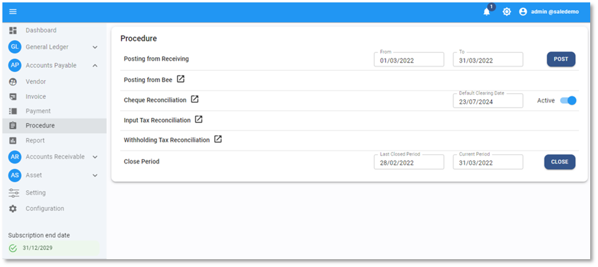
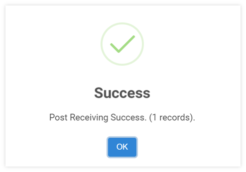
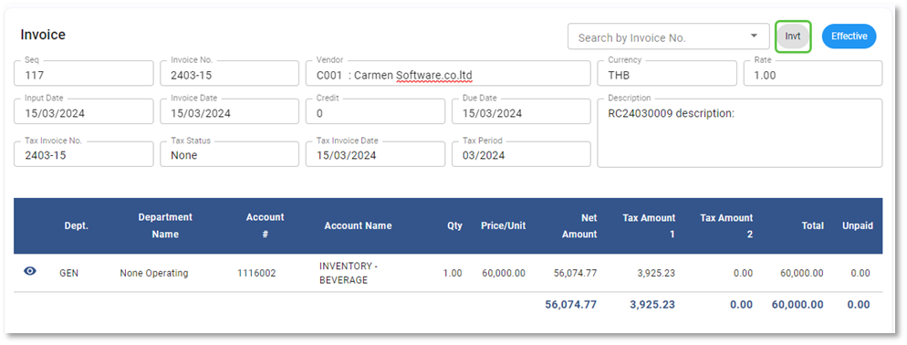

## การ Post ข้อมูล Receiving เข้า A/P Invoice

Function นี้ใช้สำหรับดึงข้อมูลจากระบบ Receiving เพื่อมาตั้งหนี้ เป็น Invoice มีขั้นตอนในระบบ ดังนี้

**หมายเหตุ** การตั้งค่า Interface ขึ้นอยู่กับระบบ Receiving ที่ลูกค้าใช้งาน

1. คลิกเข้าสู่ Account Payable Module

2. กดปุ่ม Procedure

3. ไปที่ Posting from Receiving กำหนดวันที่ที่ต้องการดึงข้อมูลได้จากช่อง From - To

4. กด **POST** เพื่อให้ระบบดึงข้อมูล

5. เมื่อระบบทำการดึงข้อมูลเรียบร้อยแล้วจะขึ้นหน้าต่างแสดงข้อความ Success และแจ้งจำนวน A/P Invoice ที่ถูกโพตเข้าไปในระบบ ตัวอย่างตามภาพด้านล่าง

    
    ตัวอย่าง Invoice ที่เกิดจากการ post มาจากระบบอื่น ๆ จะแสดง Source ด้วยรหัส “Invt”

