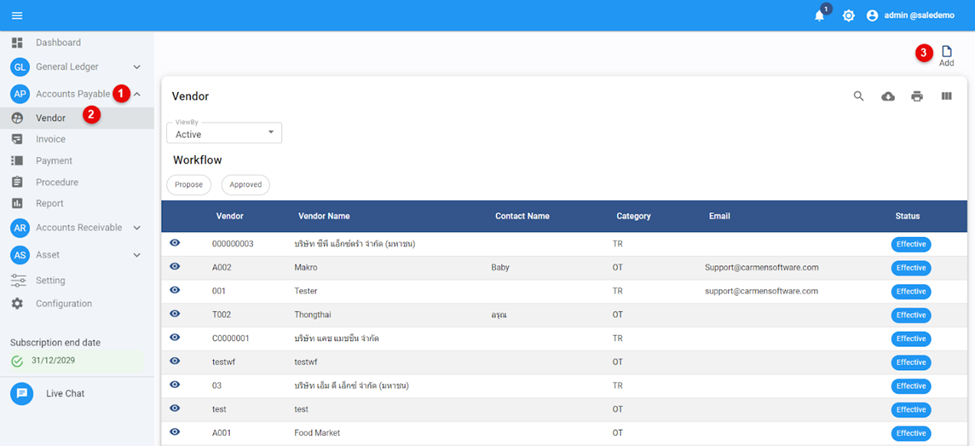
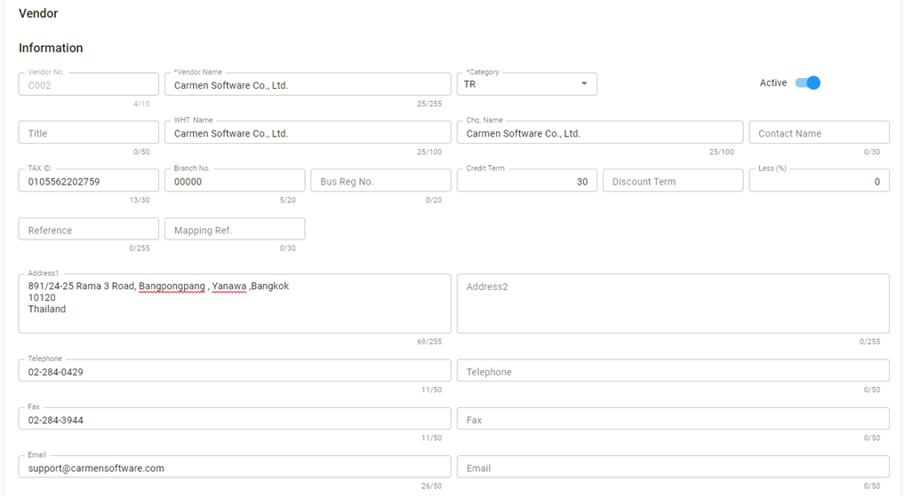
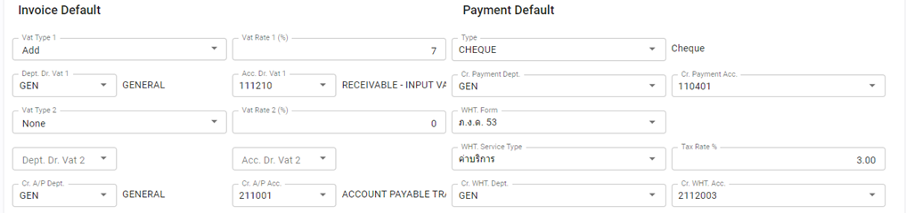
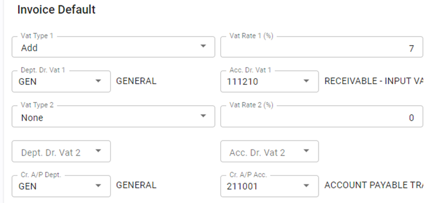
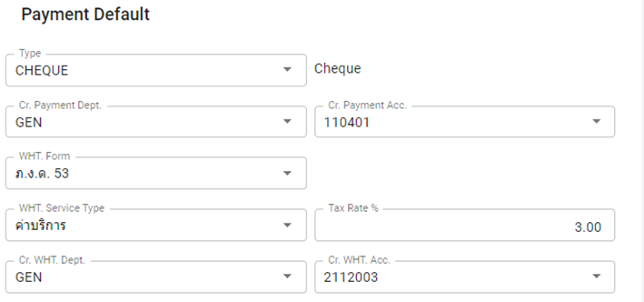
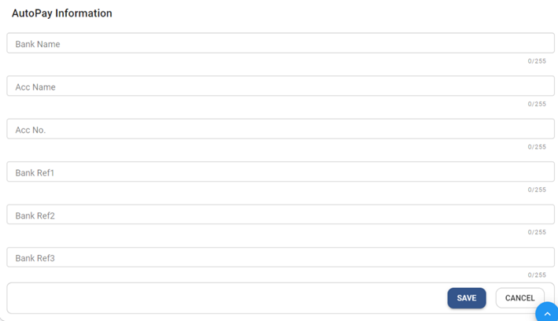

# Vendor

## การสร้าง Vendor

ขั้นตอนการสร้างข้อมูลร้านค้า หรือ ผู้ขายในระบบ (Create Vendor)

1. Click เข้าสู่ Account Payable Module

2. กดปุ่ม Vendor เพื่อเข้าใช้งานการสร้าง Vendor

3. กดปุ่ม Add เพื่อสร้าง รหัส Vendor

4. ให้ใส่ข้อมูลของร้านค้า หรือ ผู้ขายในระบบ (Vendor Profile) ดังต่อไปนี้

**หมายเหตุ** เครื่องหมาย \* คือช่องที่จำเป็นต้องระบุ

- \* Vendor No. กำหนดรหัสร้านค้า
- \* Vendor Name ระบุชื่อร้านค้า หรือ ชื่อผู้ขาย (สามารถระบุข้อมูลได้ทั้งภาษาไทยและภาษาอังกฤษ) ระบบจะใช้ในการแสดงข้อมูลบนระบบ แบบฟอร์มต่าง ๆ และรายงานภาษีซื้อ
- \* Vendor Category ระบุหมวดหมู่สินค้าสำหรับร้านค้า
  - Status Active เปิดใช้งาน
  - In-active ปิดไม่ให้ใช้งาน
- Tittle ระบุคำนำหน้าชื่อ กรณีในนามของบุคคลเช่น นาย นางสาว ยศ(ถ้ามี)
- WHT. Name ชื่อที่ใช้แสดงบนรายงาน หรือ แบบฟอร์ม Withholding Tax(ถ้ามี)
- Cheque. Name ชื่อที่ใช้ในการ print เช็คผ่านระบบ (ถ้ามี)
- Attn ระบุชื่อข้อมูล ของผู้ที่ติดต่อ หรือ บุคคลอ้างอิง (ถ้ามี)
- Tax ID ระบุหมายเลขประจำตัวผู้เสียภาษีอากร (13 หลัก)
- Branch No. ระบุรหัสสาขา (5 หลัก) เช่น 00000 (รหัสสาขาของสำนักงานใหญ่)
- Bus. Reg. No. ระบุหมายเลขจดทะเบียนการค้า
- Credit Term ระบุจำนวนวัน ที่ได้รับสินเชื่อจากร้านค้า หรือ ผู้ขาย
- Discount Term ระบุจำนวนวัน จะได้รับส่วนลด หากชำระหนี้ก่อนกำหนด
- Less (%) เปอร์เซ็นต์ที่ได้รับส่วนลด
- Reference ข้อมูลอ้างอิงเพิ่มเติม
- Mapping Ref. Additional field สำหรับ mapping เพิ่มเติม
- Address1 ระบุที่อยู่ของร้านค้า หรือ ผู้ขาย (ใช้เป็นที่อยู่หลักในการแสดงรายงาน)
- Telephone หมายเลขโทรศัพท์
- Fax หมายเลขแฟกซ์ (ถ้ามี)
- Email ระบุ Email ของร้านค้า หรือ ผู้ขาย
- Address2 ระบุที่อยู่ของร้านค้า หรือ ผู้ขาย (ถ้ามี)
- Telephone หมายเลขโทรศัพท์ (ถ้ามี)
- Fax หมายเลขแฟกซ์ (ถ้ามี)
- Email ระบุ Email ของร้านค้า หรือ ผู้ขาย (ถ้ามี)

## Invoice & Payment Default

## Invoice Default

ใช้สำหรับกำหนดค่าเบื้องต้น เพื่ออำนวยความสะดวก ในการสร้าง invoice และ บันทึกบัญชี โดยสามารถปรับแก้ไขได้อีกครั้ง ในขั้นตอนการสร้าง Invoice

การบันทึกข้อมูล Vat 1

- Vat Type 1 กำหนดวิธีการคำนวณภาษีมูลค่าเพิ่มในรายการสินค้า / บริการของร้านค้า
- Vat Rate 1 (%) ระบุเปอร์เซ็นต์ร้อยละของฐานภาษีมูลค่าเพิ่ม
- Dept. Dr. Vat 1 ระบุรหัสแผนกในส่วนของรหัสบัญชีภาษีซื้อ หากไม่สามารถระบุแผนกได้ ให้ใส่เป็น รหัส GEN แทน
- Acc. Dr. Vat 1 ระบุรหัสบัญชีภาษีซื้อ (Input Tax หรือ Input Tax Undue)

การบันทึกข้อมูล Vat 2

- Vat Type 2 กำหนดวิธีการคำนวณภาษีอื่น ๆ เช่น ภาษีที่เกี่ยวกับต่างประเทศ
- Vat Rate 2 (%) ระบุเปอร์เซ็นต์ร้อยละของฐานภาษีมูลค่าเพิ่ม
- Dept. Dr. Vat 2 ระบุรหัสแผนกสำหรับ Vat 2 หากไม่สามารถระบุแผนกได้ ให้ใส่เป็น รหัส GEN แทน
- Acc. Dr. Vat 2 ระบุรหัสบัญชีสำหรับ Vat 2

การบันทึกบัญชีเจ้าหนี้

- Cr. A/P Dept ระบุรหัสแผนกสำหรับเจ้าหนี้ หากไม่สามารถระบุแผนกได้ ให้ใส่เป็น รหัส GEN แทน
- Cr. A/P AC ระบุรหัสบัญชีสำหรับบันทึกเจ้าหนี้

Vat Type ในระบบ สามารถเลือกได้ 3 ประเภท ได้แก่

- None ไม่มีภาษีมูลค่าเพิ่มในราคาสินค้า หรือ บริการ
- Add บวกภาษีมูลค่าเพิ่ม ในราคาสินค้า หรือ บริการ
- Include มีภาษีมูลค่าเพิ่มรวมอยู่ในนราคาสินค้า หรือ บริการแล้ว

## Payment Default

ใช้สำหรับกำหนดค่าเบื้องต้น เพื่ออำนวยความสะดวก ในการสร้าง Payment และ บันทึกบัญชี โดยสามารถปรับแก้ไขได้อีกครั้ง ในขั้นตอนการสร้าง Payment

- Type ให้ระบุPayment Type ประเภทการจ่ายเงิน
- Cr. Payment Dept. ให้ระบุ Department Code ในการบันทึกบัญชีการจ่าย หากไม่สามารถระบุแผนกได้ ให้ใส่เป็น รหัส GEN แทน
- Cr. Payment Acc ให้ระบุ Account Code ในการบันทึกบัญชีการจ่าย
- WHT. Form กำหนดประเภท ภงด. ภาษีหัก ณ ที่จ่าย เช่น ภงด. 3/ ภงด. 53
- WHT. Service Type เลือกประเภทการหัก ณ ที่จ่าย
- Tax Rate % กำหนดสัดส่วนที่นำหักภาษี ให้ระบุเป็นปอร์เซ็นต์ (ระบบจะช่วยคำนวณมูลค่าของภาษีหัก ณ ที่จ่าย อัตโนมัติ)
- Cr. WHT. Dept ให้ระบุ Department Code ในการบันทึกบัญชีภาษีหัก ณ ที่จ่ายหากไม่สามารถระบุแผนกได้ ให้ใส่เป็น รหัส GEN แทน
- Cr. WHT Acc. ให้ระบุ Account Code ในการบันทึกบัญชีภาษีหัก ณ ที่จ่าย

## AutoPay Information

เป็นข้อมูลเกี่ยวกับ บัญชีธนาคาร ของ Vendor และใช้สำหรับการทำ bank interface

- Bank Name: ชื่อธนาคารของ Supplier
- Acc Name: ชื่อบัญชีธนาคารของ Supplier
- Acc No.: รหัสบัญชีนาคารของ Supplier
- Bank Ref1: ข้อมูลอ้างอิงเพิ่มเติม
- Bank Ref2: ข้อมูลอ้างอิงเพิ่มเติม
- Bank Ref3: ข้อมูลอ้างอิงเพิ่มเติม

5. กดปุ่ม **SAVE** เพื่อบันทึกข้อมูล

6. กด **OK** เพื่อเสร็จสิ้นขั้นตอน

    

7. เมนูคำสั่งอื่นที่เกี่ยวข้อง

 สร้าง Vendor  
 แก้ไข Vendor  
 การลบ Vendor (หากมีการใช้งานแล้วจะไม่สามารถลบได้)  
 พิมพ์ข้อมูล Vendor  

8. การใช้งานปุ่มอื่น ๆ บนหน้าจอ Vendor List

กดปุ่ม  เพื่อค้นหา Vendor  
กดปุ่ม  เพื่อ Export ข้อมูลออกจากระบบเป็น .csv  
กดปุ่ม  เพื่อพิมพ์ข้อมูล  
