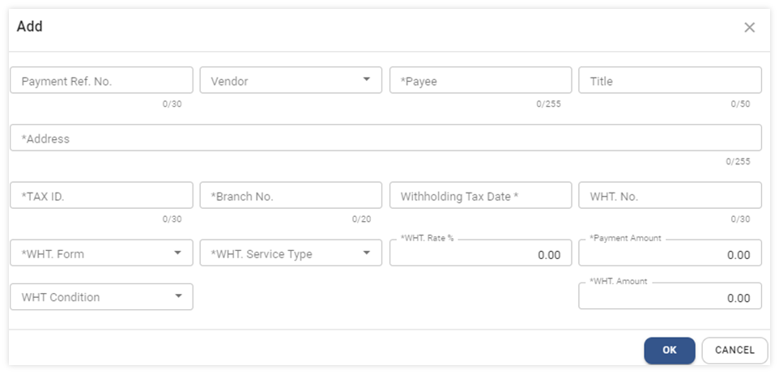

# Withholding Tax Reconciliation

ขั้นตอนการกระทบยอดหรือยันยันยอดภาษีหัก ณ ที่จ่าย

Function นี้ใช้สำหรับตรวจสอบรายการภาษีหัก ณ ที่จ่าย จากเอกสาร Payment และใช้ในกรณีที่ต้องการเพิ่มรายการภาษีหัก ณ ที่จ่าย ที่เกิดจากการซื้อด้วย Petty Cash (เงินสดย่อย) และการบันทึกจาก module อื่น ๆ ในระบบ สามารถนำมาบันทึกเพื่อนำส่ง และ ออกรายงานภาษีหัก ณ ที่จ่าย เป็นชุดเดียวกัน
Withholding Tax Reconciliation จะประกอบด้วย function การทำงาน 5 ส่วน

การตรวจสอบรายการภาษีหัก ณ ที่จ่าย (1-6)

B การบันทึกรายการภาษีหัก ณ ที่จ่ายจาก module อื่นๆ ในระบบ (7)

C การ Print แบบฟอร์มภาษีหัก ณ ที่จ่าย (8-12)

D การ Print ใบแนบภาษีหัก ณ ที่จ่ายประเภท 3 และ 53 (13-16)

E การ Export ข้อมูลภาษีหัก ณ ที่จ่าย เป็น text file เพื่อ upload เข้าระบบ RDPrep (17-22)

## การตรวจสอบรายการภาษีหัก ณ ที่จ่าย

จากระบบมีวิธี ดังต่อไปนี้ (1-6)

1. Click เข้าสู่ Account Payable Module

2. เลือกฟังก์ชัน Procedure ส่วนของ Withholding Tax Reconciliation

3. ไปที่เมนูคำสั่ง Withholding Tax Reconciliation

ระบบจะเข้าสู่หน้าจอ Withholding Tax Reconciliation

4. ให้ระบุ เดือน และปี ในช่อง Month และ Year เพื่อดูข้อมูลภาษีหัก ณ ที่จ่ายของเดือนและปีที่ต้องการ

5. ระบบจะนำรายการ ภาษีหัก ณ ที่จ่าย จากการทำ Payment มาแสดง ตามตัวอย่างจากภาพด้านล่าง
   หมายเหตุ \* รายการภาษีหัก ณ ที่จ่าย จะแสดงวันที่ ตาม Payment Date หรือ Cheque Date ขึ้นอยู่กับการตั้งค่า

6. ในระบบจะแบ่งข้อมูลออกเป็น 2 Source โดยแต่ละ Source จะมีที่มาและรายละเอียดดังนี้
   หมายเหตุ \* Source ใช้ในการระบุแหล่งที่มาของรายการภาษีหัก ณ ที่จ่าย แต่ละใบโดยแบ่งเป็น 2 ประเภทดังนี้

   6.1 Exported คือ รายการที่ Export มาจาก AP Payment ไม่สามารถลบรายการออกไปได้ แต่สามารถแก้ไขข้อมูลได้บางส่วน ได้แก่ Payee, Address, Tax ID, Branch No โดยวิธีการแก้ไข ดังนี้

   - กดปุ่ม  หน้ารายการที่ต้องการแก้ไข
   - ระบบจะแสดงหน้าต่าง ให้แก้ไขข้อมูลได้บางส่วน ได้แก่ Payee ,Address, Tax ID, Branch No
   - กดปุ่ม **OK** เพื่อบันทึกรายการ
   

    
   

   6.2 User คือ รายการที่ ผู้ใช้งาน ทำการเพิ่มเองในระบบ

## การบันทึกรายการภาษีหัก ณ ที่จ่ายจาก module อื่นๆ ในระบบ (7)

ใช้สำหรับการบันทึกรายการภาษีหัก ณ ที่จ่าย ที่เกิดจากการซื้อด้วย Petty Cash (เงินสดย่อย) และการบันทึกจาก module อื่น ๆ ในระบบ สามารถนำมาบันทึกเพื่อนำส่ง และ ออกรายงานภาษีหัก ณ ที่จ่าย เป็นชุดเดียวกัน

7. ขั้นตอนการบันทึกรายการภาษีหัก ณ ที่จ่ายเพิ่มเติมมีดังนี้

   7.1 กดปุ่ม + เพื่อเพิ่มรายการ
   

    
   

    7.2	ระบบจะแสดงหน้าต่างให้ระบุข้อมูล ดังต่อไปนี้

   **หมายเหตุ** เครื่องหมาย \* คือช่องที่จำเป็นต้องระบุ

   - Payment Ref. No เลขที่ Payment หรือเลขที่ถูกระบุด้วยตนเอง หรือเลขที่ที่เกิดจากระบบสร้างอัตโนมัติ
   - Vendor ระบุ Vendor Code (ใส่หรือไม่ใส่ก็ได้)
   - \* Payee ระบุชื่อ ที่จะใช้แสดงในรายงาน และ แบบฟอร์มภาษีหัก ณ ที่จ่าย
   - \* Address ระบุที่อยู่ที่จะใช้แสดงในรายงาน และ แบบฟอร์มภาษีหัก ณ ที่จ่าย
   - \* Tax ID ระบุหมายเลขประจำตัวผู้เสียภาษีอากร (13 หลัก) ของผู้ที่ถูกหัก
   - \* Branch No. ระบุรหัสสาขา (5 หลัก) เช่น 00000 (รหัสสาขาของสำนักงานใหญ่) ของผู้ที่ถูกหัก
   - \* Withholding Tax Date ระบุวันที่ หัก ณ ที่จ่าย
   - WHT. No ระบุเลขที่ หัก ณ ที่จ่าย โดยระบุจะคำนวณให้อัตโนมัติ
   - \* WHT. Form ระบุประเภท หัก ณ ที่จ่าย ว่าเป็น ภ.ง.ด. 3 หรือ ภ.ง.ด. 53
   - \* WHT Service Type ระบุประเภทค่าบริการที่ถูกหักภาษี ณ ที่จ่าย
   - \* WHT Rate % ระบุจำนวนร้อยละที่หัก (เปอร์เซ็นต์) (ระบบจะแสดง % ตามที่ตั้งค่าใน WHT Service Type)
   - WHT Condition ระบุเงื่อนไขในการหักภาษี
     - หัก ณ ที่จ่าย
     - ออกให้ตลอดไป
     - ออกให้ครั้งเดียว
   - \* Payment Amount ระบุจำนวนเงินที่จะนำมาคำนวณภาษี หัก ณ ที่จ่าย
   - \* WHT. Amount ระบบคำนวนให้อัตโนมัติ (ผู้ใช้งานสามารถคีย์ยอดที่หัก ได้เอง)

เมื่อใส่ข้อมูลครบถ้วน ถูกต้อง เรียบร้อยแล้ว กดที่ปุ่ม **OK** เพื่อบันทึกรายการ

## การ Print แบบฟอร์มภาษีหัก ณ ที่จ่าย (8-12)

ทำตามขั้นตอนที่ 1 – 4

9. ติ๊กถูก ☑️ รายการภาษีหัก ณ ที่จ่ายเพื่อกำหนดข้อมูลที่ต้องการ print

10. ปุ่ม Print Form  เพื่อแสดงแบบฟอร์มหนังสือรับรอง หัก ณ ที่จ่าย

11. จากนั้นสามารถเลือกว่าต้องการ print พร้อมสำเนาหรือไม่

12. กด **PRINT** เพื่อพิมพ์แบบฟอร์ม หรือ กด Cancel เพื่อยกเลิก

    

## ตัวอย่างแบบฟอร์มภาษีหัก ณ ที่จ่ายในระบบ

## การ Print ใบแนบภาษีหัก ณ ที่จ่ายประเภท 3 และ 53 (13-16)

13. ทำตามขั้นตอน 1 – 4

14. กดปุ่ม Print Report  เพื่อพิมพ์ใบแนบที่ต้องการ

15. สามารถเลือก ประเภทรายงาน ภ.ง.ด. 3 หรือ ภ.ง.ด. 53 เพื่อ print
16. กดปุ่ม **OK** เพื่อยืนยัน หรือ Cancel เพื่อยกเลิก

    

## ตัวอย่างใบแนบ ภ.ง.ด. 3

## ตัวอย่างใบแนบ ภ.ง.ด. 53

## การ Export ข้อมูลภาษีหัก ณ ที่จ่าย เป็น text file เพื่อ upload เข้าระบบ RDPrep (17-22)

17. ทำตามขั้นตอน 1 – 4

18. ติ๊กถูก ☑️ รายการภาษีหัก ณ ที่จ่ายเพื่อกำหนดข้อมูลที่ต้องการ export

19. กดปุ่ม  ที่อยู่ด้านบนขวา

20. เพื่อ export text file โดย  สามารถดูได้ที่ function Download ของ Browser ที่ใช้งาน

21. ระบบจะทำการ Export ไฟล์ข้อมูล เมื่อเรียบร้อยแล้วจะจัดเก็บอยู่ที่ Folder Download (folder อาจเก็บที่อื่นตามการตั้งค่าของ Browser ที่ใช้งาน และ User สามารถย้ายไฟล์ไปเก็บไว้ที่ Drive ที่ต้องการได้ในภายหลัง)

22. นำไฟล์ที่ได้ไปอัพโหลดเข้าสู่โปรแกรมโอนย้ายข้อมูล (RDPrep) ของสรรพกร

23. เมื่อเสร็จสิ้นกระบวนการให้กดปุ่มกากบาท X ด้านบนขวามือเพื่อออกจากหน้า Withholding Tax Reconciliation

**หมายเหตุ :**

รายการที่เพิ่มเข้ามาจากฟังก์ชันนี้ เพื่อให้แสดงรายการใน แบบฟอร์ม รายงานภาษี หัก ณ ที่จ่ายเท่านั้น ไม่มีส่วนที่เกี่ยวข้องกับ Payment ในระบบ และไม่เกี่ยวข้องกับการบันทึกบัญชีใน General Ledger Module
