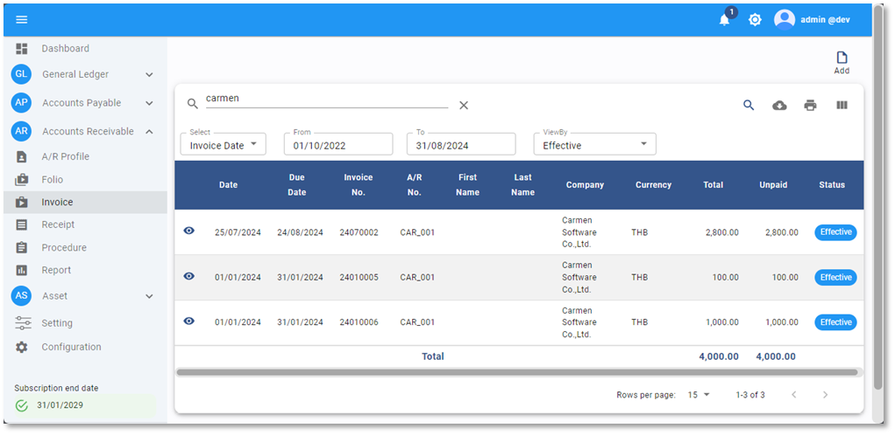

# Apply AR Contract

Function นี้ใช้สำหรับ Apply Contract ให้ระบบทำการสร้างใบแจ้งหนี้ (Invoice) ตามรอบการแจ้งหนี้โดยอัตโนมัติ

## การ Apply Contract เพื่อสร้าง Invoice อัตโนมัติ

1. Click เข้าสู่ Account Receivable Module

2. เลือก Procedure

3. ในหัวข้อ Apply Contract กดปุ่ม 

4. ระบบจะแสดงหน้า AR Contract List ให้ดำเนินการดังต่อไปนี้

4.1. ไปที่ช่อง From แล้วเลือกวันที่ที่ต้องการ Apply A/R Contract ระบบจะแสดงรายการ contract ที่ effective ณ วันที่เลือก

4.2. เลือกรายการที่ต้องการสร้าง Invoice

4.3. กด APPLY CONTRACT

5. หากเคยมีการ APPLY CONTRACT มาแล้วและระบบได้สร้าง Invoice ขึ้นมาแล้ว ระบบจะแจ้งให้ทราบว่าได้เคยมีการ Applied มาก่อนแล้ว หากต้องการให้ระบบลบ Invoice ใบเดิมและสร้างรายการใหม่ขึ้นมาให้ทำการกด **OK**

6.	กด **OK** เพื่อเสร็จสิ้นขั้นตอน

    

7.	ระบบจะแสดงหน้าต่างแสดงรายการ พร้อมหมายเลข Invoice ที่สร้างขึ้นจากการ Apply Contract

8.	กรณีที่ต้องการพิมพ์ใบแจ้งหนี้ ให้กดปุ่ม  ด้านบน  ระบบจะ Print Invoice ออกมา 2 หน้า หน้าแรกคือ ต้นฉบับ และหน้าที่ 2 คือ สำเนา

9.	กด X เพื่อ ปิดหน้าต่าง

