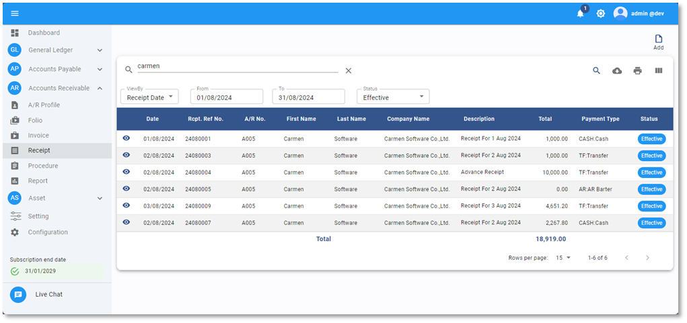
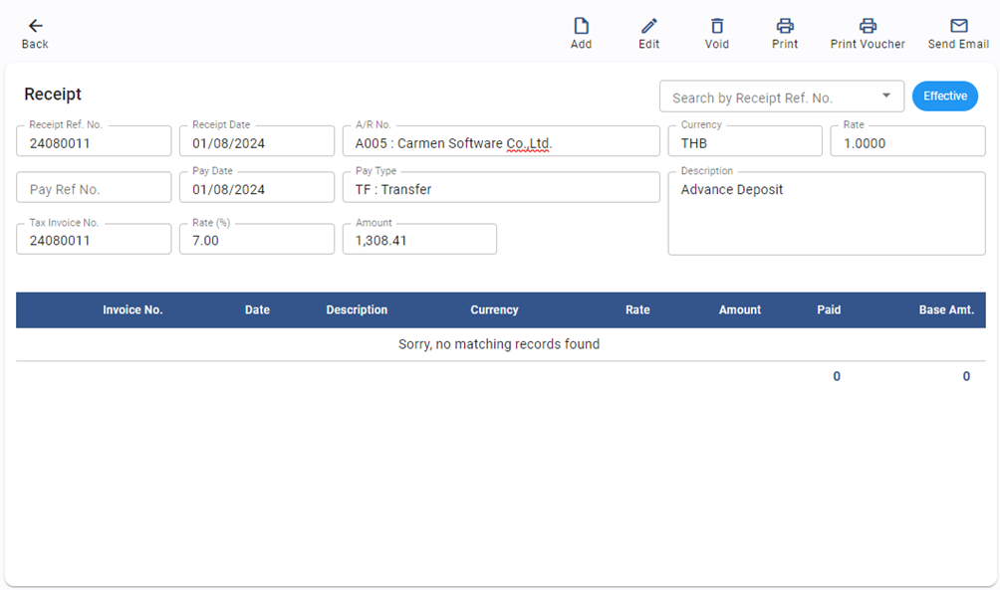
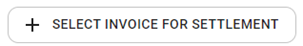
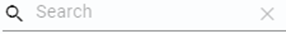
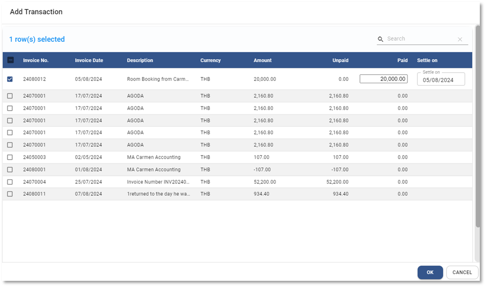
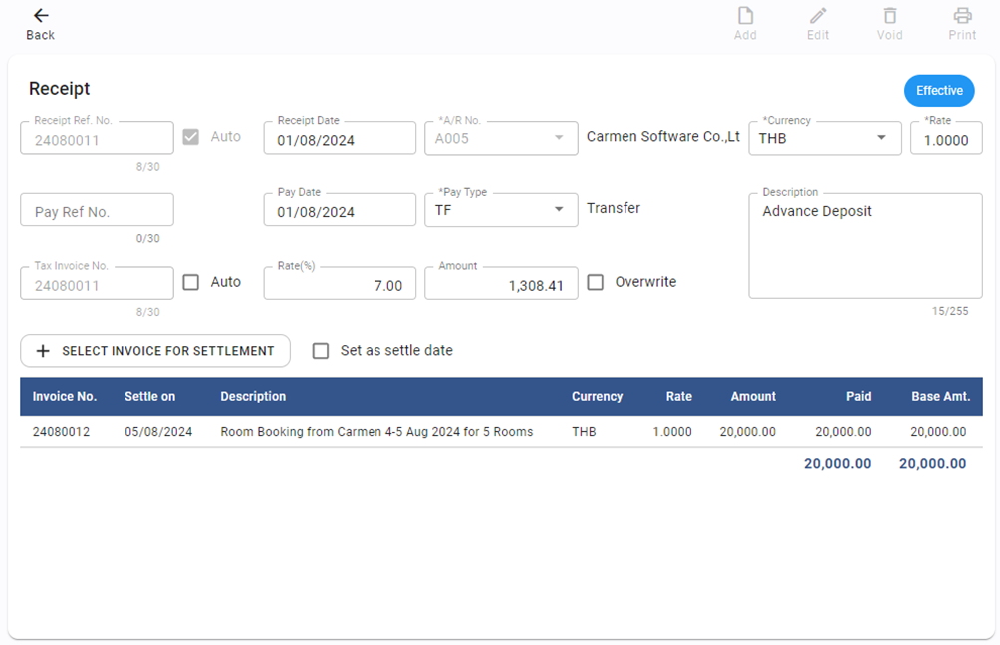
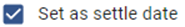
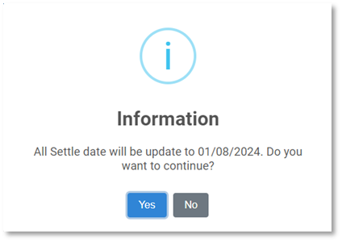
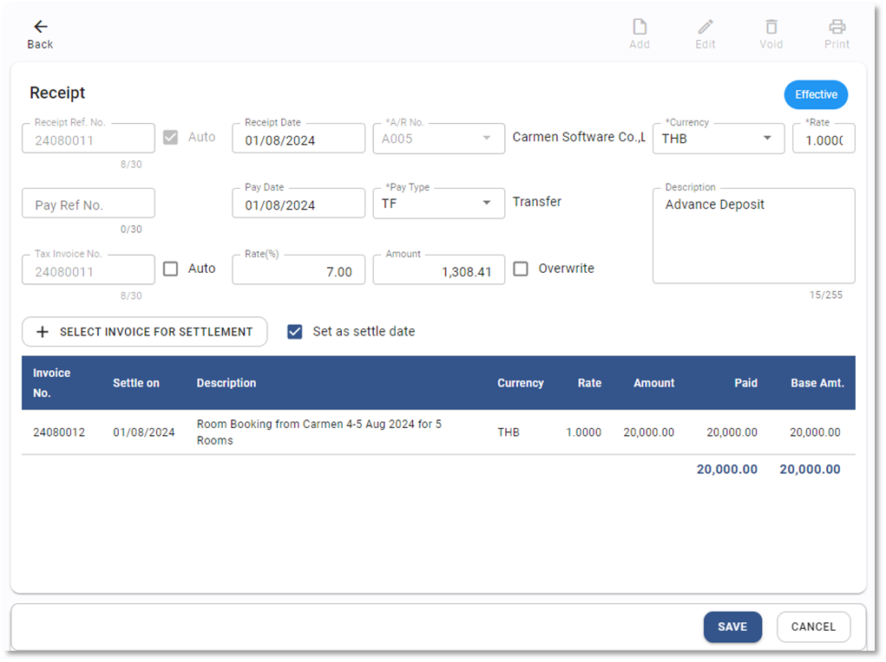

# Apply Invoice for Advance Deposit

Function นี้ใช้สำหรับการนำใบแจ้งหนี้มาลดยอดเงินมัดจำ Advance Deposit

## การนำ Invoice มาลดยอดเงินมัดจำ Advance Deposit

1. Click เข้าสู่ Account Receivable Module

2. เลือกฟังก์ชัน Receipt ระบบจะแสดงหน้าจอ ตามภาพด้านล่าง

3. และเลือกใบเสร็จรับเงิน หรือ เงินมัดจำขึ้นมา

4. กดปุ่ม  เพื่อแก้ไข

5. ขั้นตอนการเลือก Invoice โดยกดปุ่ม  SELECT INVOICE FOR SETTLEMENT

6. ระบบจะแสดงหน้าต่างให้เลือกรายการ Invoice ที่จะรับชำระ โดยทำตามขั้นตอนดังต่อไปนี้

- ติ๊กเครื่องหมายถูก ☑️ หน้า Invoice ที่จะรับชำระ
- ตรวจสอบยอดที่จะรับชำระที่ช่อง Paid กรณีต้องการชำระบางส่วน ให้คีย์ยอดลงไปที่ช่องนี้
- Settle on ใช้กำหนดวันที่ต้องการตัดยอดลูกหนี้ (Aging)
- เมื่อเลือกครบแล้วให้กดปุ่ม **OK** ด้านล่าง หรือกด Cancel เพื่อยกเลิก
- สามารถค้นหาเลข invoice ที่ต้องการได้ในช่อง Search 
- หากต้องการเลือก invoice ทุกใบสามารถกดถูกที่หัว column 

- ระบบจะดึงรายการไปแสดงในหน้าจอหลัก

7. ให้ติ๊กถูก  เพื่อกำหนดวันตัด aging ให้เป็นวันเดียวกันกับ Receipt Date

8. จากนั้นระบบ จะแสดงข้อความให้ยืนยันการปรับวันที่ให้ตอบ Yes เพื่อยืนยัน

    

9. ระบบจะแสดงวันที่ Settle on เป็นวันเดียวกันกับ Receipt Date

10. เมื่อเสร็จแล้วให้กดปุ่ม **SAVE**

11. กด **OK** เพื่อเสร็จสิ้นขั้นตอน

    

