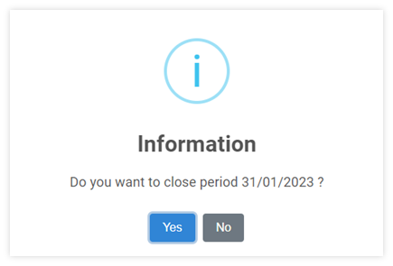

# Close Period For Account Receivable Module

## การปิดรอบบัญชี

เมื่อเสร็จสิ้นการทำงานในแต่ละรอบบัญชี ผู้ใช้งานได้มีการตรวจสอบข้อมูลเรียบร้อยแล้ว เพื่อป้องกันการแก้ไขข้อมูลในระบบ ให้ดำเนินการปิดรอบบัญชี (Close Period) โดยมีขั้นตอนดำเนินการในระบบ ดังต่อไปนี้

1. คลิกเข้าสู่ Account Receivable Module

2. เข้าฟังก์ชัน Procedure

3. กดปุ่ม Close Period

4. ระบบจะแสดงหน้าต่างให้ยืนยันการปิด Period

    

- กด “Yes” เพื่อยืนยัน
- กด “No” เพื่อยกเลิก

5. เมื่อระบบดำเนินการเรียบร้อยแล้วจะแสดงหน้าต่าง ดังภาพด้านล่าง กด **OK** เพื่อปิดหน้าต่าง

    

**หมายเหตุ**

1. การปิดรอบบัญชีในแต่ละ Module จะทำให้ไม่สามารถ เพิ่มเติม หรือแก้ไขข้อมูลในเดือนที่ปิดไปแล้วได้อีก ดังนั้นทุกครั้งก่อนการ Close Period โปรดตรวจสอบห้แน่ใจว่า ข้อมูลถูกต้องและครบถ้วนเรียบร้อยแล้ว

2. การปิดบัญชีนี้เป็นการปิดรอบบัญชีในส่วนของ Account Receivable Module เท่านั้น ในส่วนของ General Ledger ยังสามารถดึงข้อมูลจากระบบ AR เพื่อบันทึก JV ได้ปกติ (ใน General Ledger ยังไม่ถูก Close Period)

3. หากต้องการเปิด Period ให้ FC, Account Manger หรือผู้มีอำนาจส่ง E-Mail ถึง Support เพื่อทำการขอเปิด Period
