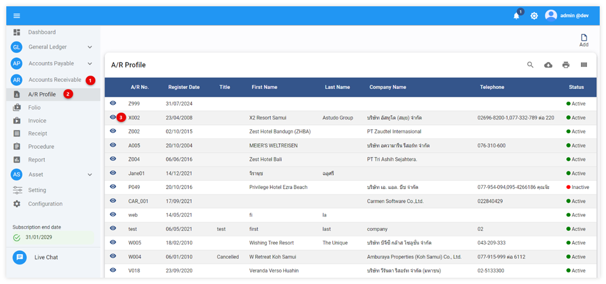
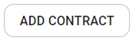
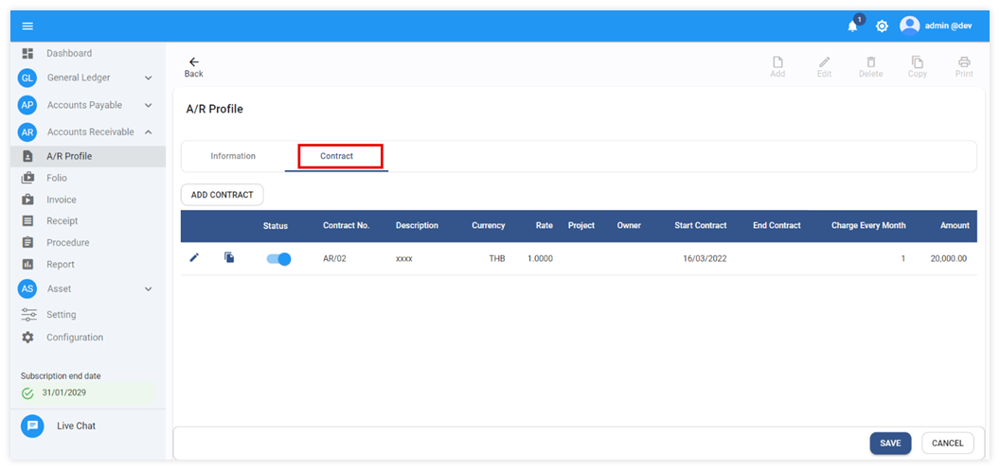
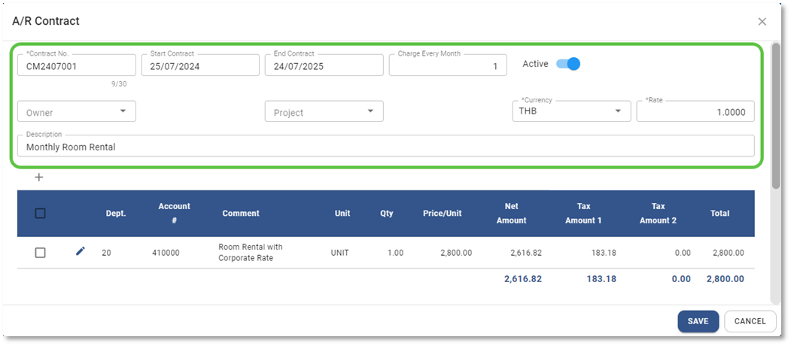
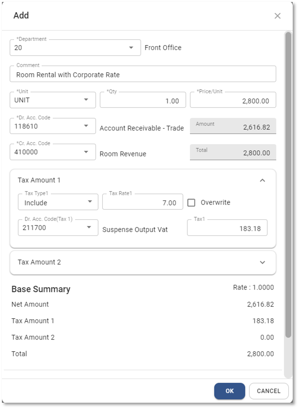
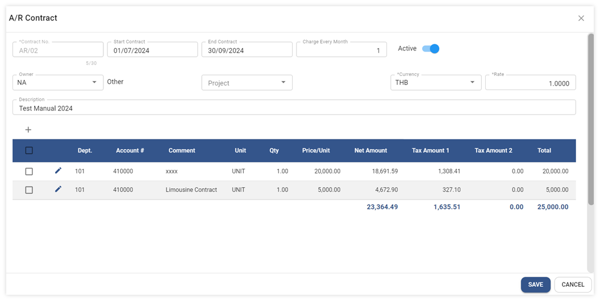
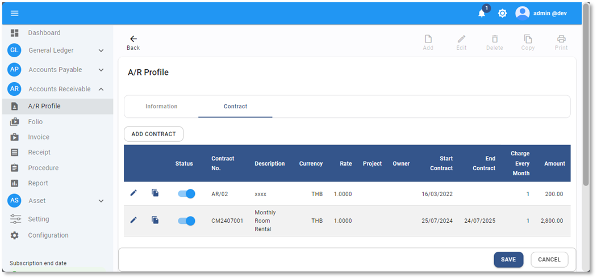

# A/R Contract

Function นี้ใช้สำหรับ บันทึกสัญญาขายที่ได้ทำไว้กับลูกหนี้ โดยใช้กับสัญญาที่มีการเรียกเก็บอย่างต่อเนื่องเช่นทุก 1 เดือน, ทุกไตรมาศ หรือทุกปี และสามารถ apply ให้ระบบทำการสร้างใบแจ้งหนี้ (Invoice) ตามรอบแจ้งหนี้โดยอัตโนมัติ

## ขั้นตอนการสร้าง A/R Contract

1. Click เข้าสู่ Account Receivable Module

2. กดปุ่ม Profile ระบบจะแสดงหน้า A/R profile list

3. เลือก A/R Profile ที่ต้องการสร้าง Contract กดปุ่ม  จะเข้าสู่หน้า A/R Profile ของลูกหนี้

4. เมื่อเข้าสู่หน้า A/R Profile ให้ Click เลือก Tab Contract และให้กดปุ่ม  ด้านบนขวามือ

5. หลังจากเข้าสู่หน้าจอ CONTRACT ให้ Click ที่สัญลักษณ์  เพื่อสร้างเอกสาร Contract

5.1. ระบุข้อมูลในส่วนของ Contract Header ดังต่อไปนี้

**หมายเหตุ** เครื่องหมาย \*
(สัญลักษณ์ \* ช่องที่จำเป็นต้องระบุ)

- \* Contract No กำหนดหมายเลข Contract
- Start Date กำหนดวันที่แรกที่จะให้ระบบออก A/R Invoice
- End Date กำหนดวันที่สุดท้ายที่จะให้ระบบออก A/R Invoice (สามารถปล่อยว่างเอาไว้ได้
  หากไม่มีวันสิ้นสุด)
- \* Currency สกุลเงิน
- \* Rate อัตราแลกเปลี่ยนเงินตรา
- Status Active เปิดใช้งาน, In-active ปิดไม่ให้ใช้งาน
- Charge Every Month กำหนดว่าต้องการให้ระบบออก Invoice ทุกๆ กี่เดือน
- Description ระบุรายละเอียดที่จะให้แสดงใน A/R Invoice

5.2. กดปุ่ม เพื่อเพิ่มข้อมูลในส่วนของ Invoice Detail ระบบจะแสดงหน้าต่างขึ้นนมาให้ระบุข้อมูลดังต่อไปนี้

- \* Department กำหนด Department Code ที่จะใช้ในการบันทึกบัญชีที่ GL
- Comment ใส่รายละเอียดรายการสินค้า หรือ บริการ
- \* Unit ระบุหน่วย
- \* Qty. ระบุจำนวน
- \* Price/Unit ระบุราคาต่อหน่วย
- \* Dr Acc Code กำหนดรหัสบัญชีที่จะบันทึกบัญชีด้าน Dr. เช่น รหัสบัญชีลูกหนี้
- \* Cr Acc. Code กำหนดรหัสบัญชีที่จะบันทึกบัญชีด้าน Cr. เช่นรหัสบัญชีรายได้

**Tax Amount 1**

- \*Tax Type 1 กำหนดประเภทภาษีมูลค่าเพิ่ม ได้แก่
  - None ไม่มีภาษีมูลค่าเพิ่มในราคาสินค้า หรือ บริการ
  - Add บวกภาษีมูลค่าเพิ่ม ในราคาสินค้า หรือ บริการ
  - Include มีภาษีมูลค่าเพิ่มรวมอยู่ในราคาสินค้า หรือ บริการแล้ว
- Tax Rate 1 ระบุเปอร์เซ็นต์ร้อยละของฐานภาษีมูลค่าเพิ่ม
- Dr. Acc. Code (Tax 1) ระบุรหัสบัญชีสำหรับการบันทึกบัญชีภาษีมูลค่าเพิ่ม
- Overwrite ใช้ในกรณีต้องการแก้ไข ภาษีมูลค่าเพิ่ม ให้ติ๊กเครื่องหมายถูกที่ช่องนี้

\*\*\* กรณีที่ติ๊กเครื่องหมายถูกที่ช่อง Overwrite ให้พิมพ์ ยอดภาษีที่ช่อง Tax Amount 1

**Tax Amount 2**

จะเป็นภาษีที่เกี่ยวกับต่างประเทศ และมีขั้นตอนการกรอกข้อมูลเหมือน Tax Amount 1

5.3. ตรวจสอบความถูกต้อง เมื่อ เรียบร้อยแล้วกดปุ่ม **OK** หรือกดปุ่ม Cancel เพื่อยกเลิก
หากมีรายละเอียดมากกว่า 1 รายการ ให้ทำตามขั้นตอน 5.1 ถึง 5.3 ซ้ำอีกครั้ง

6. เมื่อบันทึกรายละเอียดของ Contract ครบแล้วแล้วกดปุ่ม **SAVE** ด้านล่างขวามือ

7. ระบบจะแสดงข้อมูล A/R contract ที่เพิ่มขึ้นมาในหน้า A/R Profile

8. ตรวจสอบข้อมูลเรียบร้อยแล้ว ให้กดปุ่ม **SAVE** ด้านล่างขวามืออีกครั้งเพื่อบันทึกข้อมูลลูกหนี้

9. เมื่อบันทึกเสร็จแล้วระบบจะแสดงข้อความ “Success” ให้กดปุ่ม **OK** เพื่อเสร็จสิ้น

    

