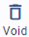

# Invoice

ขั้นตอนการสร้างใบแจ้งหนี้ (invoice)
Function นี้ใช้สำหรับการสร้างใบแจ้งหนี้ในระบบ
การสร้าง A/R Invoice สามารถสร้างได้ 3 วิธี ดังต่อไปนี้

## การสร้าง AR Invoice ด้วยตนเอง

1.1 Click เข้าสู่ Account Receivable Module

1.2 เลือกเมนู Invoice จะเข้าสู่หน้า A/R Invoice

1.3 กดปุ่ม  ระบบจะแสดงหน้า A/R Invoice

1.4 ให้ผู้ใช้งานระบุข้อมูลของ A/R Invoice Header ดังต่อไปนี้

**หมายเหตุ** เครื่องหมาย \*
(สัญลักษณ์ \* ช่องที่จำเป็นต้องระบุ)

- \* Invoice No > กำหนดเลขที่ Invoice No. โดยในระบบสามารถเลือกใช้งานได้ 2 แบบ คือ
  - ให้ระบบกำหนดให้อัตโนมัติ โดยการติ๊กเครื่องหมายถูกที่ช่อง
  - ผู้ใช้กำหนดเอง โดยติ๊กเอาเครื่องหมายติ๊กถูกที่ช่อง ออก และพิมพ์เลขที่ Invoice ในช่อง Invoice No. ด้วยตนเอง
- \* A/R No > กำหนดรหัสลูกหนี้ที่ต้องการตั้งหนี้
- \* Currency > กำหนดสกุลเงิน
- \* Rate > อัตราแลกเปลี่ยนเงินตรา
- Prefix > รหัสเอกสารใช้ในกรณีที่ต้องการออกใบกำกับภาษีขาย
- Tax Invoice No > ระบบจะสร้างให้อัตโนมัติหากเลือก Tax Status เป็น Output Vat
- Tax Status > สามารถเลือกได้ 2 แบบ
  - None > ไม่ออกใบกำกับภาษีขายบน Invoice
  - Output Vat > ออกใบกำกับภาษีขายบน Invoice โดยจะใช้สำหรับการขายสินค้าเท่านั้น
    สำหรับการขายประเภทบริการ จะต้องออกใบกำกับภาษีบนใบเสร็จรับเงิน (Receipt) เท่านั้น
- \* Date > กำหนดวันที่ใบแจ้งหนี้
- \* Due Date > กำหนดวันที่ครบกำหนดชำระ (ระบบจะคำนวณให้อัตโนมัติโดยอ้างอิงจาก Credit Term ที่ตั้งค่าเอาไว้ใน A/R Profile)
- Description > ระบุรายละเอียดของใบแจ้งหนี้ (Invoice)

1.5 กดปุ่ม + เพื่อเพิ่มข้อมูลในส่วนของ Invoice Detail ระบบจะแสดงหน้าต่างขึ้นมาให้ระบุข้อมูลดังต่อไปนี้

- \* Department > กำหนด Department Code ที่จะใช้ในการบันทึกบัญชีที่ GL
- Comment > ใส่รายละเอียดรายการสินค้า หรือ บริการ
- Reference > ใส่รายละเอียดเพิ่มเติม
- Group No > ใช้ในกรณีที่มี Invoice Detail หลายรายการ แต่เมื่อพิมพ์ใบแจ้งหนี้ต้องการให้
  - แสดงรายละเอียดเฉพาะรายการแรกและ Group Summary Amount รวมกัน
- Date > วันที่ ที่ทำรายการ เช่น Folio Date, Bill Date
- \* Unit > ระบุหน่วย
- \* Qty. > ระบุจำนวน
- \* Price/Unit > ระบุราคาต่อหน่วย
- \* Dr Acc Code > กำหนดรหัสบัญชีที่จะบันทึกบัญชีด้าน Dr. เช่น รหัสบัญชีลูกหนี้
- \* Cr Acc. Code > กำหนดรหัสบัญชีที่จะบันทึกบัญชีด้าน Cr. เช่นรหัสบัญชีรายได้

**Tax Amount 1**

\*Tax Type 1 > กำหนดประเภทภาษีมูลค่าเพิ่ม ได้แก่

1. None ไม่มีภาษีมูลค่าเพิ่มในราคาสินค้า หรือ บริการ

2. Add บวกภาษีมูลค่าเพิ่ม ในราคาสินค้า หรือ บริการ

3. Include มีภาษีมูลค่าเพิ่มรวมอยู่ในราคาสินค้า หรือ บริการแล้ว

Tax Rate 1 > ระบุเปอร์เซ็นต์ร้อยละของฐานภาษีมูลค่าเพิ่ม

Dr. Acc. Code (Tax 1) > ระบุรหัสบัญชีสำหรับการบันทึกบัญชีภาษีมูลค่าเพิ่ม

Overwrite > ใช้ในกรณีต้องการแก้ไข ภาษีมูลค่าเพิ่ม ให้ติ๊กเครื่องหมายถูกที่ช่องนี้

**Tax Amount 2**

เป็นการบันทึกภาษีที่เกี่ยวกับต่างประเทศ การกรอกข้อมูลเหมือนกันกับ Tax Amount 1

1.6 เมื่อทำการเพิ่มข้อมูลเรียบร้อยแล้วให้ กดปุ่ม **OK** ด้านล่าง หรือกดปุ่ม Cancel เพื่อยกเลิก

1.7 หากมีมากกว่า 1 รายการ ให้ทำตามขั้นตอน ข้อที่ 1.5-1.6 ซ้ำอีกครั้ง จนครบรายการ

1.8 ตรวจสอบข้อมูลเรียบร้อยแล้ว ให้กดปุ่ม **SAVE** ด้านล่างขวามือเพื่อบันทึกข้อมูลใบแจ้งหนี้ หรือกด Cancel เพื่อยกเลิก

1.9 เมื่อระบบทำการบันทึกข้อมูลเรียบร้อยแล้ว จะขึ้นหน้าต่างแสดงข้อความ Success ให้กดปุ่ม **OK**

    
    ภาพตัวอย่าง A/R Invoice หลังจาก Save ข้อมูล

## การสร้าง A/R Invoice โดยการ Copy

Function นี้ใช้ในกรณีที่ต้องการคัดลอก A/R Invoice ที่เคยมีอยู่ในระบบ มาสร้างเป็น Invoice จะช่วยให้ผู้ใช้ ทำงานสะดวกและรวดเร็วมากขึ้น โดยในระบบมีวิธีการดังต่อไปนี้

2.1 Click ที่เมนู Accounts Receivable

2.2 Click ที่ Invoice

2.3 Click ที่ A/R Invoice ที่ต้องการจะคัดลอก

2.4 กดปุ่ม  ด้านบนขวามือ

2.5 ระบบจะทำการคัดลอกใบแจ้งหนี้เดิม และสร้างเป็นเอกสารใหม่เพื่อให้ทำการแก้ไขข้อมูล ทั้งนี้ผู้ใช้งานสามารถแก้ไขข้อมูลได้ตามต้องการ หลังจากแก้ไขข้อมูลสำเร็จแล้วให้กด **SAVE** เอกสาร เพียงเท่านี้ก็จะได้ A/R Invoice ใบใหม่ หรือ Cancel เพื่อยกเลิก

2.6 เมื่อระบบทำการบันทึกข้อมูลเรียบร้อยแล้ว จะขึ้นหน้าต่างแสดงข้อความ Success ให้กดปุ่ม **OK**

    

## การสร้าง A/R Invoice จาก Folio

เป็นการสร้างใบแจ้งหนี้ (Invoice) โดยอ้างอิงข้อมูลจาก PMS Interface เพื่อรับรู้ข้อมูลลง AR Aging เท่านั้น ดังนั้นใบแจ้งหนี้ที่บันทึกด้วยรายละเอียดของ Folio จะไม่มีการบันทึกบัญชีลงใน GL อีก เนื่องจากลูกหนี้ City Ledger หรือ Credit Card ได้ทำการบันทึกบัญชีในขั้นตอน interface กับ GL เรียบร้อยแล้ว

**ขั้นตอนการตั้ง A/R invoice (Select from Folio)**

3.1 Click เข้าสู่ Account Receivable Module

3.2 เลือกฟังก์ชัน Invoice จะเข้าสู่หน้า A/R Invoice list

3.3 กดปุ่ม  ระบบจะแสดงหน้า A/R Invoice

3.4 ให้ผู้ใช้งาน ระบุข้อมูลของ A/R Invoice Header ดังต่อไปนี้ (\* ช่องที่จำเป็นต้องระบุ)

- \* Invoice No > กำหนดเลขที่ Invoice No. โดยในระบบสามารถเลือกใช้งานได้ 2 แบบ คือ
  - ให้ระบบกำหนดให้อัตโนมัติ โดยการติ๊กเครื่องหมายถูกที่ช่อง
  - ผู้ใช้กำหนดเอง โดยติ๊กเอาเครื่องหมายติ๊กถูกที่ช่อง ออก และพิมพ์เลขที่ Invoice ในช่อง Invoice No. ด้วยตนเอง
- \* A/R No > กำหนดรหัสลูกหนี้ที่ต้องการตั้งหนี้
- \* Currency > กำหนดสกุลเงิน
- \* Rate > อัตราแลกเปลี่ยนเงินตรา
- Prefix > รหัสเอกสารใช้ในกรณีที่ต้องการออกใบกำกับภาษีขาย
- Tax Invoice No > ระบบจะสร้างให้อัตโนมัติหากเลือก Tax Status เป็น Output Vat
- Tax Status > สามารถเลือกได้ 2 แบบ
  - None > ไม่ออกใบกำกับภาษีขายบน Invoice
  - Output Vat > ออกใบกำกับภาษีขายบน Invoice โดยจะใช้สำหรับการขายสินค้าเท่านั้น
    สำหรับการขายประเภทบริการ จะต้องออกใบกำกับภาษีบนใบเสร็จรับเงิน (Receipt) เท่านั้น
- \* Date > กำหนดวันที่ใบแจ้งหนี้
- \* Due Date > กำหนดวันที่ครบกำหนดชำระ (ระบบจะคำนวณให้อัตโนมัติโดยอ้างอิงจาก Credit Term ที่ตั้งค่าเอาไว้ใน A/R Profile)
- Description > ระบุรายละเอียดของใบแจ้งหนี้ (Invoice)

3.5 เพิ่มรายละเอียดโดยกดกดปุ่ม 

3.6 ระบบจะแสดงหน้าต่าง A/R Folio list

3.7 ให้ติ๊กเครื่องหมายถูก ☑️ หน้ารายการ Folio ที่ต้องการ นํามาตั้ง Invoice

3.8 เมื่อเลือกรายการครบถ้วน ตามที่ต้องการแล้วให้ กดปุ่ม **OK**

3.9 ระบบจะดึงข้อมูลมาแสดงใน Invoice Detail หากตรวจสอบข้อมูลว่าถูกต้องแล้วให้กดปุ่ม **SAVE** ด้านล่างขวามือเพื่อบันทึกใบแจ้งหนี้ (Invoice)

3.10 กรณีต้องการแก้ไขข้อมูล

3.11 ให้กดปุ่ม  ด้านหน้ารายการ ระบบจะแสดงหน้าต่างให้แก้ไขข้อมูล

3.12 แก้ไขแล้วกดปุ่ม **OK**

    

3.13 เรียบร้อยแล้วให้กดปุ่ม **SAVE** ด้านล่างขวามือเพื่อบันทึกใบแจ้งหนี้ (Invoice)

3.14 เมื่อระบบทำการบันทึกข้อมูลเรียบร้อยแล้ว จะขึ้นหน้าต่างแสดงข้อความ Success ให้กดปุ่ม **OK**

    

## การสร้างใบลดหนี้ CN

4. การสร้างใบลดหนี้

4.1 ทำการสร้าง Invoice และ บันทึกข้อมูล Debit และ Credit เหมือนกับการสร้าง Invoice ปกติ

4.2 กรอกตัวเลขเป็นติดลบ

    

4.3 และทำการบันทึก Invoice ตามปกติ

เมนูคำสั่งอื่นๆ ที่เกี่ยวข้อง

 สร้างใบแจ้งหนี้ใหม่

 แก้ไขใบแจ้งหนี้ (เมื่อยังไม่ approve หรือ รับชำระแล้ว หรือ ยกเลิกแล้ว หรืออยู่ใน period ที่ปิดไปแล้ว)

 การยกเลิกใบแจ้งหนี้ (เมื่อยังไม่ approve หรือ รับชำระแล้ว หรืออยู่ใน period ที่ปิดไปแล้ว)

 การคัดลอกใบแจ้งหนี้

 การพิมพ์ใบแจ้งหนี้

 การพิมพ์เอกสารบันทึกบัญชีใบแจ้งหนี้

 การตรวจสอบเอกสารชำระเงินที่ได้รับชำระเงินจากใบแจ้งหนี้ใบที่เปิดอยู่

 การส่งใบแจ้งหนี้ไปยังลูกหนี้ในช่องทาง Email (ต้องมีการตั้งค่าก่อนเริ่มใช้งาน)

**ตัวอย่าง A/R Voucher**

