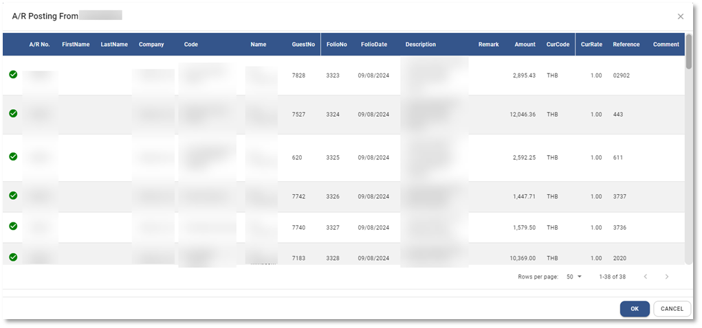

# AR Posting from PMS (PMS Interface)

Function นี้ใช้สำหรับการ post ข้อมูล City Ledger และ Credit Card จากระบบ PMS แบบ API
การ Post หรือ Interface ข้อมูลจาก PMS แบบ API

## ขั้นตอนการ post ข้อมูลจากระบบ PMS มีดังนี้

1. Click เข้าสู่ **Account Receivable Module**

2. เลือกเมนู Procedure และระบบจะแสดงหน้าจอทางขวามือ

3. กดปุ่ม  เพื่อทำการ post ข้อมูลจากระบบ PMS (รายละเอียดจะแตกต่างกันไปขึ้นอยู่กับระบบที่ลูกค้าใช้งานอยู่)

4. ระบบจะแสดงหน้าต่างให้กำหนดข้อมูลเพื่อ Post ข้อมูล

5. ระบบจะแสดงข้อมูลให้เลือกดังนี้

- From กำหนดวันที่เริ่มต้นที่ต้องการ post ข้อมูล
- To กำหนดวันที่สิ้นสุดที่ต้องการ post ข้อมูล
  Select Balance Account กำหนดข้อมูลในการบันทึกบัญชี
- Department กำหนดแผนก
- Dr. Acc. Code กำหนดบัญชีด้าน Debit เพื่อบันทึกบัญชีในใบแจ้งหนี้ Invoice
- Cr. Acc. Code กำหนดบัญชีด้าน Credit เพื่อบันทึกบัญชีในใบแจ้งหนี้ Invoice
- Tax กำหนดบัญชีภาษีขายเพื่อบันทึกบัญชีในใบแจ้งหนี้ Invoice
- Tax Type วิธีการคำนวณภาษีขาย
  - Add = ราคายังไม่รวมภาษีขาย
  - Include = ราคารวมภาษีขาย
  - None = ไม่มีภาษีขาย
- Tax Rate กำหนด % ของภาษีขาย
- Mapping Code กดปุ่มนี้เพื่อทำการแก้ไขการ mapping ข้อมูล Guest / Credit Card กับ AR Profile

6. กด **POST** เพื่อยืนยันการ post ข้อมูลจากระบบ PMS

## การ Mapping รหัสลูกหนี้ ระหว่าง Carmen และ PMS

7. ในกรณีที่ยังไม่เคยทำการ mapping ข้อมูล Guest / Credit Card ของระบบ PMS กับ AR Profile ระบบจะแจ้งข้อความ “Incomplete Data” ให้กด **OK** เพื่อเปิดหน้าต่าง Mapping

ขั้นตอนการ mapping สามารถทำได้ 2 วิธี

7.1 Mapping ในระบบ

7.1.1 กดปุ่ม  หน้ารหัส หรือชื่อของ Guest / Credit Card

7.1.2 ระบบจะแสดงหน้าต่างให้เลือกรหัส AR Profile

7.1.3 จากนั้นกด **OK** เพื่อยืนยันการ mapping หรือ Cancel เพื่อยกเลิก

    

7.2 Mapping ใน Excel และ import กลับเข้ามาในระบบ

7.2.1 กดปุ่ม  เพื่อ download ข้อมูลออกไปเป็นไฟล์นามสกุล .csv ที่สามารถเปิดด้วย excel

7.2.2 กรอกรหัส AR Profile ใน excel ที่ Column ชื่อ “ArNo” ให้ครบทุกบรรทัด

7.2.3 กดปุ่ม  เพื่อ import file ที่ mapping เสร็จแล้วเข้ามาในระบบ

8. เมื่อ mapping เสร็จแล้วให้กด **POST** เพื่อเสร็จสิ้นขั้นตอนการ mapping หรือ กด Cancel เพื่อยกเลิก

9. ให้กด **POST** เพื่อทำการ post ข้อมูล

    

10. ระบบจะแสดงหน้าต่างแสดงรายการที่จะ post เข้าระบบ

11. หากถูกต้องแล้วให้กด **OK** เพื่อบันทึกข้อมูลลง Folio ในระบบ หรือกด Cancel เพื่อยกเลิก

12. กด **OK** เพื่อเสร็จสิ้นขั้นตอน

    

