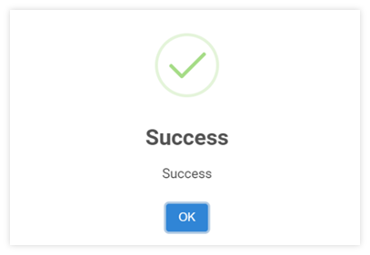

# Receipt for Advance Deposit

Function นี้ใช้สำหรับการรับเงินมัดจำจากลูกหนี้ รวมถึงการออกใบเสร็จรับเงิน และใบกำกับภาษีในระบบ

## การรับเงินมัดจำ Advance Deposit

1. Click เข้าสู่ Account Receivable Module

2. เลือกฟังก์ชัน Receipt ระบบจะแสดงหน้าจอ ตามภาพด้านล่าง

3. กดปุ่ม  ระบบจะแสดงหน้า Receipt

4. ให้ผู้ใช้งาน ระบุข้อมูลของ Receipt ดังต่อไปนี้

**หมายเหตุ** เครื่องหมาย \*
(สัญลักษณ์ \* ช่องที่จำเป็นต้องระบุ)

- \* Receipt Ref. No. > กำหนดเลขที่ใบเสร็จรับเงินโดยในระบบสามารถเลือกใช้งานได้ 2 แบบ คือ
  ให้ระบบกำหนดให้อัตโนมัติ โดยการติ๊กเครื่องหมายถูกที่ช่อง 
  ผู้ใช้กำหนดหนดเอง โดยติ๊กเอาเครื่องหมายติ๊กถูกที่ช่อง  ออก
  และพิมพ์เลขที่ใบเสร็จรับเงิน ในช่อง Receipt Ref. No.
- \* Receipt Date > กำหนดวันที่ออกใบเสร็จ
- \* A/R No > กำหนดรหัสลูกหนี้
- \* Currency > กำหนดสกุลเงิน
- \* Rate > อัตราแลกเปลี่ยนเงินตรา
- Pay Ref No. > หมาเลขอ้างอิงเกี่ยวกับการรับชำระ เข่นเลขที่เช็ค
- Pay Date > วันที่ได้รับชำระเงิน
- \* Pay Type > กำหนดประเภทการชําระหนี้เช่น Cash, Cheque หรือ Bank Transfer
- Description > ระบุคำอธิบาย รายละเอียดของใบเสร็จ

**กรณีที่ต้องการออกใบกำกับภาษีในใบเสร็จรับเงิน ให้ระบุข้อมูลดังต่อไปนี้**

- Tax Invoice no. > ระบบกำหนดให้อัตโนมัติ โดยการติ๊กเครื่องหมายถูกที่ช่อง Auto 
- Rate (%) > ระบุเปอร์เซ็นต์ร้อยละของฐานภาษีมูลค่าเพิ่ม
- Amount > ยอดภาษีมูลค่าเพิ่ม (ระบบจะคำนวณจาก Paid amount ให้อัตโนมัติ)
  ในกรณีต้องการแก้ไข ภาษีมูลค่าเพิ่ม ให้ติ๊กเครื่องหมายถูกที่ช่อง Overwrite และพิมพ์ยอดภาษีมูลค่าเพิ่มที่ช่อง Amount

  

## การบันทึกภาษีหัก ณ ที่จ่าย

5. ในกรณีต้องการบันทึกรายการภาษี หัก ณ ที่จ่าย Click ที่ช่อง Withholding Tax โดยกรอกรายละเอียดการบันทึกข้อมูล ดังต่อไปนี้

- Dept. > กำหนด Department Code จะใช้บันทึกบัญชี
- Acc. Code > กำหนด Account Code จะใช้บันทึกบัญชีภาษีหัก ณ ที่จ่าย
- Total > ระบุยอดที่จะนำไปคำนวณภาษีหัก ณ ที่จ่าย
- Rate > ระบุเปอร์เซ็นต์ ภาษีหัก ณ ที่จ่าย
- Amount > ยอดภาษี หัก ณ ที่จ่าย ระบบจะคำนวณให้อัตโนมัติ
- Overwrite > ติ๊กเครื่องหมายถูก ☑️ กรณีที่ต้องการแก้ไขยอดภาษีหัก ณ ที่จ่าย แล้วให้ผู้ใช้งานพิมพ์ยอดภาษี หัก ณ ที่จ่าย ที่ช่อง Amount

6. ตรวจสอบ ชื่อ และ ที่อยู่ ในการออกใบเสร็จรับเงิน/ใบกำกับภาษี โดยการClick ที่ช่อง Billing to และตรวจสอบข้อมูลดังต่อไปนี้

- Name > ชื่อ สกุล กรณีต้องการออกใบเสร็จรับเงิน หรือ ใบเสร็จรับเงิน/ใบกำกับภาษีในนามบุคคล
- Company > ชื่อบริษัท ที่ต้องการออกใบเสร็จรับเงิน หรือ ใบเสร็จรับเงิน/ใบกำกับภาษี
- Billing To > ระบบจะกำหนดที่อยู่ตามการตั้งค่าเบื้องต้นจาก AR Profile หรือเลือกที่อยู่อื่นมาใช้แทนได้
- Address > ที่อยู่ที่ต้องการออกใบเสร็จรับเงิน หรือ ใบเสร็จรับเงิน/ใบกำกับภาษี โดยระบบจะแสดงที่อยู่ตามที่ตั้งค่าเบื้องต้น

7. กำหนด Account code ในส่วนของ Receipt Account (ในกรณีที่ลูกหนี้ชำระค่าบริการ จำเป็นต้องระบุ Payment Account Code เพื่อส่งขอมูลการชำระเงินในส่วนของ AR ไปยังระบบ General Ledger) โดยมีขั้นตอนดังต่อไปนี้

7.1. Cr. Account กำหนดรหัสผังบัญชี ที่จะใช้บันทึกบัญชีลดลูกหนี้ (Aging) โดยไม่ต้องลงบัญชีเงินมัดจำ

- \* Cr Dept. Code > กำหนด Department Code
- \* Cr Acc. Code > กำหนด Account Code
  7.2. Gain/Loss Account กำหนดรหัสบัญชีที่จะใช้บันทึกกำไรขาดทุนจากอัตราแลกเปลี่ยนเมื่อรับชำระเงินด้วยสกุลเงินอื่น (หากมี ต้องระบุ)
- Dept. Code > กำหนด Department Code จะใช้บันทึกบัญชี
- Acc. Code > กำหนด Account Code จะใช้บันทึกบัญชี
  7.3. Bank Charge Account > กำหนดรหัสบัญชีที่จะใช้บันทึกยอด Bank Charge (หากมี ต้องระบุ)
- \* Dept. Code > กำหนด Department Code จะใช้บันทึกบัญชี
- \* Acc. Code > กำหนด Account Code จะใช้บันทึกบัญชี

8. Dr. Account กำหนดรหัสบัญชีที่จะใช้บันทึกตามวิธีการรับชำระเงินเช่น Cash, Bank หรือ Cheque

- \* Dr Dept. Code > กำหนด Department Code
- \* Dr Acc. Code > กำหนด Account Code

10. ตรวจสอบยอดที่แสดงในส่วนของ Summary ด้านล่าง ขวามือ

- Payment Amount > กรอกจำนวนเงินที่ได้รับเงินมัดจำจากลูกหนี้
- Settlement Base Amount > ยอดเงินรวมที่ได้รับชำระ แปลงตามสกุลเงินหลัก (Base Currency)
  เนื่องจากยังไม่มีการเลือก invoice มารับชำระจึงแสดงเป็น 0
- Gain/Loss > ยอดกำไรขาดทุนจากอัตราแลกเปลี่ยน
- Withholding Tax > ยอดที่ถูกหักภาษีหัก ณ ที่จ่าย
- Bank Charge > ระบุยอด Bank Charge ที่ถูกหัก
- Net Payment > ยอดสุทธิ ที่ได้รับชำระ
- Credit Available > จำนวนเงินคงเหลือในกรณีที่รับชำระเงินล่วงหน้า
  เนื่องจากยังไม่มีการเลือก invoice มาชำระจึงแสดงคงเหลือเท่ากับ Payment Amount

11. กดปุ่ม **SAVE** เพื่อบันทึกข้อมูล

12. เมื่อระบบทำการบันทึกข้อมูลเรียบร้อยแล้ว จะขึ้นหน้าต่างแสดงข้อความ Success ให้กดปุ่ม **OK**

    

