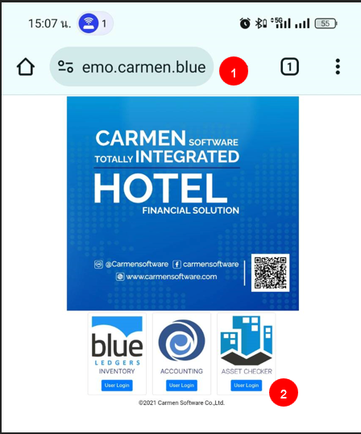
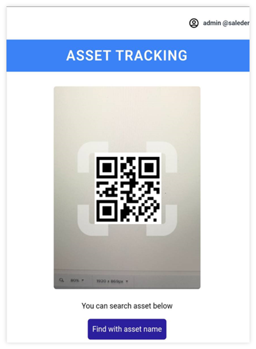
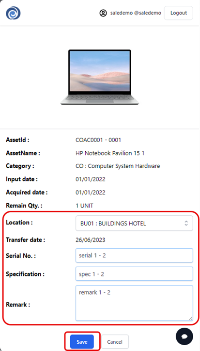
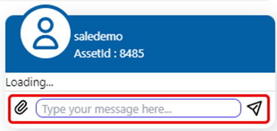
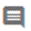
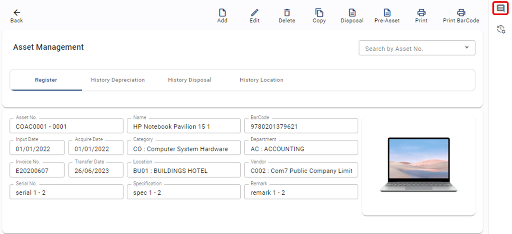
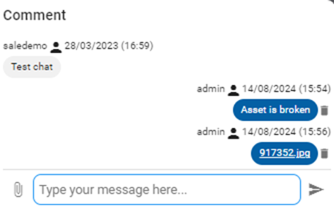

# Asset Checker

Function นี้ใช้สำหรับ การนับทรัพย์สิน โดยสามารถใช้มือถือ หรือ Tablet ในการ scan QR Code เพื่อใช้ตรวจสอบรายการสินทรัพย์ที่บันทึกอยู่ในระบบ Carmen
Asset checker สามารถใช้ได้บน Browser เช่น Chrome โดยต้องทำการอนุญาตให้ Browser เข้าถึงกล้อง และ Storage ได้โดยมีขั้นตอนการใช้งานดังนี้

## การค้นหาสินทรัพย์

1. เปิด URL สำหรับเข้าระบบ Carmen และเข้าสู่ระบบ Asset checker ผ่าน Web Brower บนโทรศัพท์มือถือ หรือ Tablet

2. เลือก Asset Checker โดยคลิ๊กที่  เพื่อ Log in เข้าสู่ระบบ Scan QR Code

3. นำมือถือหรือ Tablet ทำการ Scan QR Code ที่ติดอยู่บนสินทรัพย์ หรือ ค้นหาด้วยชื่อ

4. หลัง Scan QR Code เรียบร้อยแล้ว จะได้รายงานที่แสดงผลการสแกนข้อมูลบนจอมือถือ

## การ update ข้อมูลสินทรัพย์ด้วย Asset checker

5. สามารถกรอกข้อมูลเพื่อ Update ดังนี้

- Location ทำการบันทึก location ที่พบสินทรัพย์นี้
- Serial Number บันทึก Serial number ของสินทรัพย์ เพื่อ update ข้อมูลเข้าระบบ
- Specification บันทึก specification ของสินทรัพย์ เพื่อ update ข้อมูลเข้าระบบ
- Remark บันทึกข้อมูลเพิ่มเติมของสินทรัพย์เข้าระบบ

6. กด **SAVE** เพื่อบันทึกข้อมูลสินทรัพย์รหัสดังกล่าว

## การใส่ Comment และแนบภาพถ่ายเพิ่มเติม

สามารถทำตามขั้นตอนดังนี้

7.1. กดปุ่ม  บริเวณด้านขวาล่างของหน้าจอ

7.2. กดปุ่ม  เพื่อแนบภาพถ่ายจากการตรวจสอบได้

7.3. กรอก comment เพิ่มเติมเกี่ยวกับสินทรัพย์ที่ตรวจสอบและกดส่ง 

7.4. สามารถดูภาพถ่ายและ Comment ที่กรอกไปบน Asset Register ได้เช่นเดียวกัน

- 7.4.1. เปิดสินทรัพย์ที่ต้องการและกดปุ่ม 

- 7.4.2. ระบบจะแสดง Comment ด้านขวามือ

    

