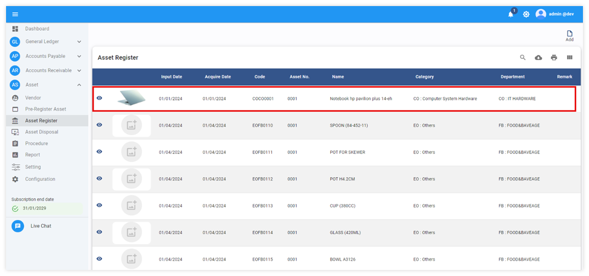
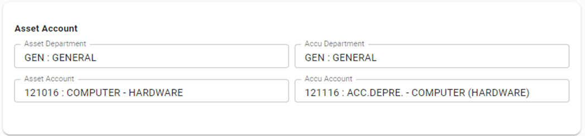

# Asset Disposal

การตัดจำหน่ายสินทรัพย์ Function นี้ใช้สำหรับการตัดจำหน่ายสินทรัพย์ในกรณีที่ต้องการขายสินทรัพย์ หรือทำการ Writ Off สินทรัพย์ที่หมดมูลค่าแล้ว

การตัดจำหน่ายสินทรัพย์สามารถทำได้ 2 วิธี คือ

## การตัดจำหน่ายสินทรัพย์ที่ Asset Disposal

1.1 Click ปุ่ม Asset

1.2 เลือก Asset Disposal

1.3 Click ปุ่ม Add ระบบจะแสดง หน้าต่าง Select Disposal Type เป็น Default แบบ Quantity เพื่อตัดจำหน่ายสินทรัพย์แบบจำนวน

1.4 กด **OK**

    

ระแบบจะแสดงรายการสินทรัพย์ที่สามารถ disposal ได้

1.6 กดปุ่ม  เพื่อค้นหาสินทรัพย์ที่ต้องการได้

1.7 จากนั้นเลือกสินทรัพย์ที่ต้องการตัดจำหน่าย

## การตัดจำหน่ายสินทรัพย์ที่ Asset Register

2.1. ไปที่ Function Asset Register

2.2. เลือกสินทรัพย์ที่ต้องการตัดจำหน่าย

2.3. กดปุ่ม 

## การบันทึกข้อมูล Disposal

หลังจากเลือกสินทรัพย์ที่ต้องการตัดจำหน่ายด้วยวิธีข้างต้นแล้ว ระบบจะแสดงให้กรอกข้อมูลดังนี้

3.1.1 Asset Disposal ข้อมูลของสินทรัพย์ที่ต้องการตัดจำหน่าย

- Asset No. รหัสสินทรัพย์ และเลขลำดับที่
- Name ชื่อสินทรัพย์
- Input Date วันที่บันทึกสินทรัพย์เข้าระบบ
- Category ประเภทสินทรัพย์
- Department แผนกที่เป็นเจ้าของสินทรัพย์
- Acquire Date วันที่เริ่มคำนวณค่าเสื่อมของสินทรัพย์จริง
- Location สถานที่ตั้งสินทรัพย์
- Serial No. หมายเลข Serial ของสินทรัพย์
- Specification รายละเอียดสินทรัพย์
- Remark หมายเหตุ หรือ ข้อมูลเพิ่มเติมสำหรับสินทรัพย์

3.1.2 Remain Value มูลค่าคงเหลือของสินทรัพย์ที่ตัดจำหน่าย ณ วันที่ตัดจำหน่าย

- Last Cost มูลค่าของสินทรัพย์ต่อชิ้น
- Available จำนวนคงเหลือของสินทรัพย์
- Total Value มูลค่าทั้งหมดของสินทรัพย์
- Accu Depre ค่าเสื่อมราคาสะสมของสินทรัพย์
- Netbook Value มูลค่าคงเหลือของสินทรัพย์

3.1.3 Disposal ข้อมูลการตัดจำหน่าย

- Disposal Type \* เลือกประเภทการตัดจำหน่ายเป็น Amount หรือ Quantity (ปัจจุบันระบบจะรองรับแบบ Quantity เท่านั้น)
- Disposal Date \* ระบุวันที่ ที่ต้องการตัดจำหน่ายสินทรัพย์
- Amount/Unit \* ระบุมูลค่าของสินทรัพย์ที่ต้องการตัดจำหน่าย (หากเลือก Disposal Typeเป็น Amount)
- QTY. \* ระบุจำนวนสินทรัพย์ที่ต้องการตัดจำหน่าย (หากเลือก Disposal Typeเป็น QTY.)
- Total Asset Value มูลค่าสินทรัพย์ที่ต้องการตัดจำหน่าย

3.1.4 Sale Value มูลค่าการขาย หรือตัดจำหน่าย

- Sale Amount ระบุราคาขาย หรือมูลค่าตัดจำหน่าย
- Net Book Value มูลค่าคงเหลือของสินทรัพย์ที่ตัดจำหน่าย
- Gain/Loss Amount กำไรขาดทุนจากการขายสินทรัพย์ (Sale Amount – Net Book Value)

3.1.5 Asset Account การบันทึกบัญชีเพื่อลดยอดสินทรัพย์และค่าเสื่อมราคาสะสม (ระบบจะใช้ข้อมูล default ที่ตั้งค่าไว้ในรหัสสินทรัพย์นั้น)

- Asset Department ระบุ Department code ของสินทรัพย์ที่จะขาย (ใส่ GEN ได้เนื่องจาก Account code ในหมวด Balance Sheet ไม่จำเป็นต้อง ระบุแผนก)
- Asset Account (Credit) ระบุ Account code ของสินทรัพย์ที่ตัดจำหน่ายเพื่อลดยอดสินทรัพย์ทางบัญชี
- Accu. Department ระบุ Department code ของค่าเสื่อมราคาสะสม
- Accu. Account (Debit) ระบุ Account code ของค่าเสื่อมราคาสะสมเพื่อลดยอดค่าเสื่อมราคาสะสมทางบัญชี

3.1.6 Disposal Account การบันทึกบัญชีเพื่อบันทึกกำไรขาดทุนจากการขายสินทรัพย์และเงินสด หรือเงินฝากธนาคารที่ได้รับจากการขายหรือตัดจำหน่าย

- Gain/Loss Department ระบุ Department code ของกำไรขาดทุนจากการขายสินทรัพย์
- Gain/Loss Account ระบุ Account code ของกำไรขาดทุนจากการขายสินทรัพย์
- Sale Department ระบุ Department code ของเงินสด หรือเงินฝากธนาคาร
- Sale Account (Debit) ระบุ Account code ของเงินสด หรือเงินฝากธนาคาร

3.1.7 กดปุ่ม **SAVE** เพื่อบันทึก Disposal หรือ Cancel เพื่อยกเลิก

## ตัวอย่างการบันทึกบัญชีของ Disposal เมื่อทำการบันทึกลง JV แล้ว

