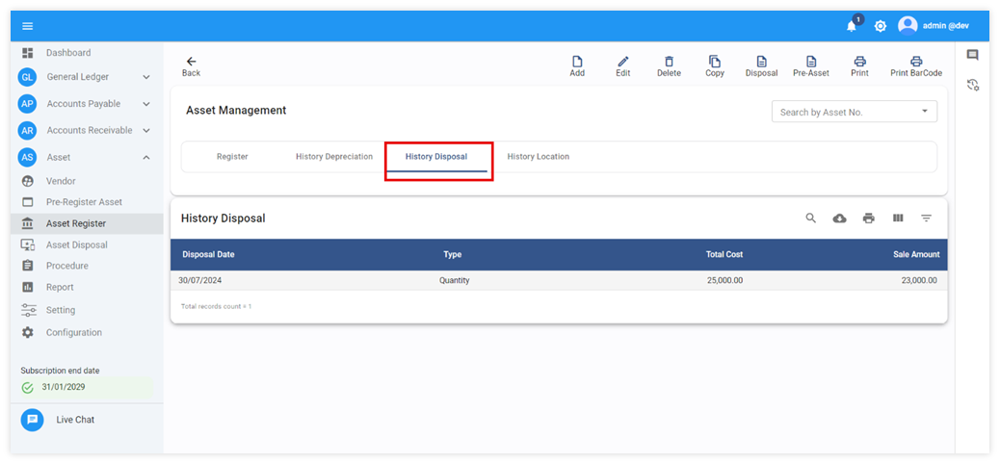

# Asset Register

Function นี้ใช้สำหรับบันทึกสินทรัพย์ลงในระบบเพื่อใช้ในการคำนวณค่าเสื่อมราคา และค่าเสื่อมราคาสะสม
การบันทึกสินทรัพย์ในระบบทำได้ 3 วิธี คือ

## การบันทึกสินทรัพย์ด้วยตนเอง (Asset Register Manually)

1.1 CLICK เข้าสู่ Asset Module

1.2 กดปุ่ม Asset Register

1.3 กดปุ่ม  เพื่อเพิ่มสินทรัพย์ใหม่ลงระบบ

1.4 ระบบจะแสดงหน้าต่าง Asset Register จากตัวอย่างภาพด้านล่าง ให้ระบุข้อมูลต่อไปนี้

**รายละเอียดการบันทึกข้อมูลสินทรัพย์**

**Asset Register**

**หมายเหตุ** เครื่องหมาย \* คือช่องที่จำเป็นต้องระบุ

- \* Asset No. รหัสสินทรัพย์ และเลขลำดับที่ (ในกรณีที่มีการ copy สินทรัพย์)
  - สามารถกำหนดเอง หรือ ตั้งค่าให้ระบบ Auto Generate Asset ID
- \* Asset Name ระบุชื่อสินทรัพย์ สามารถกำหนดชื่อสินทรัพย์ได้ทั้งภาษาไทยและภาษาอังกฤษ
- Barcode ใส่รหัส Barcode ของสินทรัพย์ (หากมี)
- \* Input Date ระบุวันที่บันทึกสินทรัพย์เข้าระบบ หรือวันที่ที่ให้ระบบ Carmen เริ่มคำนวณค่าเสื่อมราคาของสินทรัพย์
- \* Acquire Date ระบุวันที่เริ่มคำนวณค่าเสื่อมราคาของสินทรัพย์จริง เช่น สินทรัพย์ถูกคำนวณค่าเสื่อมราคาจากระบบอื่น มาก่อน ให้ระบุวันที่ที่เริ่มคำนวณค่าเสื่อมราคาจากระบบดังกล่าว
   Acquire Date จะมีผลต่อการคำนวณวันหมดอายุของสินทรัพย์
- \* Category ระบุรหัสประเภทสินทรัพย์ เพื่อแบ่งหมวดหมู่ของสินทรัพย์ให้สัมพันธ์กับผังบัญชี
- \* Department ระบุรหัสแผนกที่เป็นเจ้าของสินทรัพย์
- Invoice # ระบุเลขที่เอกสารที่ซื้อสินทรัพย์
- Transfer Date ระบุวันที่โอนย้ายสินทรัพย์
- \* Location ระบุรหัสสถานที่ตั้งสินทรัพย์
- Vendor ระบุรหัสร้านค้าที่ซื้อสินทรัพย์
- Serial No. ระบุหมายเลข Serial ของสินทรัพย์
- Specification ระบุรายละเอียดสินทรัพย์
- Remark ระบุหมายเหตุ หรือ ข้อมูลเพิ่มเติมสำหรับสินทรัพย์

**Register Value**

- \* Currency เลือกสกุลเงินที่ใช้ในการบันทึกสินทรัพย์
- \* Rate ระบุอัตราการแลกเปลี่ยนสกุลเงิน
- \* Amount/Unit ระบุราคาสินทรัพย์ต่อหน่วย / ไม่รวมภาษี
- \* Unit เลือกหน่วยของสินทรัพย์
- \* Qty. ระบุจำนวนสินทรัพย์
  - Salvage Value/Unit ระบุค่าซากต่อหน่วย (ปกติเป็น 1 บาท)
- \* Asset Life ระบุประเภทอายุของการคำนวณ เช่น Year, Month, Day
- \* Asset Life ระบุอายุที่จะให้คำนวณสินทรัพย์
- Ini. Accu. Depre. ระบุค่าเสื่อมราคาสะสมยกมา กรณีสินทรัพย์มีการคำนวณค่าเสื่อมมาแล้ว

Asset Account กำหนดรหัส Department Code และ Account Code ในการบันทึกบัญชี ดังต่อไปนี้

**Cost Account**

- Cost Account กำหนด Account Code ที่จะใช้บันทึกบัญชีตามประเภทสินทรัพย์

**Accu. Depreciation**

- Accu. Dept กำหนด Department Code ที่จะใช้บันทึกค่าเสื่อมราคาสะสม
- Accu. Account กำหนด Account Code ที่จะใช้บันทึกค่าเสื่อมราคาสะสมตาม

**Depreciation Account**

- Depre Dept กำหนด Department Code ที่จะใช้บันทึกค่าเสื่อมราคา
- Depre Account กำหนด Account Code ที่จะใช้บันทึกค่าเสื่อมราคา

  1.5 ตรวจสอบความถูกต้องของข้อมูล เมื่อเรียบร้อยแล้วกดปุ่ม **SAVE** เพื่อบันทึกข้อมูลเข้าระบบ

  1.6 เมื่อ save แล้ว ระบบจะทำการคำนวณค่าเสื่อมราคาเอาไว้ให้ล่วงหน้า ตั้งแต่วันเริ่มต้น จนสิ้นสุด
  หมายเหตุ: หัวข้อทีมีเครื่องหมาย \* อยู่ด้านหน้าคือข้อมูลที่จำเป็นต้องระบุ

## วิธีคำนวณค่าเสื่อมราคา

เมื่อสร้างสินทรัพย์สำเร็จ ระบบจะทำการคำนวณค่าเสื่อมราคาตั้งแต่เดือนเริ่มต้น จนถึงเดือนที่สิ้นสุด ตามวิธีคำนวณค่าเสื่อมราคาแบบเส้นตรง
ระบบจะคำนวณด้วยการนำราคาต้นทุนของอุปกรณ์ ลบด้วยมูลค่าซาก และลบด้วยค่าเสื่อมราคาสะสมยกมา
หารด้วยจำนวนวันของอายุสินทรัพย์ เพื่อจะได้ค่าเสื่อมราคาต่อวันของสินทรัพย์
นำค่าเสื่อมราคาต่อวัน คูณด้วยจำนวนของแต่ละเดือน จะทำให้ค่าเสื่อมราคาแต่ละเดือนอาจต่างกันได้เล็กน้อย
*\*\*ค่าเสื่อมราคา = ( (ราคาต้นทุน – ค่าเสื่อมราคาสะสม – มูลค่าซาก) / อายุการใช้งานทั้งหมด (วัน) ) *จำนวนวันของแต่ละเดือน

เมนูสำหรับใช้งานอื่นๆที่เกี่ยวข้อง

 ใช้ในกรณีต้องการจะสร้างเอกสารบันทึกข้อมูล Assets Details ใหม่  
 ใช้ในกรณีต้องการแก้ไขข้อมูลในเอกสารที่ทำการบันทึกไปเรียบร้อยแล้ว  
 ใช้ในกรณีต้องการลบเอกสารที่ได้บันทึกไปแล้ว (สินทรัพย์ที่อยู่ใน Period ที่ปิดไปแล้วจะไม่สามารถลบข้อมูล และแก้ไขได้เพียง account code เท่านั้น)  
 ใช้ในกรณีต้องการคัดลอกข้อมูลจากประเภทสินทรัพย์ชนิดเดียวกัน มีข้อมูลเหมือนกัน เพื่อต้องการแตก
รายการสินทรัพย์ให้มีจำนวนมากกว่า 1 รายการ
 
 ใช้ในกรณีต้องการทราบรายละเอียดการตัดจำหน่ายสินทรัพย์  
 ใช้ในกรณีต้องการสร้างทะเบียนสินทรัพย์จาก Pre-Register Asset  
 ใช้ในกรณีพิมพ์ Register Asset Form  
 ใช้ในกรณีพิมพ์ Barcode  

## การบันทึกสินทรัพย์ด้วยการ Copy จากสินทรัพย์ที่มีอยู่ในระบบ

2.1 CLICK เข้าสู่ Asset Module

2.2 กดปุ่ม Asset Register

2.3 Click เครื่องหมาย  เลือกรายการสินทรัพย์ที่ต้องการจะทำการ Copy รายการสินค้า

2.4 เมื่อเข้าสู่หน้าต่างรายการสินทรัพย์ที่เลือกไว้แล้ว ให้ทำการClick เมนู Copy

2.5 ระบบจะแสดงหน้าต่าง Copy Asset เพื่อให้ระบุจำนวนสินทรัพย์ที่ต้องการจะคัดลอกข้อมูล และเมื่อกำหนดข้อมูลเสร็จเรียบร้อยแล้ว ให้ Click **OK**

รายละเอียดในการบันทึกข้อมูล มีดังนี้

- Item to Copy คือ จำนวนที่ต้องการสร้างสินทรัพย์เพิ่ม เช่นต้องการเพิ่ม 4 ชิ้น ให้กรอกช่อง Item to Copy = 4 ชิ้น
- Asset No. คือ เลขที่สินทรัพย์ที่ระบบจะทำการสร้างให้อัตโนมัติ
- \* Input Date ระบุวันที่บันทึกสินทรัพย์เข้าระบบ หรือวันที่ที่ให้ระบบ Carmen เริ่มคำนวณค่าเสื่อมราคาของสินทรัพย์
- \* Acquire Date ระบุวันที่เริ่มคำนวณค่าเสื่อมราคาของสินทรัพย์จริง เช่น สินทรัพย์ถูกคำนวณค่าเสื่อมราคาจากระบบอื่น มาก่อน ให้ระบุวันที่ที่เริ่มคำนวณค่าเสื่อมราคาจากระบบดังกล่าว Acquire Date สามารถระบุวันที่ก่อน หรือ เท่ากับ Input date เท่านั้น แบะ Acquire Date จะใช้ในการคำนวณวันหมดอายุของสินทรัพย์

    

**หมายเหตุ** สำหรับสินทรัพย์ที่สามารถแยกแยะความแตกต่างกันได้ เช่น โทรทัศน์ Computer ขอแนะนำให้ใช้ Copy เพื่อบันทึกสินทรัพย์เป็นรายตัว เพื่อใส่ข้อมูลเพิ่มเติมแตกต่างกันได้เช่น Serial no.

2.6 จากนั้นระบบจะแสดงผลการบันทึกข้อมูล และเมื่อ Click **OK** อีกครั้ง

2.7 ระบบแสดงรายการสินทรัพย์ที่ทำการคัดลอกสำเร็จ จากหน้าจอหนี้สามารถ Click เครื่องหมาย  เพื่อทำการแก้ไขข้อมูลต่อไป

## การบันทึกสินทรัพย์โดยใช้ข้อมูลจาก Pre-Register Asset

3.1 CLICK เข้าสู่ Asset Module

3.2 กดปุ่ม Asset Register

3.3 กดปุ่ม  เพื่อเพิ่มสินทรัพย์ใหม่ลงระบบ

3.4 จากรูปด้านล่างให้ CLICK  เลือกเมนู

3.5 ระบบจะแสดงรายการสินทรัพย์ที่ได้จากการดึงข้อมูลจากระบบ AP หรือระบบ Receiving ให้ Double Click ที่รายการสินทรัพย์เพื่อดึงข้อมูลเข้าสู่ระบบบันทึกสินทรัพย์

3.6 ระบบทำการดึงข้อมูลจาก Pre-Register Asset มายังหน้าจอหลักเพื่อทำรายการสินทรัพย์ และกำหนดเงื่อนไขในการคำนวณค่าเสื่อมของสินทรัพย์ต่อไป

3.7 ทำการบันทึกข้อมูลสินทรัพย์ตามขั้นตอนที่ 1.4

## การดูประวัติการคำนวณค่าเสื่อมราคา History Depreciation

เมื่อสร้างสินทรัพย์สำเร็จ ระบบจะทำการคำนวณค่าเสื่อมราคาตั้งแต่เดือนเริ่มต้น จนถึงเดือนที่สิ้นสุด ตามวิธีคำนวณค่าเสื่อมราคาแบบเส้นตรง
ระบบจะคำนวณด้วยการนำราคาต้นทุนของอุปกรณ์ ลบด้วยมูลค่าซาก และละด้วยค่าเสื่อมราคาสะสมยกมา
หารด้วยจำนวนวันของอายุสินทรัพย์ เพื่อจะได้ค่าเสื่อมราคาต่อวันของสินทรัพย์
นำค่าเสื่อมราคาต่อวัน คูณด้วยจำนวนของแต่ละเดือน จะทำให้ค่าเสื่อมราคาแต่ละเดือนอาจต่างกันได้เล็กน้อย

ค่าเสื่อมราคา = ( (ราคาต้นทุน – ค่าเสื่อมราคาสะสม – มูลค่าซาก) ÷ อายุการใช้งานทั้งหมด ) \*จำนวนวันของแต่ละเดือน

    ค่าเสื่อมราคาจะแสดงข้อมูลใน Tab : History Depreciation ตามตัวอย่างจากรูปข้างล่างนี้
    

## การดูประวัติการขายสินทรัพย์ History Disposal

เมื่อมีการขาย หรือตัดจำหน่ายสินทรัพย์ด้วย function : Disposal ระบบจะแสดงประวัติการขายหรือตัดจำหน่าย โดยแสดงข้อมูลวันที่ ประเภทการตัดจำหน่าย มูลค่าต้นทุน และมูลค่าที่ขายสินทรัพย์

ขั้นตอนการดูข้อมูล

5.1. เลือกสินทรัพย์ที่ต้องการดูข้อมูล

5.2. เลือก Tab : History Disposal

5.3. ระบบจะแสดงประวัติ Disposal ในระบบ

จากข้อมูลการตัดจำหน่ายสินทรัพย์ตามภาพด้านบนนี้ ผู้ใช้งานสามารถกดปุ่มเพื่อดาวน์โหลด ข้อมูลเป็น Excel file เพื่อนำไปใช้งานในรูปแบบอื่นที่ต้องการต่อไปได้

## การบันทึกโอนย้ายทรัพย์สินระหว่างแผนก

ขั้นตอนการโอนย้ายสินทรัพย์ระหว่างแผนก

6.1 เลือกรายการสินทรัพย์ที่ต้องการโอนย้าย Click ที่เครื่องหมาย  เพื่อดูข้อมูลสินทรัพย์

6.2 Click Edit เพื่อทำการแก้ไขข้อมูล

6.3 เปลี่ยน Location จาก FO OFFICE ไปยัง HR OFFICE และกด **SAVE** ตามตัวอย่างภาพด้านล่าง

6.4 หลังจากกด Save เรียบร้อยแล้วระบบจะแสดงหน้าต่างว่าบันทึกข้อมูลสำเร็จแล้ว หลังจากนั้นกด **OK**

    

## การดูประวัติโอนย้ายสินทรัพย์ History Location 

ประวัติการย้าย แผนก หรือ Transfer location ในระบบ
หลังจากบันทึก Asset Register เรียบร้อยแล้ว หากมีการโอนย้ายสินทรัพย์นั้นจาก Location A ไปยัง Location B ระบบจะทำการบันทึกประวัติการโอนย้ายแผนกและสถานที่จัดเก็บสินทรัพย์นั้นให้ทราบ 

7.1	ทำการเปิดสินทรัพย์ที่ต้องการดูประวัติการโอนย้าย

7.2	เปิด tab : History Location

7.3	ระบบจะแสดงประวัติการโอนย้ายแผนกหรือสถานที่เก็บสินทรัพย์

## ตัวอย่าง JV สำหรับการบันทึกบัญชีค่าเสื่อมราคาจากการ Posting Asset to GL

