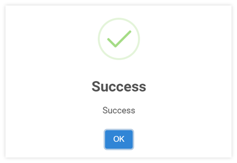

# Close Period for Asset Module

ขั้นตอนการปิดรอบบัญชี (Close Period Asset Management Module)

เมื่อเสร็จสิ้นการทำงานในแต่ละรอบบัญชี ผู้ใช้งานได้มีการตรวจสอบข้อมูลเรียบร้อยแล้วเพื่อป้องกันการแก้ไขข้อมูลในระบบ ให้ดำเนินการปิดรอบบัญชี (Close Period) โดยมีขั้นตอนดำเนินการในระบบ ดังต่อไปนี้

1. ไปที่ Asset Module

2. Click ที่ฟังก์ชัน Procedure เลือกคำสั่ง Close Period

3. จากนั้นระบบจะแสดงหน้าต่าง ถามว่า Do you want to close ../../..(เดือนที่จะปิดรอบบัญชี) ?? กด “Yes” เพื่อยืนยัน (หรือ กด No เพื่อยกเลิก)

    

4. เมื่อระบบดำเนินการเรียบร้อยแล้วจะแสดงหน้าต่าง ดังภาพด้านล่าง

    

**หมายเหตุ**

- การปิดรอบบัญชีในแต่ละ Module จะทำให้ไม่สามารถ เพิ่มเติม หรือ แก้ไขข้อมูลในเดือนที่ปิดไปแล้วได้อีก ดังนั้นก่อนการ Close Period ในระบบโปรดตรวจสอบให้แน่ใจว่า ข้อมูล ครบถ้วนและถูกต้อง

- การปิดบัญชีนี้ เป็นการปิดรอบบัญชีในส่วนของ Asset Management Module เท่านั้น แต่ยังคงสามารถโอนข้อมูลไปบันทึกบัญชีที่ General Ledger ได้อยู่ (หาก Period ใน General Ledger Module ยังไม่ถูกปิด)

- หากต้องการเปิด Period ให้ FC, Account Manger หรือผู้มีอำนาจส่ง E-Mail ถึง Support เพื่อทำการขอเปิด Period
