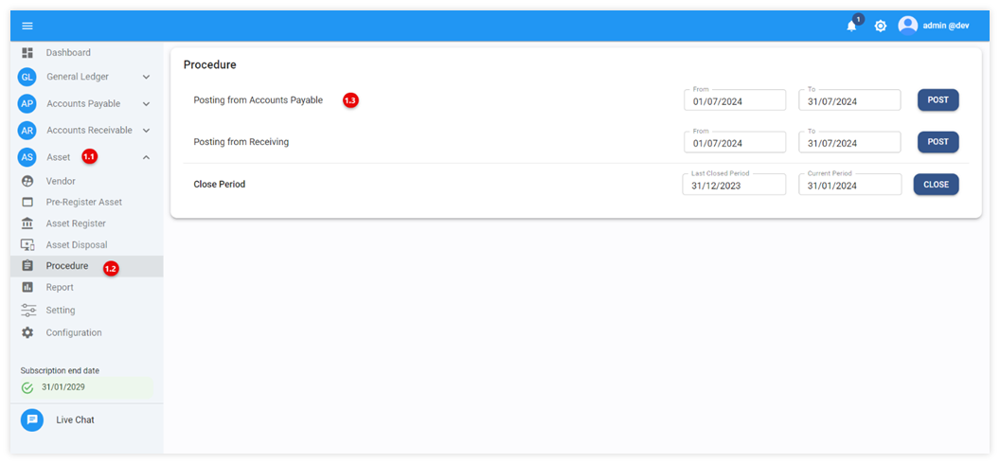
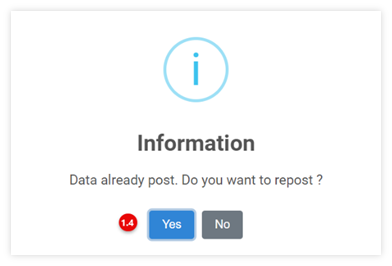
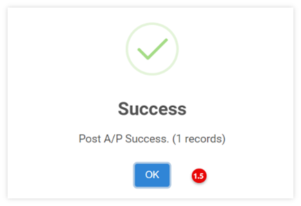
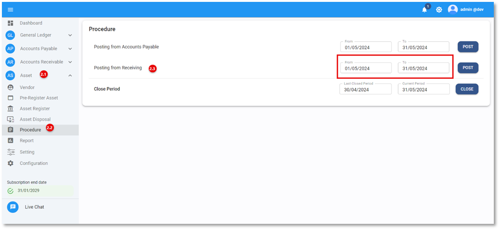
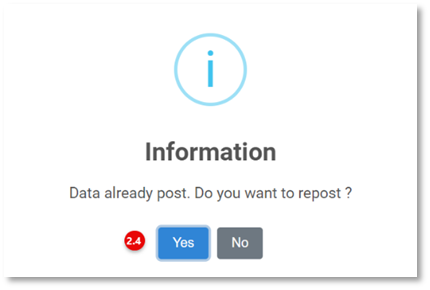
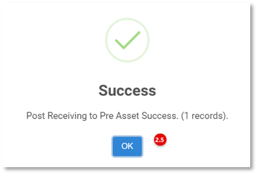
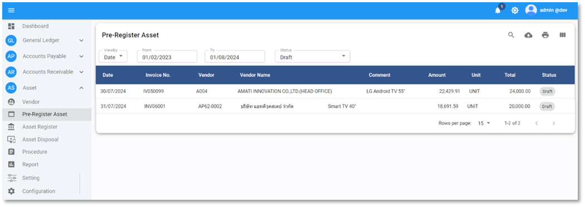

# Pre-Register Asset

Function นี้ใช้สำหรับการ Post ข้อมูลรายการทรัพย์สินที่ผ่านขั้นตอนการซื้อจาก Module Receiving หรือ AP เพื่อนำรายละเอียดสินค้า และราคาสินค้ามาใช้สำหรับบันทึกทรัพย์สินและใช้คำนวนค่าเสื่อมราคา โดยสามารถดึงข้อมูลตามขั้นตอนดังนี้

**หมายเหตุ**

- จะต้องทำการตัดสินใจว่าจะ post ข้อมูลจาก Receiving หรือ AP

- ก่อนใช้งานจะต้องทำการตั้งค่าให้แล้วเสร็จก่อน

## การ Post ข้อมูล Pre-Register Asset จาก AP

1.  ดึงข้อมูลทรัพย์สินจากระบบ AP (Posting from Accounts Payable) โดยมีขั้นตอนดังต่อไปนี้

    1.1 Click เมนู Asset

    1.2 Click เมนู Procedure

    1.3 ในเมนู Posting from Accounts Payable ให้ระบุวัน วว/ดด/ปป ต้องการดึงข้อมูล เสร็จแล้วกด **POST**

    1.4 หลังจากกด Post เรียบร้อยแล้วระบบให้ยืนยันการ Post Data ให้ทำการกด Yes หากต้องการยืนยัน หรือ กด No เพื่อยกเลิกการดำเนินการ
        

        
        

    1.5 หากดำเนินการดึงข้อมูลสำเร็จระบบจะแสดงข้อความ Success ดังภาพด้านล่าง
        

        
        

## การ Post ข้อมูล Pre-Register Asset จาก Receiving

2. ดึงข้อมูลทรัพย์สินจากระบบ Receiving (Posting from Receiving) โดยมีขั้นตอนดังต่อไปนี้

    2.1 Click เมนู Asset

    2.2 Click เมนู Procedure

    2.3 ในเมนู Posting from Receiving ให้ระบุวัน วว/ดด/ปป ต้องการดึงข้อมูล เสร็จแล้วกด **POST**
    

    
    

    2.4	หลังจากกด Post เรียบร้อยแล้วระบบให้ยืนยันการ Post Data ให้ทำการกด **YES** หากต้องการยืนยัน หรือ กด No เพื่อยกเลิกการดำเนินการ
    

    
    

    2.5	หากดำเนินการดึงข้อมูลสำเร็จระบบจะแสดงข้อความ Success ดังภาพด้านล่าง
      

    
    

หลังจากดึงข้อมูลจากระบบ **AP** หรือระบบ **Receiving** สำเร็จแล้ว สามารถทำการตรวจสอบข้อมูลที่เมนู **Pre-Register Asset** เพื่อตรวจสอบรายการต่อไป

บนหน้าจอ **Pre-Register Asset** จะประกอบด้วยข้อมูลดังนี้

-	**Date** วันที่ของเอกสารใบแจ้งนี้ หรือ ใบกำกับภาษี
-	**Invoice No.** เลขที่เอกสารใบแจ้งหนี้ หรือ ใบกำกับภาษี
-	**Vendor** รหัสเจ้าหนี้
-	**Vendor** Name ชื่อเจ้าหนี้
-	**Comment** คำอธิบายรายการเพิ่มเติม
-	**Amount** มูลค่าก่อนภาษี
-	**Unit** หน่วยซื้อ
-	**Total** มูลค่าทั้งหมด
-	**Status สถานะของ **Pre-Register Asset**
    + **Draft** ข้อมูลยังไม่ถูกบันทึกเป็นทรัพย์สิน
    + **Posted** ข้อมูลถูกบันทึกเป็นทรัพย์สินแล้ว
    + **Void** ข้อมูลถูกยกเลิก

