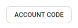
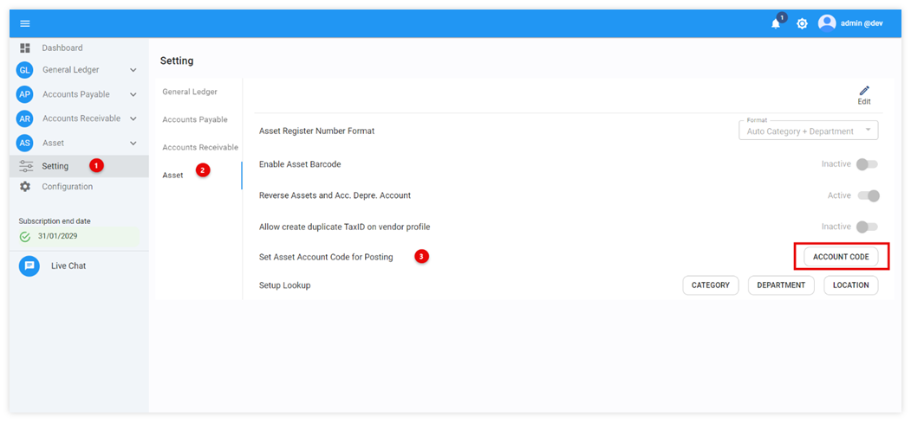

# Pre-Register Asset Setting

Function นี้ใช้สำหรับตั้งค่าเพื่อกำหนด Account code ที่จะใช้ในการดึงรายการทรัพย์สินจากการซื้อผ่านระบบ Receiving หรือ AP Invoice มาใช้เป็น Pre-Register Asset

## การตั้งค่าก่อนใช้งาน Pre-Register Asset

วิธีตั้งค่า Asset Account Code สำหรับการ Post ข้อมูลเข้าระบบมีขั้นตอนดังต่อไปนี้

1. Click ที่ Setting

2. Click ที่ Asset

    ในหัวข้อ Set Asset Account Code for Posting ให้ Click ที่ 

3. ระบบจะแสดงหน้าจอ Setting Account Code for Posting โดยมีวิธีขั้นตอนในการตั้งค่า ดังนี้

   3.1. หน้าจอส่วนที่ 1 (Part 1) คือ Account Code ทั้งหมดในผังบัญชี ซึ่งจำเป็นต้อง Click เลือกรายการ Account Code ที่เกี่ยวข้องกับรายการบัญชีทรัพย์สินเพื่อสื่อสารให้ระบบ Posting from AP ทราบว่าจะให้ระบบดึงข้อมูลเฉพาะรายการทรัพย์สินที่มี Account Code ที่ถูกเลือกจากหน้า Setting นี้เท่านั้น
    
    
   3.2. เมื่อClick เลือกรายการเฉพาะในส่วนของ Asset Account Code เรียบร้อยแล้ว ให้สังเกตว่า Account Code ที่Click ไปแล้วนั้นได้ถูกย้ายฝั่งมายังหน้าจอส่วนที่ 2 แล้วหรือยัง (Part2) หากพบว่า Account Code มาอยู่ในหน้าจอส่วนที่ 2 ตามที่ได้เลือกครบหมดแล้ว ให้ทำการกด **OK** และระบบจะแสดงหน้าจอบันทึกข้อมูลสำเร็จแล้ว ตามภาพด้านล่าง

   

    
   

**หมายเหตุ**

- ในการ Click เลือกรายการ Account Code แนะนำให้ Click เลือกที่ละรายการเพื่อคัดกรองเฉพาะ Account Code ที่เกี่ยวข้องกับการซื้อทรัพย์สินเท่านั้น

- ไม่แนะนำให้เลือกแบบ Select All เพราะระบบจะนำข้อมูล Account Code ทั้งหมดในผังบัญชีย้ายมายังหน้าจอส่วนที่ 2 (Part2) ซึ่งจะทำให้ระบบดึงสินค้าทุกประเภทที่ซื้อมาบันทึกเป็น Pre-Register Asset
