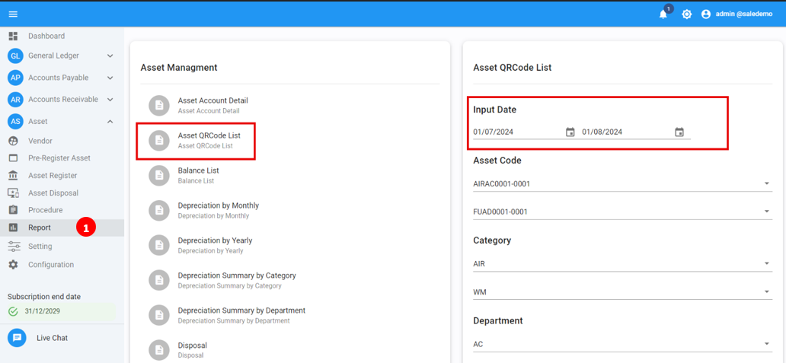
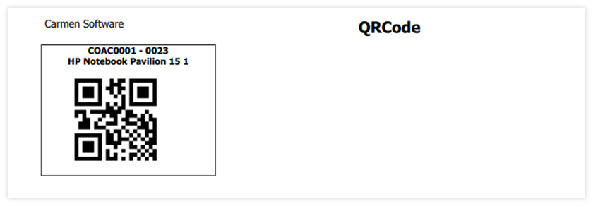

# Print Asset QR Code

Function นี้ใช้สำหรับ Print QR code sticker จากระบบ เพื่อนำไปติดเอาไว้กับตัวสินทรัพย์โดยมีขั้นตอนการใช้งานดังนี้

1. เปิด module Asset

2. เปิด Report และเปิดรายงาน Asset QR Code List เพื่อเลือกสินทรัพย์ที่ต้องการจะ print QR code

3. ระบบจะแสดงรายงาน ให้ดำเนินการสั่งพิมพ์

4. นำ sticker ไปติดกับสินทรัพย์

**หมายเหตุ**

- สามารถใช้ได้กับเครื่องพิมพ์ที่สามารถติดตั้ง driver ลงบนเครื่อง windows ได้

