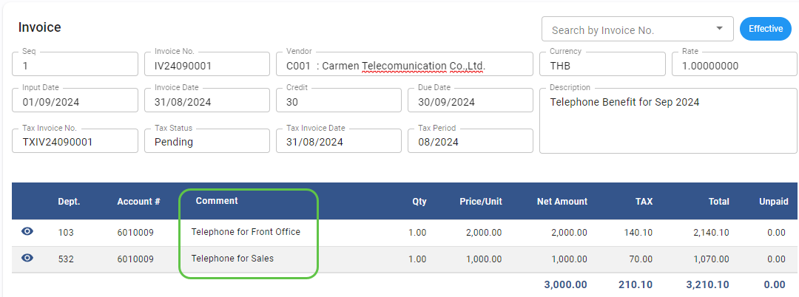
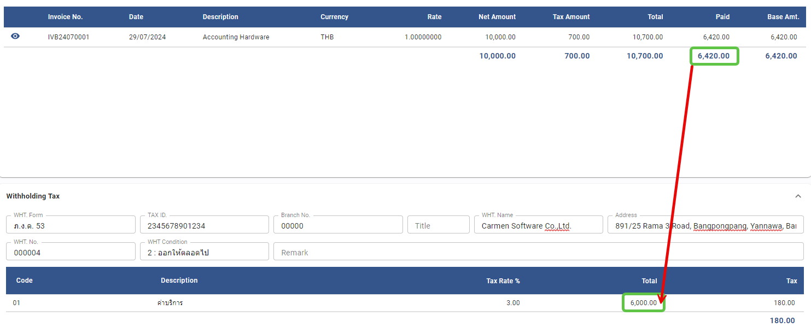
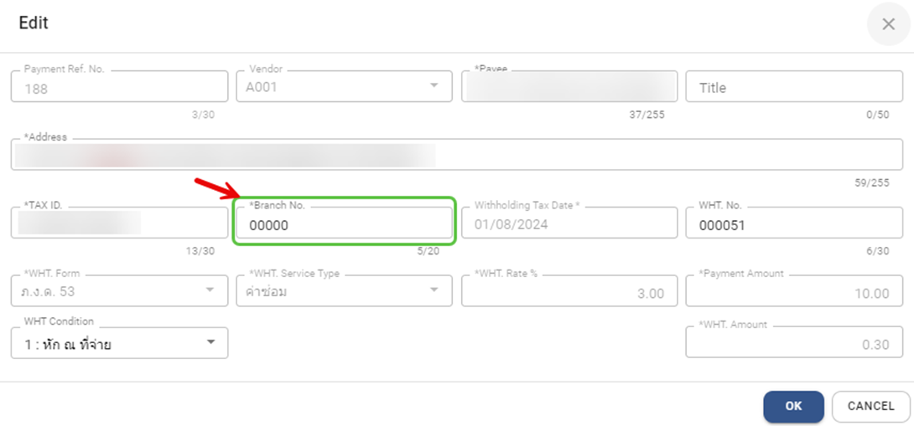
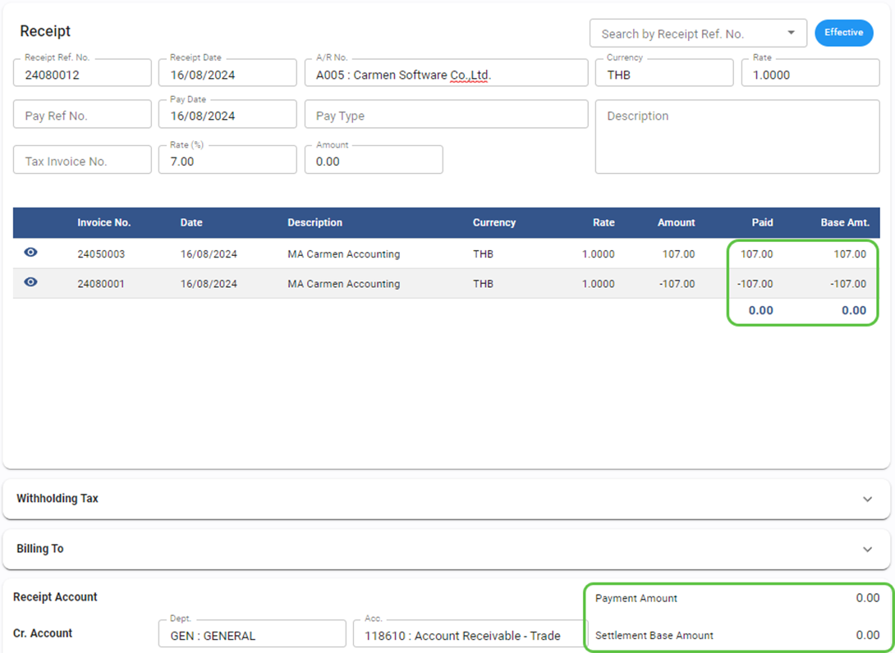
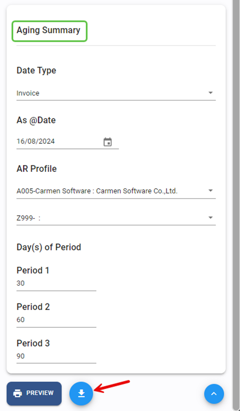
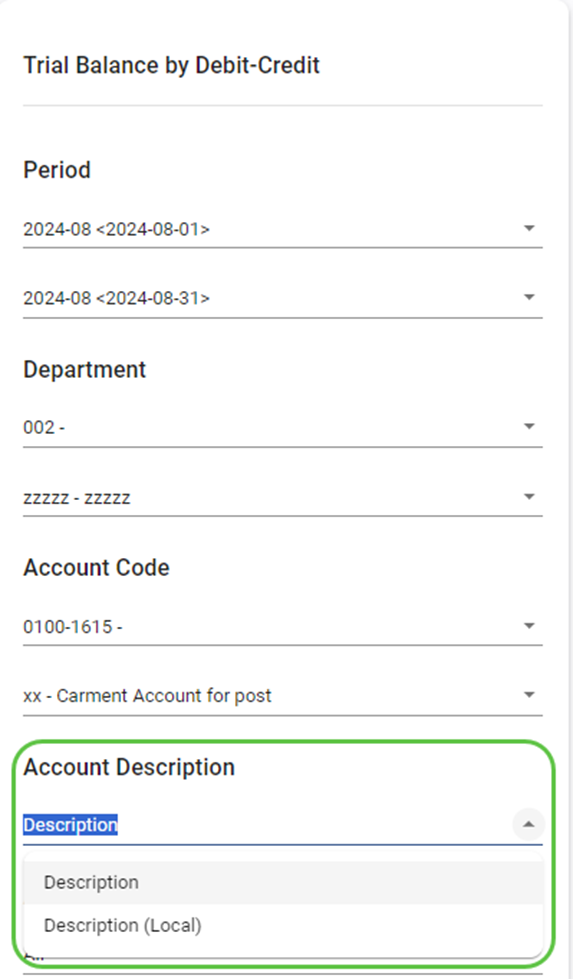
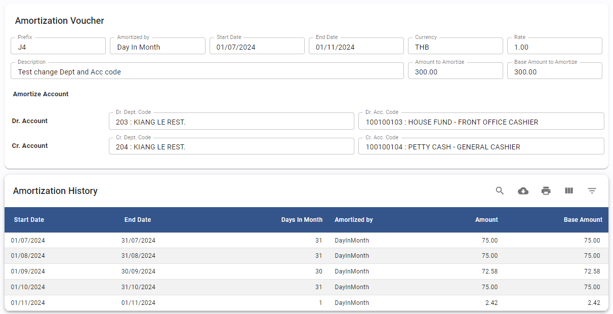
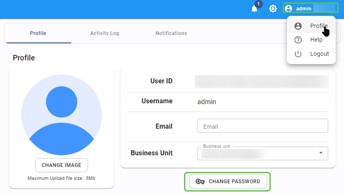

# August 2024 Relaese Infomation

## Accounts Payable Module

### AP – Invoice – Show detail comment on invoice screen

- Note : revise invoice screen to show detail comment information
- From : Accounts Payable Module 🡪 Invoice

    

### AP – Payment – Automatic calculate WHT total amount as before tax amount

- Note : revise WHT total amount calculation
- From : Accounts Payable Module 🡪 Payment 🡪 WHT Total Amount

    

### AP – Procedure – Input Tax Reconciliation

- Note : Not allow to save Tax invoice as blank if status is Confirm
- From : Accounts Payable Module 🡪 Procedure 🡪 Input Tax Reconciliation

### AP – Procedure – WHT Reconciliation

- Note : Add “Branch No” field to screen
- From : Accounts Payable Module 🡪 Procedure 🡪 WHT Reconciliation

## Accounts Receivable Module

### AR – Receipt – Allow to save with amount zero

- Note : Allow to apply CN with Invoice and save with amount zero
- From : Accounts Receivable Module 🡪 Procedure 🡪 Input Tax Reconciliation

### AR – Procedure – Aging Summary Report

- Note : Add option to export as csv
- From : Accounts Receivable Module 🡪 Report 🡪 Aging Summary

    

## Asset Module

### Asset – Asset Register – Change field name

- Note : change field name for account code mapping from “Cost” to “Asset”
- From : Asset Module 🡪 Asset Register

### Asset – Asset Register – Allow to edit account code mapping

- Note : allow to edit account code mapping after close period
- From : Asset Module 🡪 Asset Register

### Asset – Report – Depreciation summary by category show disposal amount for B/F Asset

- Note : show disposal amount for asset code which is brought forward and disposal in same year
- From : Asset Module 🡪 Report

## General Ledger Module

### GL – Procedure – Posting from AR – Invoice from Folio will not post to GL

- Note : new option to skip posting invoice from folio to avoid duplicate with PMS Daily posting
- From : General Ledger Module 🡪 Report 🡪 Trial Balance by Debit/Credit

### GL – Report – Trial Balance by Debit/Credit – Add option to show local description

- Note : new option shows local (Thai) description in report
- From : General Ledger Module 🡪 Report 🡪 Trial Balance by Debit/Credit

    

### GL – Report – Trial Balance – Add option for export data

- Note : add option for export data
- From : General Ledger Module 🡪 Report 🡪 Trial Balance

### GL – Report – Trial Balance by Debit/Credit – Add Net amount section at bottom of report

- Note : add Net amount section to shows net zero balance between debit and credit
- From : General Ledger Module 🡪 Report 🡪 Trial Balance by Debit/Credit

### GL – Amortization voucher – add Amortization history to review the amortize amount

- Note : customer can review the amount before apply amortization JV
- From : General Ledger Module 🡪 Amortization voucher

    

## User Profile Setup

### User Profile – Solve error reset password

- Note : Solve error when reset password
- From : User 🡪 Profile 🡪 change password

    

