# Financial Report

## Financial Report (รายงานทางการเงิน)

Financial ใช้สำหรับการเรียกดูงบการเงินตามมาตรฐานของระบบ สำหรับงบการเงินที่ซับซ้อนนั้นลูกค้าสามารถใช้ Excel Add In ในการเรียกดูได้ตามปกติ

Financial Report ในระบบ Carmen แบ่งเป็น 2 รายงาน

1.Profit and Loss (งบกำไร(ขาดทุน))

2.Balance Sheet (งบดุล หรือ งบแสดงฐานะทางการเงิน)

โดยไปที่ module “General Ledger” 

ไปที่หัวข้อ “Financial Report”
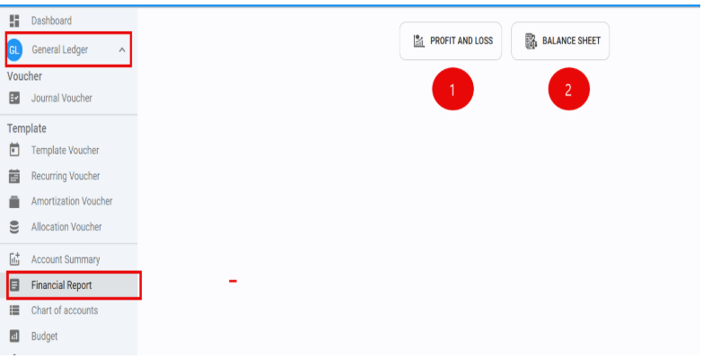
1.ขั้นตอนการตั้งค่า รายงาน Profit and Loss และ Balance Sheet     
การตั้งค่า mapping account code ก่อนเรียกดูรายงาน

1.1 Click “Setting”
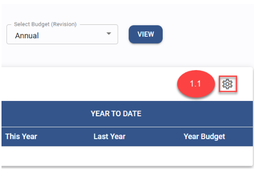
1.2 ที่ “Description” ฝั่งซ้ายมือ Click หัวข้อที่ต้องการ Mapping ผังบัญชี 
สามารถเลือกได้มากกว่า 1 account code ระบบจะทำการ sum ตัวเลขจาก account code ที่เลือกมาให้
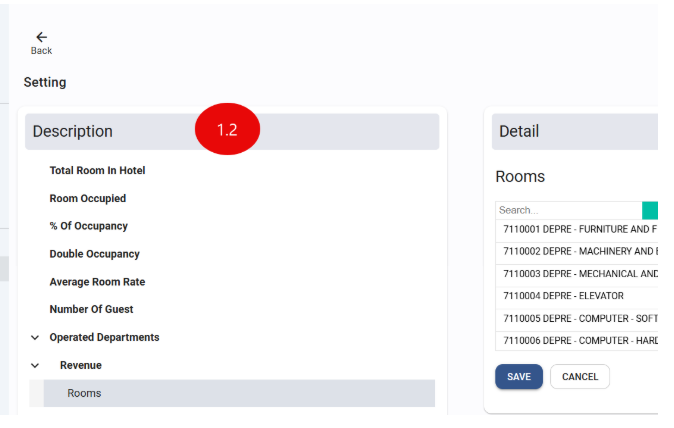
1.3 ที่ “Detail” ขวามือจะแสดงตาราง Account code mapping จากหัวข้อที่ถูกเลือก
การเพิ่มผังบัญชี

1.3.1 Click “Select All” หากต้องการเลือก Mapping ทุกผังบัญชี หรือ ค้นหา ผังบัญชีที่ต้องการ ในช่อง “Search”

1.3.2 หรือ Click ที่ ผังบัญชี แต่ละตัว ที่ต้องการ เพื่อ Mapping ผังบัญชี กับ “Detail” ที่แสดง
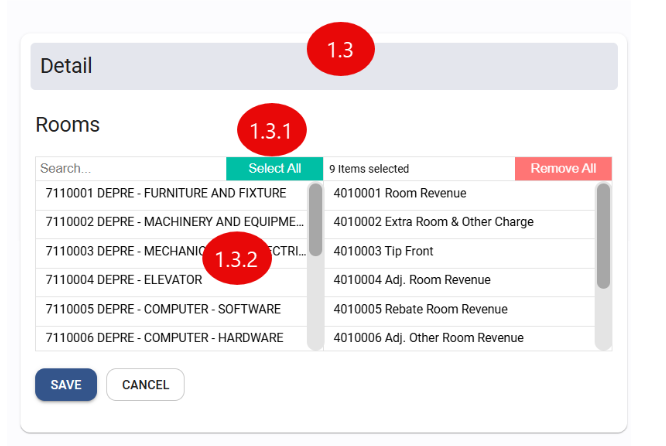

การยกเลิกผังบัญชี

1.3.3 Click “Remove All” หากต้องการ ลบ Mapping ทุกผังบัญชี ที่เลือกไว้

1.3.4 หรือ Click ที่ ผังบัญชี ที่ต้องการ เพื่อ ลบ ผังบัญชี ที่ทำการ Mapping ไว้

## การบันทึกข้อมูล

1.3.5 Click “Save” เพื่อ บันทึก หรือ “Cancel” เพื่อ ยกเลิก

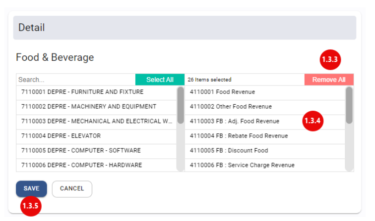

2.ขั้นตอนการ “View” รายงาน Profit and Loss

2.1 Click เครื่องหมายถูก ที่ “All Department” หากต้องการเลือก Department ทั้งหมด

2.2 Click ที่ “Department” ระบบจะแสดง Department ให้เลือก

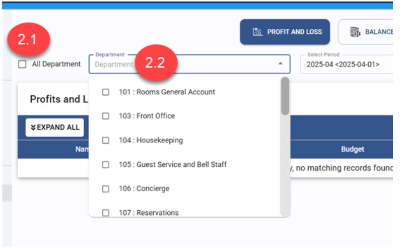

2.3 Click เครื่องหมายถูก เพื่อ เลือก “Department” ที่ต้องการ

2.4 Click เครื่องหมายกากบาท เพื่อ ลบ “Department” ที่ไม่เกี่ยวข้อง

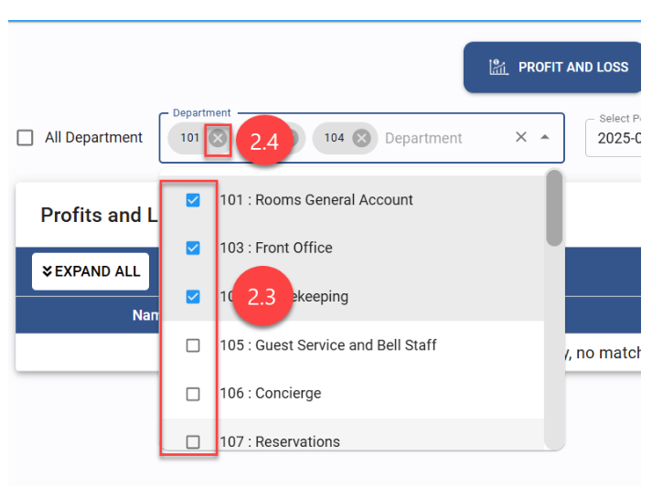
        
2.5 ที่ “Select Period” Click เลือก “Period” ที่ต้องการ

2.6 ที่ “Select Budget (Revision)” Click เลือก “Budget” ที่ต้องการให้แสดงเปรียบเทียบ

2.6.1 Annual คือ Budget version หลัก

2.6.2 Revision 1 – 4 คือ budget revision

2.7 Click “View” ระบบจะแสดงข้อมูลตามที่เลือก

2.8 Click “Expand All” เพื่อ แสดงรายละเอียดตาม account code ของแต่ละหัวข้อ ในรายงานหรือ Click “Collapse All” เพื่อ ย่อ ข้อมูล ในแต่ละหัวข้อ ในรายงาน

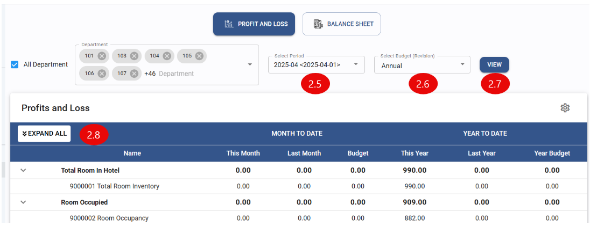
  
2.9 การแสดงข้อมูลบนรายงาน P&L จะแบ่งออกเป็น 2 ส่วน

2.9.1 MONTH TO DATE
 
- This Month = ยอดของ Period ที่เลือกจาก “Select Period”
- Last Month = ยอดของ Period ที่ผ่านมาจาก “Select Period”
- Budget = ยอดของ Budget ที่เลือกจาก “Select Budget (Revision)” ของ Period ที่เลือก จาก “Select Period”

2.9.2 YEAR TO DATE 

- This Year = ยอดรวมจาก Period เริ่มต้น จนถึง Period ที่เลือก ณ ปีที่เลือก จาก “Select Period”
- Last Year = ยอดรวมจาก Period เริ่มต้น จนถึง Period ที่เลือก ของปีที่ผ่านมา จาก “Select Period”
- Year Budget = ยอดรวมของ Budget ที่เลือกจาก “Select Budget (Revision)” จาก Period เริ่มต้น จนถึง Period ที่เลือก ณ ปีที่เลือก จาก “Select Period”

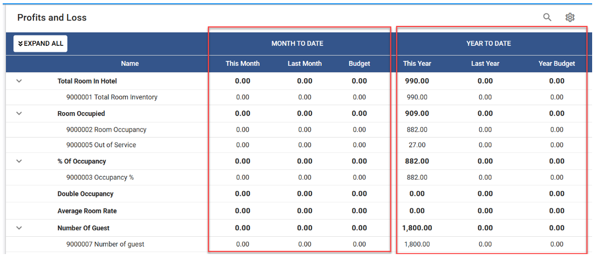            

3.ขั้นตอนการ “View” รายงาน Balance Sheet

3.1 Click เครื่องหมายถูก ที่ “All Department” หากต้องการเลือก Department ทั้งหมด

3.2 Click ที่ “Department” ระบบจะแสดง Department ให้เลือก

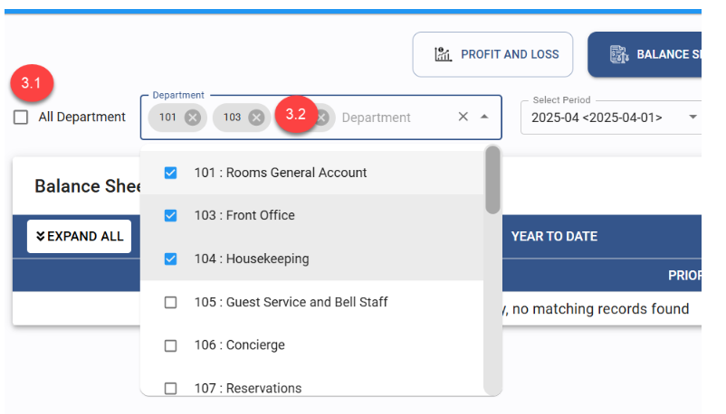

3.3 Click เครื่องหมายถูก เพื่อ เลือก “Department” ที่ต้องการ

3.4 Click เครื่องหมายกากบาท เพื่อ ลบ “Department” ที่ไม่เกี่ยวข้อง

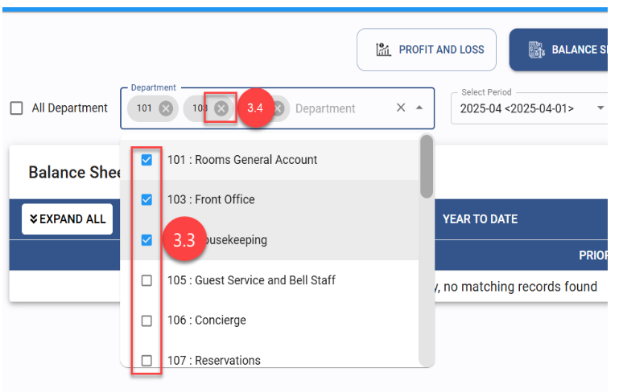         

3.5 ที่ “Select Period” Click เลือก “Period” ที่ต้องการ

3.6 ที่ “ViewBy” Click เลือก ได้ 2 วิธี คือ 1.Monthly 2.Annual (Yearly)

3.7 Click “View” ระบบจะแสดงข้อมูลตามที่เลือก

3.8 Click “Expand All” เพื่อ แสดง ข้อมูล ในแต่ละบรรทัด ในรายงาน หรือ Click “Collapse All” เพื่อ ย่อ ข้อมูล ในแต่ละบรรทัด ในรายงาน

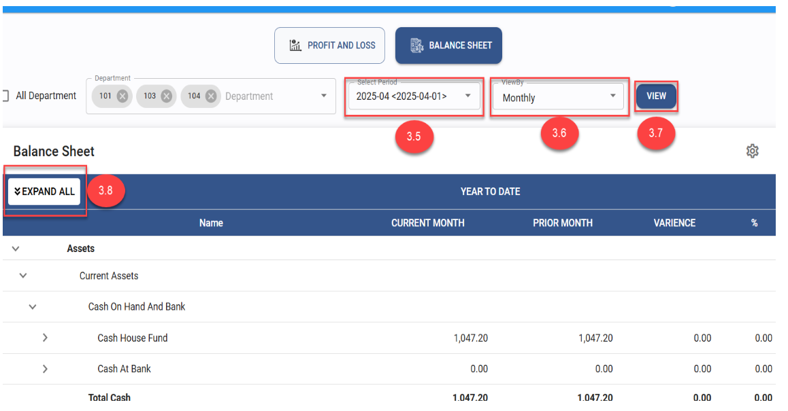   

3.9 การดูรายงาน Balance sheet แบบ ViewBy “Monthly” คือการดูยอดสะสมของเดือนปัจจุบัน เปรียบเทียบกับยอดสะสมของเดือนที่แล้ว

- Current Month = ยอดรวมตั้งแต่ใช้ระบบ จนถึง Period ที่เลือกจาก “Select Period”
- Prior Month = ยอดรวมตั้งแต่ใช้ระบบ จนถึง Period ที่แล้ว ที่เลือกจาก “Select Period”
- Variance = ผลต่างของ Current Month ลบด้วย Prior Month
- % = คำนวนจาก Variance 

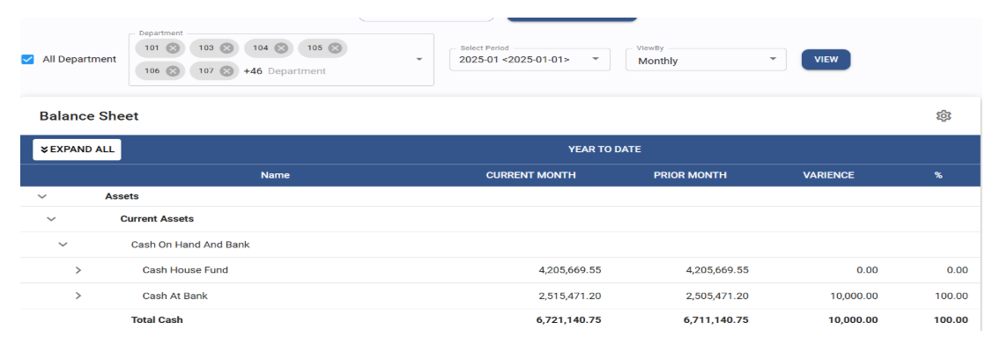

3.10 การดูรายงาน Balance sheet แบบ ViewBy “Annual”คือการดูยอดสะสมของเดือนปัจจุบัน เปรียบเทียบกับยอดสะสม ณ สิ้นปีที่แล้ว

- Current Year = ยอดรวมตั้งแต่ใช้ระบบ จนถึง Period ที่เลือกจาก “Select Period”
- Prior Year = ยอดรวมตั้งแต่ใช้ระบบ จนถึง ปี ที่แล้ว ที่เลือกจาก “Select Period”
- Variance = ผลต่างของ Current Year ลบด้วย Prior Year
- % = คำนวนจากช่อง Variance

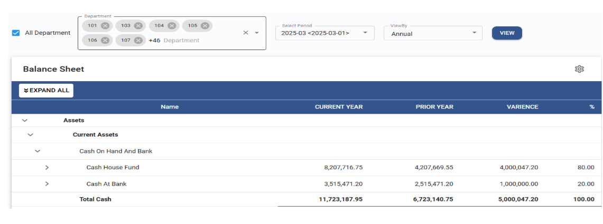

4.การตั้งค่า Reverse Sign

4.1 ใน Chart Of Accounts มีการเพิ่มการตั้งค่า “Reverse Sign” 

4.2 การตั้งค่านี้จะมีผลกับ Financial Report ในระบบเท่านั้น

4.3 Function นี้ใช้ในกรณีที่ต้องการกลับตัวเลขให้แสดงผลตรงกันข้าม 

4.3.1 เช่น account code ที่เป็นตัวลดรายได้ จากตัวอย่างคือ “Rebate Service Charge” 

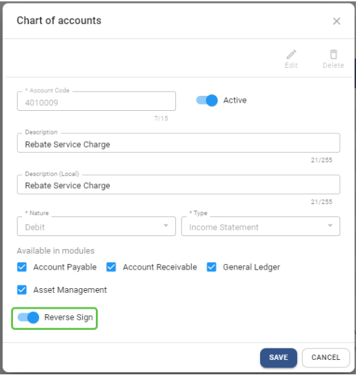

4.3.2 เมื่อตั้งค่า reverse sign แล้ว ระบบจะทำการแสดงผลตรงกันข้าม ดังนั้น “Rebate Service Charge” จะแสดงผลเป็นติดลบ เพื่อทำให้รายได้ในหมวด “Room” มีมุลค่าลดลง

