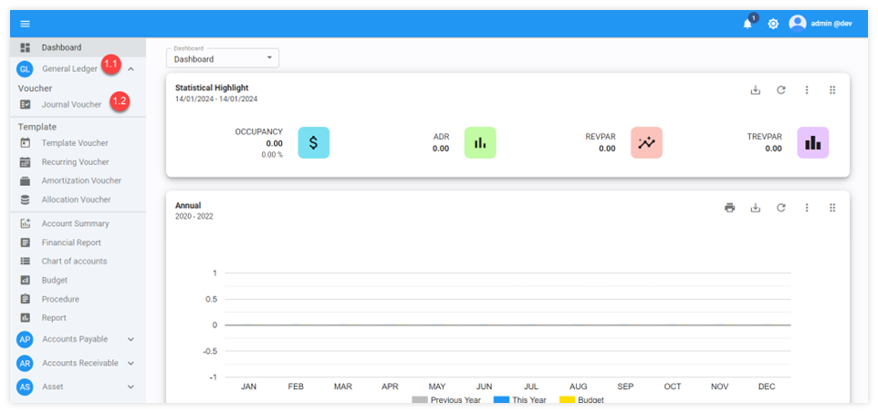
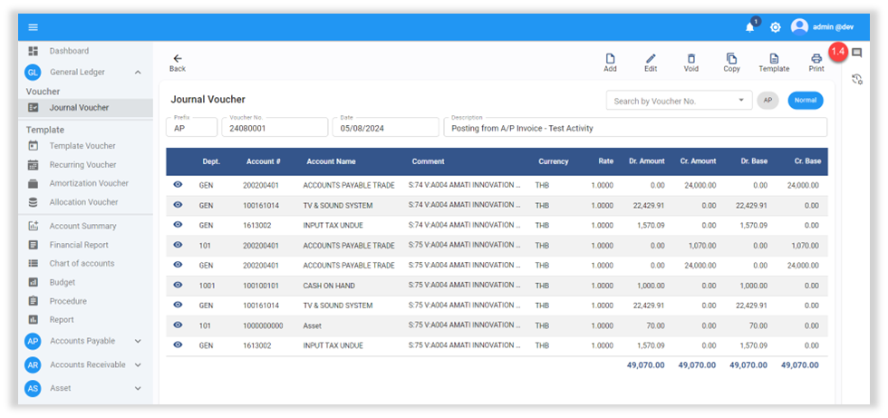
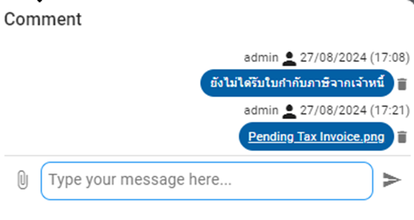
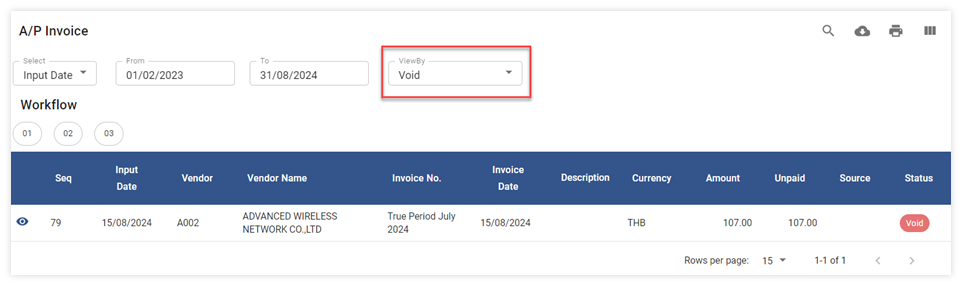
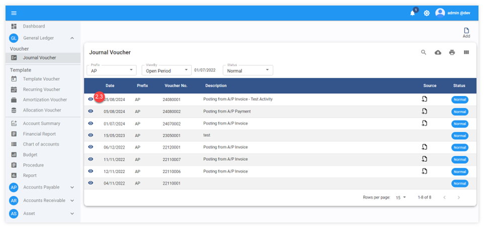
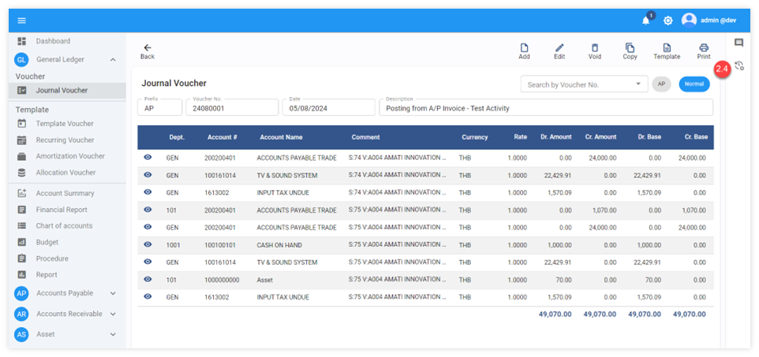
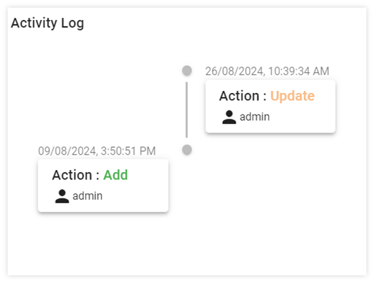

# Comment and Document Management & Activity Log

Comment and Document Management คือการใส่ comment เพิ่มเติมเกี่ยวกับเอกสาร และสามารถแนบรูปภาพ หรือ ไฟล์ที่เกี่ยวข้องกับเอกสารได้
Activity Log คือการตรวจสอบกิจกรรม หรือ Action ที่เกิดขึ้นกับเอกสารแต่ละใบ เช่นมีการแก้ไขเอกสารกี่ครั้ง หรือ มีการ void เอกสาร โดยบุคคล หรือ เวลาใด
ทั้งนี้ Comment History & Activity Log สามารถใช้งานได้กับทุกๆ เอกสารในระบบ Carmen

## การใช้งาน Comment and Document Management

 Comment History คือ การบันทึกความคิดเห็นในเอกสารเพื่อเป็นการช่วยจำ รวมถึงแนบรูปภาพ หรือไฟล์ที่เกี่ยวข้องกับเอกสาร

1. การใช้งาน Comment History ในระบบ General Ledger

1.1 Click General Ledger

1.2 Click Journal Voucher

1.3 Click เลือก Voucher ที่ต้องการจะตรวจสอบข้อมูล

1.4 Click สัญลักษณ์  เพื่อตรวจดูความคิดเห็นเพิ่มเติมในใบงาน

1.5 ระบบจะแสดงข้อมูลในส่วนของความคิดเห็นในเอกสาร และไฟล์แนบต่าง ๆ ของเอกสารนั้น

1.6 หากต้องการลบ comment หรือไฟล์แนบให้กด 

1.7 หากต้องการใส่ comment เพิ่มเติม ให้กรอกข้อความลงไปและกด 

1.8 หากต้องการใส่รูปภาพหรือไฟล์แนบต่าง ๆ ให้กด  เพื่อเลือกรูปหรือไฟล์แนบ

## การใช้งาน Activity Log

 Activity Log คือ การบันทึกกิจกรรมของเอกสารในรูปแบบต่างๆ ดังต่อไปนี้

- สร้างเอกสาร (Add Data) ระบบจะแสดงรายละเอียดถึงวันเวลาในการ ”สร้าง” เอกสาร เช่น สร้างโดยใคร สร้างวันที่เท่าไหร่ และสร้างเวลาไหน ซึ่งผู้ใช้งานจะสามารถตรวจสอบได้จากหน้าต่างใบงานของระบบ Carmen Accounting ได้เลย
- การแก้ไขข้อมูลในเอกสาร (Update Data) ระบบจะแสดงรายละเอียดถึงวันเวลาในการ “แก้ไข” เอกสาร เช่น สร้างโดยใคร สร้างวันที่เท่าไหร่ และสร้างเวลาไหน ซึ่งผู้ใช้งานจะสามารถตรวจสอบได้จากหน้าต่างใบงานของระบบ Carmen Accounting ได้เช่นกัน
- การยกเลิกข้อมูลในเอกสาร (Void Data) ระบบจะแสดงรายละเอียดถึงวันเวลาในการ “ยกเลิก” เอกสาร เช่น สร้างโดยใคร สร้างวันที่เท่าไหร่ และสร้างเวลาไหน ซึ่งผู้ใช้งานจะสามารถตรวจสอบได้จากหน้าต่างใบงานของระบบ Carmen Accounting โดยเลือกมุมมองเอกสารประเภท View by Void

2. การใช้งาน Activity Log ในระบบ General Ledger

2.1 Click General Ledger

2.2 Click Journal Voucher

2.3 Click เลือก Voucher ที่ต้องการจะตรวจสอบข้อมูล

2.4 Click สัญลักษณ์  เพื่อตรวจกิจกรรมของเอกสาร

   ตัวอย่างภาพการแสดงข้อมูลในส่วนของความคิดเห็นในเอกสารใบงาน
     

