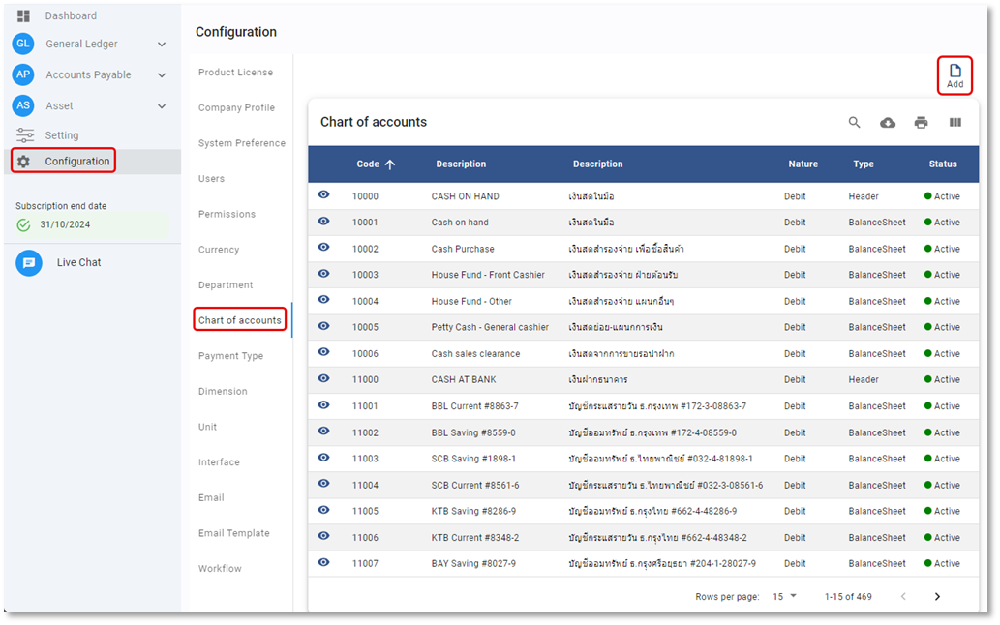
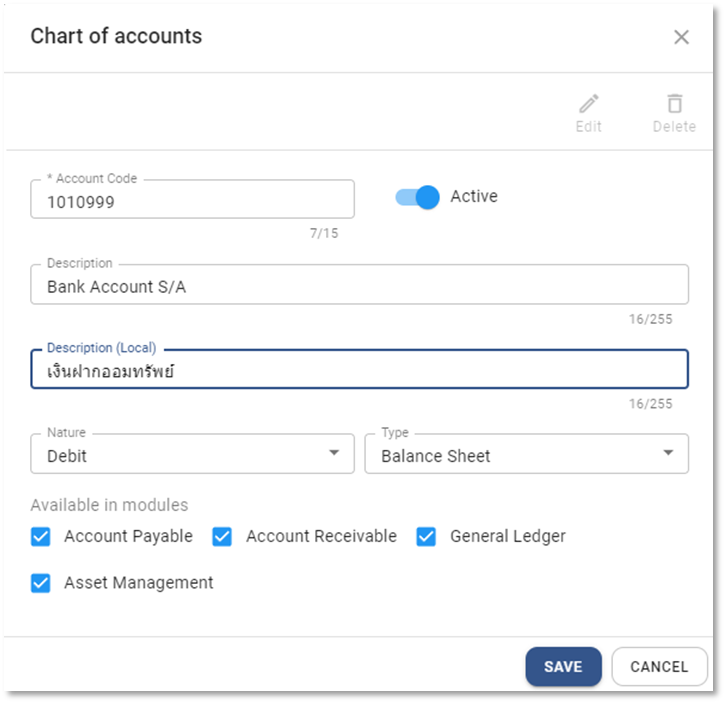
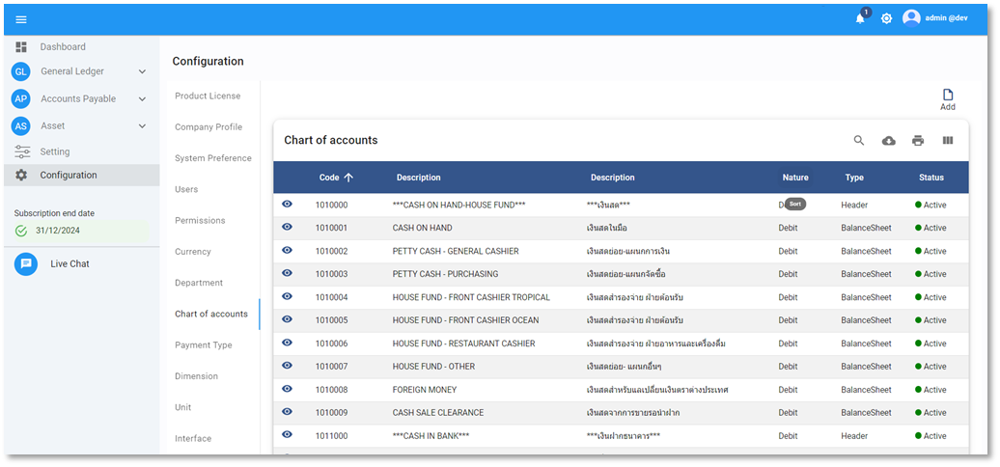

# การสร้างรหัสบัญชี Chart Of Accounts

## การสร้างรหัสบัญชี (Account Code) ในระบบ

1.1 กดปุ่ม Configuration > Chat Of Account

1.2 กดปุ่ม  ระบบจะแสดงหน้าต่าง Chart of Account ให้กำหนดค่าดังต่อไปนี้

1.3 ขั้นตอนการบันทึกข้อมูลผังบัญชี โดยมีรายละเอียดดังนี้

**หมายเหตุ** เครื่องหมาย \*
(สัญลักษณ์ \* ช่องที่จำเป็นต้องระบุ)

- \* กำหนดรหัสบัญชี
- Status กำหนด สถานะของ Account Code
  - Active เปิดใช้งาน
  - In-active ปิดไม่ให้ใช้งาน
- \* Description ระบุคำอธิบายภาษาอังกฤษ
- \* Description (Local) ระบุคำอธิบายภาษาไทย
- \* Nature กำหนดลักษณะตามผังบัญชี 5 ประเภท (เมื่อมีการนำ Account Code ไปใช้ในการบันทึกบัญชีแล้ว จะไม่สามารถแก้ไข หรือเปลี่ยน Acc. Nature ได้)
  - หมวด 1 สินทรัพย์ Dr.
  - หมวด 2 หนี้สิน Cr
  - หมวด 3 ทุน Cr.
  - หมวด 4 รายได้ Cr.
  - หมวด 5 ค่าใช้จ่าย Dr.
- \*Type กำหนดประเภทของรหัสบัญชีในระบบมี 4 ประเภท คือ
  - Header หมวดบัญชีคุม ไม่ถูกนำคำนวณในการบันทึกบัญชี
  - Balance Sheet รหัสบัญชีที่สัมพันธ์กับงบดุล
  - Income Statement รหัสบัญชีที่สัมพันธ์กับงบกำไรขาดทุน
    เมื่อทำขั้นตอน Year End ระบบจะกลับบัญชีในหมวดรายได้และค่าใช้ให้เป็น 0 และบันทึกกำไรขาดทุนตอนสิ้นปีให้อัตโนมัติ
  - Statistic รหัสบัญชีที่ใช้ในการบันทึกข้อมูลทางสถิติ
- \*Available In Module กำหนด Module ที่สามารถใช้รหัสบัญชีนี้ได้โดยการติ๊กเครื่องหมายถูกหน้า Module เพื่อป้องกันการบันทึกรหัสบัญชีใน Module ที่ไม่ต้องการ

  - Account Payable
  - Account Receivable
  - General Ledger
  - Asset Management

    1.4 กด **SAVE** เพื่อบันทึกข้อมูล หรือกด Cancel เพื่อยกเลิก

    

1.5 กด **OK** เพื่อเสร็จสิ้นการบันทึกข้อมูล

    

## การแก้ไขรหัสบัญชี Account Code

1.6 กดปุ่ม Chat Of Account

1.7 คลิกที่ปุ่ม  Account Code ที่ต้องการแก้ไข

1.8 กดปุ่ม จะสามารถแก้ไขได้ 2 ส่วน ได้แก่

- Description, Description (Local)
- Available In Module

---

1.9 กด **SAVE** เพื่อบันทึกข้อมูล

    

1.10 กด **OK** เพื่อเสร็จสิ้นการบันทึกข้อมูล

    

## การลบรหัสบัญชี Account Code

1.11 กดปุ่ม Chat Of Account

1.12 คลิกที่ปุ่ม  Account Code ที่ต้องการลบ

1.13 กดปุ่ม 

1.14 ระบบจะขึ้นหน้าต่างให้ยืนยันการลบ

- กด YES เพื่อ ยืนยัน
- หรือ No เพื่อยกเลิก

    

1.15 เมื่อเรียบร้อยแล้วจะมีหน้าต่างแสดงข้อความ Success

    

**หมายเหตุ** : Account Code ที่มีการใช้งานแล้ว จะไม่สามารถลบได้ แนะนำให้แก้ไข Status เป็น In-Active แทน

## การใช้งานปุ่มอื่น ๆ บนหน้าจอ

1.16 กดปุ่ม  เพื่อค้นหา Currency

1.17 กดปุ่ม  เพื่อ Export ข้อมูลอัตราแลกเปลี่ยนออกจากระบบเป็น .csv

1.18 กดปุ่ม  เพื่อพิมพ์ข้อมูลอัตราแลกเปลี่ยน
