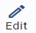

# Company Profile

การบันทึกข้อมูลบริษัท Company Profile

Function นี้ใช้สำหรับกำหนดข้อมูลบริษัทและโรงแรมของลูกค้า

1. คลิกข้าสู่ Configuration

2. เลือก Company Profile

3. กดปุ่ม  ด้านบนขวามือ

4. ระบบจะเปิดให้กรอก หรือ แก้ไขข้อมูลบริษัท

5. ให้ผู้ใช้งานทำการ เพิ่มเติม หรือ แก้ไขข้อมูล โดยแต่ละช่องมีรายละเอียด ดังต่อไปนี้

- Logo สามารถเพิ่ม หรือ แก้ไข Logo โดย กดปุ่ม  ตรงกลางด้านบนเพื่อเลือกรูปภาพ

  **Hotel Information**

- Hotel Name ชื่อ โรงแรม รีสอร์ท
- Address ที่อยู่ โรงแรม รีสอร์ท
- Tel เบอร์โทรศัพท์ของ โรงแรม รีสอร์ท
- Email อีเมลของโรงแรม รีสอร์ท

  **Company Information**

- \* Reg. Name ชื่อและที่อยู่ของบริษัทที่จดทะเบียนไว้กับกระทรวงพาณิชย์และกรมสรรพากร
  (ไม่สามารถแก้ไขได้เอง เนื่องจากมีผลกับ License)
- Tel. หมายเลขโทรศัพท์
- Email อีเมล
- Branch No หมายเลขสาขา (กรอกเป็นตัวเลข 5 ตำแหน่ง เช่นสำนักงานใหญ่ให้กรอก 00000)
- Address ที่อยู่ของบริษัทที่จดทะเบียนไว้กับกระทรวงพาณิชย์และกรมสรรพากร
- Company Reg. ID หมายเลขจดทะเบียนบริษัท
- Fax หมายเลขแฟกซ์
- \* Tax ID หมายเลขประจำตัวผู้เสียภาษีอากร
- Reg. Date วันที่จดทะเบียนบริษัท

6. ตรวจสอบความถูกต้อง เรียบร้อยแล้วกดปุ่ม **SAVE** เพื่อบันทึกข้อมูล
