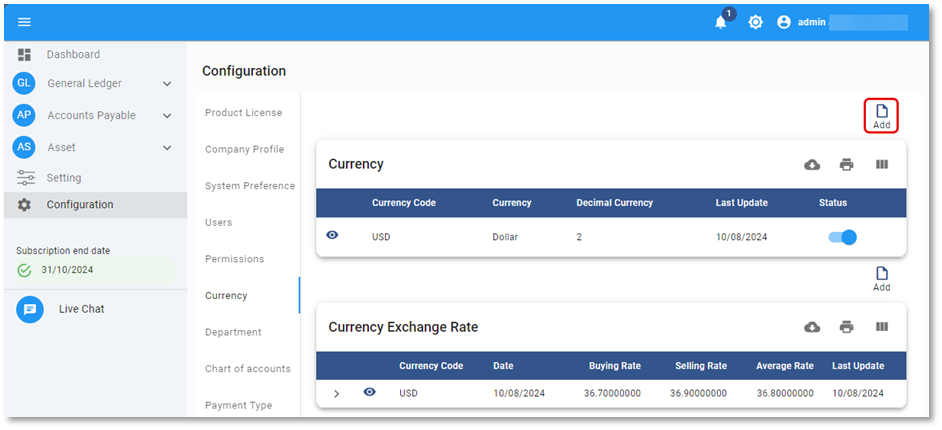
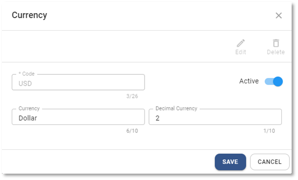
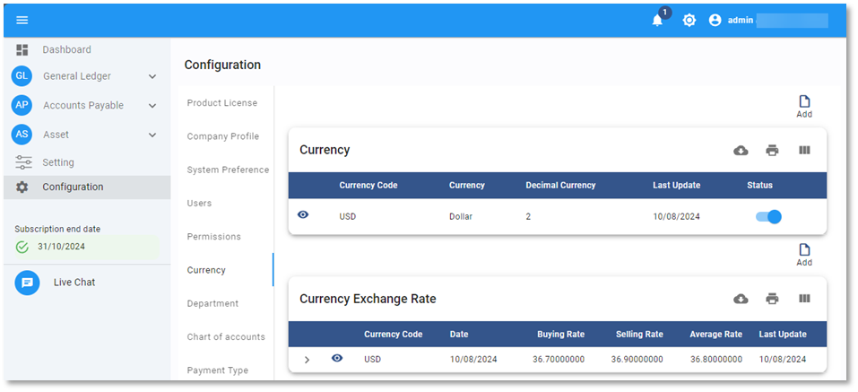

# การสร้างสกุลเงิน (Currency)

Function นี้ใช้สำหรับบันทึกสกุลเงินเพื่อรองรับการบันทึกข้อมูลแบบ Multi Currency

## การเพิ่มสกุลเงิน Currency

1.1. Click เมนู Configuration

1.2. เลือก Currency

1.3. กดปุ่ม Add  ด้านบน ขวามือ

1.4. ระบบจะแสดงหน้าต่าง Currency ให้ระบุข้อมูลดังต่อไปนี้

- Code กำหนดรหัสสกุลเงิน
- Status กำหนด Status ของ Unit
  - Active เปิดให้ใช้งาน
  - Inactive ปิดไม่ให้ใช้งาน
- Currency กำหนดชื่อสกุลเงิน
- Decimal Currency กำหนดตำแหน่งทศนิยมที่ต้องการใช้

---

1.5. เมื่อเรียบร้อยแล้วกดปุ่ม **SAVE** เพื่อยืนยัน หรือ Cancel เพื่อยกเลิก

    

1.6. ระบบจะแสดงหน้าต่างตามภาพด้านล่าง ให้กด **OK** เพื่อปิด

    

## การแก้ไขสกุลเงิน Currency

1.7. กดปุ่ม Currency

1.8. Click ที่ปุ่ม  หน้า Currency ที่ต้องการแก้ไข

1.9. กดปุ่ม  จะสามารถแก้ไขได้ 2 ส่วน ได้แก่

- Currency
- Decimal Currency

---

1.10. กด **SAVE** เพื่อบันทึกข้อมูล

    

1.11. กด **OK** เพื่อเสร็จสิ้นการบันทึกข้อมูล

    

## การลบสกุลเงิน Currency

1.12. กดปุ่ม Currency

1.13. Click ที่ปุ่ม  หน้า Currency ที่ต้องการลบ

1.14. กดปุ่ม 

    

1.15. ระบบจะขึ้นหน้าต่างให้ยืนยันการลบ

- กด YES เพื่อ ยืนยัน
- หรือ No เพื่อยกเลิก

    

1.16. เมื่อเรียบร้อยแล้วจะมีหน้าต่างแสดงข้อความ Success

    

**หมายเหตุ** : Currency ที่มีการใช้งานแล้ว จะไม่สามารถลบได้

## การใช้งานปุ่มอื่น ๆ บนหน้าจอ

1.17. กดปุ่ม  เพื่อค้นหา Currency

1.18. กดปุ่ม  เพื่อ Export ข้อมูลอัตราแลกเปลี่ยนออกจากระบบเป็น .csv

1.19. กดปุ่ม  เพื่อพิมพ์ข้อมูลอัตราแลกเปลี่ยน
