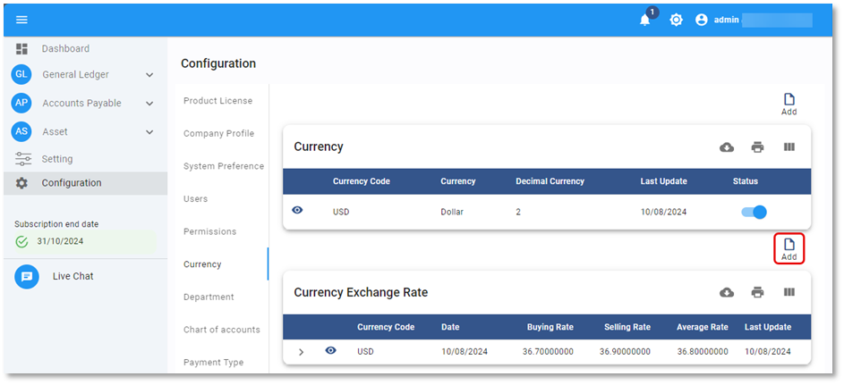
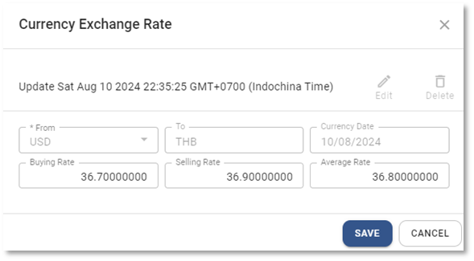

# Currency Exchange Rate

การสร้างสกุลเงินและอัตราแลกเปลี่ยนเงินตราต่างประเทศ (Currency & Currency Exchange Rate)

Function นี้ใช้สำหรับบันทึกอัตราแลกเปลี่ยนเพื่อรองรับการบันทึกข้อมูลแบบ Multi Currency

## การเพิ่มอัตราแลกเปลี่ยน Currency Exchange Rate

1.1. Click เมนู Configuration

1.2. เลือก Currency

1.3. การสร้าง Currency Exchange Rate เพื่อกำหนดอัตราแลกเปลี่ยน

1.4. กดปุ่ม Add  ด้านบน ขวามือ

1.5. ระบบจะแสดงหน้าต่าง Currency Exchange Rate ให้ระบุข้อมูลดังต่อไปนี้ (สามารถสร้างประวัติของอัตราแลกเปลี่ยนเป็นรายวันได้)

- From กำหนด Currency Code ที่ต้องการระบุอัตราแลกเปลี่ยน
- To ระบบจะแสดง Base Currency ของระบบ
- Currency Date ระบุวันที่ของอัตราแลกเปลี่ยน
- Buying Rate ระบุอัตราการแลกเปลี่ยนที่ธนาคารซื้อ
- Selling Rate ระบุอัตราการแลกเปลี่ยนที่ธนาคารขาย
- Average Rate ระบุอัตราแลกเปลี่ยนถั่วเฉลี่ย

---

1.6. เมื่อเรียบร้อยแล้วกดปุ่ม **SAVE** เพื่อยืนยัน หรือ Cancel เพื่อยกเลิก

    

1.7. ระบบจะแสดงหน้าต่างตามภาพด้านล่าง ให้กด **OK** เพื่อปิด

    

## การแก้ไขอัตราแลกเปลี่ยน Currency Exchange Rate

1.8. กดปุ่ม Currency

1.9. คลิกที่ปุ่ม  หน้า Currency Exchange Rate ที่ต้องการแก้ไข

1.10. กดปุ่ม  จะสามารถแก้ไขได้ 3 ส่วน ได้แก่

- Buying Rate
- Selling Rate
- Average Rate

---

1.11. กด **SAVE** เพื่อบันทึกข้อมูล

    

1.12. กด **OK** เพื่อเสร็จสิ้นการบันทึกข้อมูล

    

## การลบอัตราแลกเปลี่ยน Currency Exchange Rate

1.13. กดปุ่ม Currency

1.14. คลิกที่ปุ่ม  หน้า Currency Exchange Rate ที่ต้องการลบ

1.15. กดปุ่ม 

    

1.16. ระบบจะขึ้นหน้าต่างให้ยืนยันการลบ

- กด YES เพื่อ ยืนยัน
- หรือ No เพื่อยกเลิก

    

1.17. เมื่อเรียบร้อยแล้วจะมีหน้าต่างแสดงข้อความ Success

    

**หมายเหตุ** : Currency Exchange Rate ที่มีการใช้งานแล้ว จะไม่สามารถลบได้

## การใช้งานปุ่มอื่น ๆ บนหน้าจอ

1.18. กดปุ่ม  เพื่อค้นหา Currency Exchange Rate

1.19. กดปุ่ม  เพื่อ Export ข้อมูลอัตราแลกเปลี่ยนออกจากระบบเป็น .csv

1.20. กดปุ่ม  เพื่อพิมพ์ข้อมูลอัตราแลกเปลี่ยน
