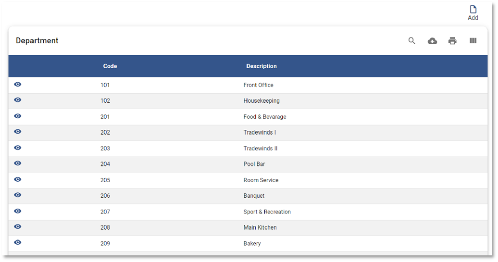
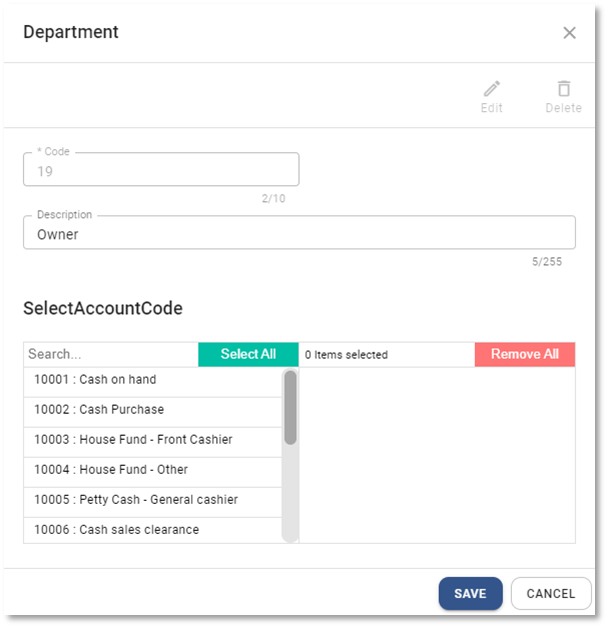

# การสร้างรหัสแผนก Department

## การเพิ่มรหัสแผนก Department

การสร้างแผนก Department Code ในการบันทึกบัญชี

1.1 Click เข้าสู่ Configuration

1.2 เลือก Department Code

1.3 กดปุ่ม  ระบบจะแสดงหน้าต่าง Department ให้กำหนดค่าดังต่อไปนี้

1.4 กรอกข้อมูลผังบัญชีดังนี้

**หมายเหตุ** เครื่องหมาย \*
(สัญลักษณ์ \* ช่องที่จำเป็นต้องระบุ)

- \* Code > กำหนดรหัสแผนก
- Description > กำนดชื่อแผนก
- Select Account code > ใช้กำหนดรหัสบัญชีที่สามารถใช้คู่กับแผนกได้ เช่น แผนก Front Office สามารถใช้ได้เฉพาะ Account code ในหมวดรายได้ค่าห้องเท่านั้น
  จะช่วยป้องกัน user เลือก Account code ผิดแผนกได้
- กด **SAVE** เพื่อบันทึกข้อมูล หรือ Cancel เพื่อยกเลิก

    

1.5 กด OK เพื่อเสร็จสิ้นการบันทึกข้อมูล

    

## การแก้ไขรหัสแผนก Department Code

1.6. กดปุ่ม Department

1.7. Click ที่ปุ่ม  หน้า Code Department ที่ต้องการแก้ไข

1.8 กดปุ่ม  จะสามารถแก้ไขได้ 2 ส่วน ได้แก่

- Description
- Select Account code

---

1.9 กด **SAVE** เพื่อบันทึกข้อมูล

    

1.10 กด **OK** เพื่อเสร็จสิ้นการบันทึกข้อมูล

    

## การลบรหัสแผนก Department Code

1.11 กดปุ่ม Department

1.12 Click ที่ปุ่ม  หน้า Department ที่ต้องการลบ

1.13 กดปุ่ม 

    

1.14 ระบบจะขึ้นหน้าต่างให้ยืนยันการลบ

- กด YES เพื่อ ยืนยัน
- หรือ No เพื่อยกเลิก

    

1.15 เมื่อเรียบร้อยแล้วจะมีหน้าต่างแสดงข้อความ Success

    

**หมายเหตุ** : Department Code ที่มีการใช้งานแล้ว จะไม่สามารถลบได้

## การใช้งานปุ่มอื่น ๆ บนหน้าจอ

1.17. กดปุ่ม  เพื่อค้นหา Department Code

1.18. กดปุ่ม  เพื่อ Export ข้อมูลแผนกออกจากระบบเป็น .csv

1.19. กดปุ่ม  เพื่อพิมพ์ข้อมูลแผนก
