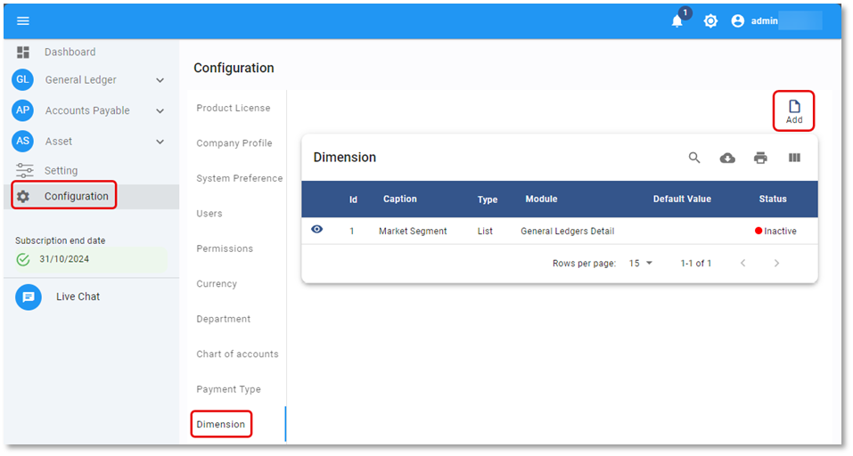
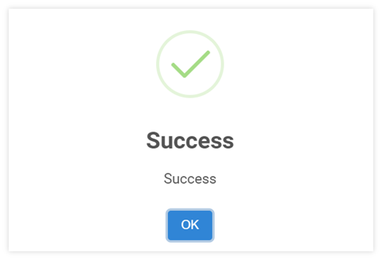
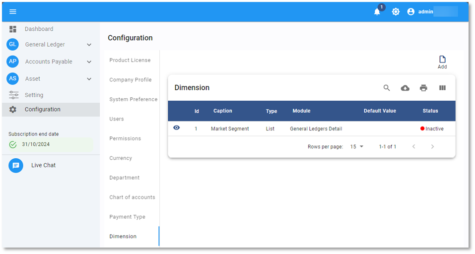
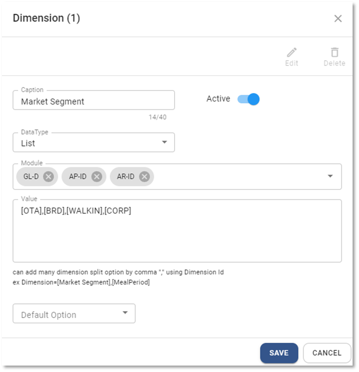
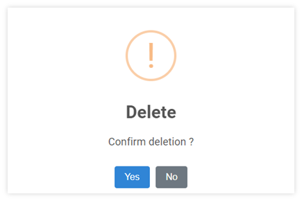

# การสร้างประเภทการวิเคราะห์ข้อมูล Dimension

Function นี้ใช้สำหรับสร้างประเภทและรหัสการวิเคราะห์ข้อมูล เพื่อนำไปใช้ในการบันทึกในระดับ Transaction เช่นต้องการวิเคราะห์ข้อมูลรายได้ค่าห้องแยกตาม Market Segment หรือ ต้องการวิเคราะห์ข้อมูลรายได้อาหารและเครื่องดื่มแยกตาม Meal Period

## การเพิ่ม Dimension

1.1. คลิกเมนู Configuration

1.2. เลือก Dimension

1.3. กดปุ่ม Add  ด้านบน ขวามือ

1.4. ระบบจะแสดงหน้าต่าง Dimension ให้ระบุข้อมูลดังต่อไปนี้

- Caption กำหนดชื่อของประเภทการวิเคราะห์
- Status กำหนด สถานะของรหัสวิเคราะห์
  - Active เปิดใช้งาน
  - In-active ปิดไม่ให้ใช้งาน
- Data Type ระบุประเภทข้อมูล ให้เลือกเป็น List เมื่อต้องการสร้างรหัสการวิเคราะห์
- Module ระบุ Module ที่สามารถบันทึกประเภทการวิเคราะห์ได้
- Value กำหนดรหัสวิเคราะห์ (ใช้ได้กับ Data Type ประเภท List เท่านั้น)
- Default Option กำหนดรหัสวิเคราะห์เบื้องต้น

---

1.5. กดปุ่ม **SAVE** เพื่อบันทึกข้อมูล หรือกด Cancel เพื่อยกเลิก

    

1.6. ระบบจะแสดงหน้าต่างตามภาพด้านล่าง ให้กด **OK** เพื่อปิด

    

## การแก้ไขรหัสวิเคราะห์ Dimension Code

2.1 กดปุ่ม Dimension

2.2 คลิกที่ปุ่ม  หน้า Dimension Code ที่ต้องการแก้ไข

2.3 กดปุ่ม จะสามารถแก้ไขได้ 5 ส่วน ได้แก่

- Caption
- Status
- Data Type
- Module
- Value

---

2.4 กด **SAVE** เพื่อบันทึกข้อมูล

    

2.5 กด **OK** เพื่อเสร็จสิ้นการบันทึกข้อมูล

    

## การลบรหัสวิเคราะห์ Dimension Code

3.1 กดปุ่ม Dimension

3.2 คลิกที่ปุ่ม  หน้า Dimension Code ที่ต้องการลบ

3.3 กดปุ่ม 

    

3.4 ระบบจะขึ้นหน้าต่างให้ยืนยันการลบ

- กด YES เพื่อ ยืนยัน
- หรือ No เพื่อยกเลิก

    

3.5 เมื่อเรียบร้อยแล้วจะมีหน้าต่างแสดงข้อความ Success

    

**หมายเหตุ** : Dimension Code ที่มีการใช้งานแล้ว จะไม่สามารถลบได้

## การใช้งานปุ่มอื่น ๆ บนหน้าจอ

4.1 กดปุ่ม  เพื่อค้นหา Dimension Code

4.2 กดปุ่ม  เพื่อ Export ข้อมูลรหัสวิเคราะห์ออกจากระบบเป็น .csv

4.3 กดปุ่ม  เพื่อพิมพ์ข้อมูลรหัสวิเคราะห์
