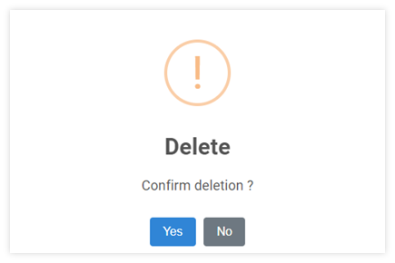

# Payment Type

ขั้นตอนการสร้างประเภทการชำระเงิน/รับชำระเงิน (Payment Type)

Function นี้ใช้สำหรับบันทึกประเภทการชำระเงินเพื่อนำไปใช้กับ Payment ของเจ้าหนี้ Vendor และบันทึกประเภทการรับชำระเงินเพื่อนำไปใช้กับ Receipt ของลูกหนี้ AR

## การเพิ่ม Payment Type

1.1. คลิกเมนู Configuration

1.2. เลือก Payment type

1.3. กดปุ่ม Add  ด้านบน ขวามือ

1.4. ระบบจะแสดงหน้าต่าง Payment Typeให้ระบุข้อมูลดังต่อไปนี้

- Code กำหนด Payment Code
- Description ระบุชื่อของประเภทการจ่าย/รับชำระเงิน เช่น Cash, Bank Transfer
- Available in module กำหนด Module ที่สามารถใช้งาน Payment Code นี้
  โดยการติ๊กเครื่องหมายถูกหน้า Module ดังต่อไปนี้
  - Account Payable
  - Account Receivable

---

1.5. กดปุ่ม **SAVE** เพื่อบันทึกข้อมูล หรือกด Cancel เพื่อยกเลิก

    

1.6. ระบบจะแสดงหน้าต่างตามภาพด้านล่าง ให้กด **OK** เพื่อปิด

    

## การแก้ไขรหัส Payment Type

2.1. กดปุ่ม Payment Type

2.2. คลิกที่ปุ่ม  หน้า Payment Code ที่ต้องการแก้ไข

2.3. กดปุ่ม จะสามารถแก้ไขได้ 2 ส่วน ได้แก่

- Description
- Available in modules

---

2.4. กด **SAVE** เพื่อบันทึกข้อมูล

    

2.5. กด **OK** เพื่อเสร็จสิ้นการบันทึกข้อมูล

    

## การลบรหัส Payment Type

3.1 กดปุ่ม Payment Type

3.2 คลิกที่ปุ่ม  หน้า Payment Code ที่ต้องการลบ

3.3 กดปุ่ม 

    

3.4 ระบบจะขึ้นหน้าต่างให้ยืนยันการลบ

- กด YES เพื่อ ยืนยัน
- หรือ No เพื่อยกเลิก

    

3.5 เมื่อเรียบร้อยแล้วจะมีหน้าต่างแสดงข้อความ Success

    

**หมายเหตุ** : Payment Code ที่มีการใช้งานแล้ว จะไม่สามารถลบได้

4. การใช้งานปุ่มอื่น ๆ บนหน้าจอ

4.1 กดปุ่ม  เพื่อค้นหา Payment Code

4.2 กดปุ่ม  เพื่อ Export ประเภทการชำระเงินออกจากระบบเป็น .csv

4.3 กดปุ่ม  เพื่อพิมพ์ประเภทการชำระเงิน
