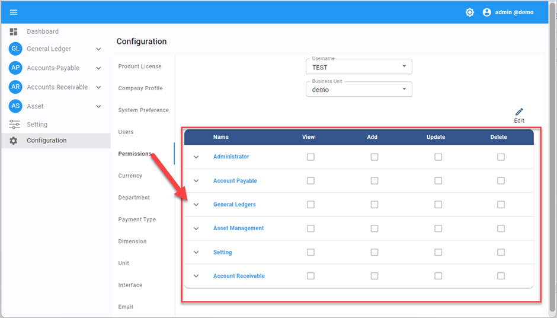

# Permissions

ขั้นตอนการกำหนด User Permission ในระบบ
Function นี้ใช้กำหนด Permission เข้าใช้งานระบบ
รายละเอียดฟังก์ชันและสิทธิการใช้งานในระบบ
เมนูฟังก์ชันหลัก ๆ ในระบบจะแบ่งเป็น 2 ส่วน คือ

1.1. ส่วนของ Module ได้แก่

- Account Payable
- General Ledgers,
- Asset Management
- Account Receivable

  1.2. ส่วนของ Configuration และ Setting ได้แก่

- Administrator
- Setting

## สิทธิการใช้งานในระบบจะมีดังต่อไปนี้

- View สิทธิในการดูข้อมูล
- Add สิทธิในการเพิ่มข้อมูล
- Update สิทธิในการแก้ไข หรือ อัพเดตข้อมูล
- Delete สิทธิในการลบข้อมูล

## ขั้นตอนการกำหนดสิทธิให้กับผู้ใช้งาน (Assign Permission)

1. Click เมนู Configuration

2. เลือกที่ Permissions จะแสดงหน้าต่าง

3. ไปที่ช่อง User เลือก User ที่จะกำหนดสิทธิ

4. เลือก BU ที่จะกำหนดสิทธิให้กับ User

5. กด 

6. กำหนดสิทธิการใช้งานในแต่ละฟังก์ชัน วิธีการดังต่อไปสี้

6.1. Click ที่ปุ่มลูกศร  หน้าฟังก์ชันหลักเพื่อขยายดูฟังก์ชันย่อยในแต่ละส่วน

6.2. ไปที่ฟังก์ชันฟังย่อย ที่ต้องการการกำหนดสิทธิ

6.3. ติ๊กเครื่องหมายถูก  คอลัมน์ที่ให้สิทธิแก่ User ในการเข้าถึง ดังต่อไปนี้

 View ให้สิทธิในการดูข้อมูล

 Add ให้สิทธิในการเพิ่มข้อมูล

 Update ให้สิทธิในการแก้ไข หรือ อัพเดตข้อมูล

 Delete ให้สิทธิในการลบข้อมูล หรือ ยกเลิก (Void)

7. เมื่อกำหนดสิทธิเรียบร้อยแล้วให้กดปุ่ม **SAVE** เพื่อบันทึกข้อมูล

8. เมื่อระบบทำการบันทึกข้อมูลเรียบร้อยแล้วจะแสดงหน้าต่างแสดงข้อความ “Success” กด **OK** เพื่อจบการทำงาน

    

**หมายเหตุ** : กรณีที่ User สามารถเข้าได้มากกว่า 1 BU ให้ดำเนินการ ตามข้อ 3-8 จนครบ
