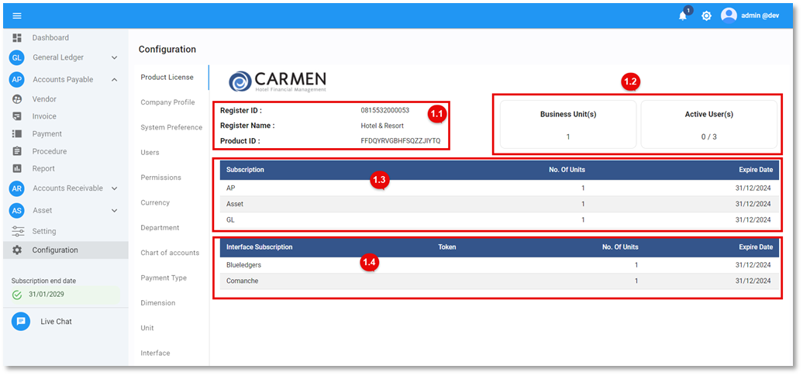

# Product License

การดูข้อมูล Product License

ข้อมูลใบอนุญาตและสิทธิ์ในการเข้าใช้งานระบบ

1.1 License Register Details

- Register ID > รหัสลงทะเบียนใบอนุญาตใช้งานระบบอย่างถูกต้อง
- Register Name > ชื่อผู้ประกอบการที่ใช้ลงทะเบียน
- Product ID License ID

1.2 Business Unit & Active User(s)

- Business Unit(s) > จำนวนสถานประกอบการที่ได้รับอนุญาต
- Active User(s) > จำนวน License ของผู้ใช้งาน

1.3 Subscription Module ที่ได้รับอนุญาตใช้งาน

1.4 Interface Subscription ระบบที่อนุญาตให้เชื่อมข้อมูลเพื่อใช้งาน

