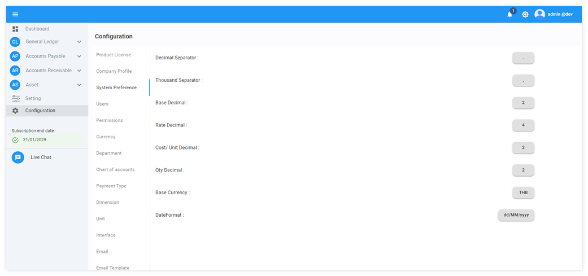

# System Preference

การตั้งค่าพื้นฐานของระบบ System Preference

1.	System Preference 

การตั้งค่าระบบมูลค่าตัวเลข สกุลเงิน และวันที่

-	Decimal Separator >	ใช้ทศนิยมคั่นระหว่างตัวเลขจำนวนเต็มและเศษสตางค์
-	Thousand Separator >	ใช้เครื่องหมาย (,) คั่นระหว่างมูลค่าจำนวนหลักหลักพันและหลักร้อย
-	Base Decimal >		ใช้ทศนิยม 2 ตำแหน่ง เป็นการแสดงหลักในระบบ
-	Rate Decimal > 		ใช้ทศนิยม 4 ตำแหน่งในการเก็บค่าทศนิยมเพื่อคำนวณปัดเศษ
-	Cost/Unit Decimal >	ใช้ทศนิยม 2 ตำแหน่งในการแสดงต้นทุนต่อหน่วยที่มียอดปัดเศษ
-	Qty Decimal >		ใช้ทศนิยม 2 ตำแหน่งในการแสดงจำนวนที่มีปัดเศษ	
-	Base Currency >		ใช้สกุลเงินเป็นเงินบาทไทย
-	Date Format >		ระบบใช้รูปแบบวันที่คือ วันที่/เดือน/ปี คศ.

 
