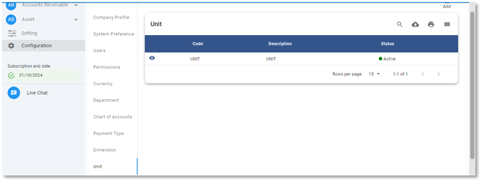
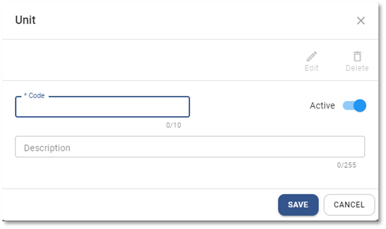
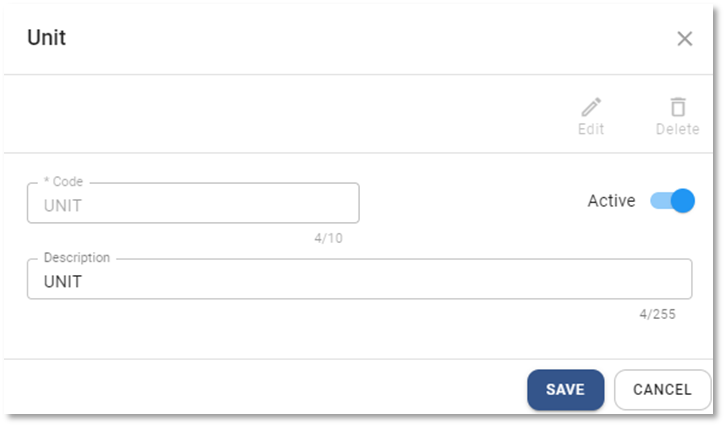

# Unit

ขั้นตอนการสร้างหน่วย (Unit) Function นี้ใช้บันทึกหน่วยเพื่อใช้กับ AR Invoice, AP Invoice และ Asset

## การเพิ่มหน่วย Unit

1.1. Click เมนู Configuration

1.2. เลือก Unit

1.3. กดปุ่ม Add  ด้านบน ขวามือ

1.4. ระบบจะแสดงหน้าต่าง Unit ให้ระบุข้อมูลดังต่อไปนี้

- Code กำหนด Unit Code
- Status กำหนด Status ของ Unit
  - Active เปิดให้ใช้งาน
  - Inactive ปิดไม่ให้ใช้งาน
- Description ระบุชื่อของหน่วยที่จะใช้

---

1.5. กดปุ่ม **SAVE** เพื่อบันทึกข้อมูล หรือกด Cancel เพื่อยกเลิก

    

1.6. ระบบจะแสดงหน้าต่างตามภาพด้านล่าง ให้กด **OK** เพื่อปิด

    

## การแก้ไขรหัสหน่วย Unit

1.7. กดปุ่ม Unit

1.8. Click ที่ปุ่ม  หน้า Unit Code ที่ต้องการแก้ไข

1.9. กดปุ่ม จะสามารถแก้ไขได้ 2 ส่วน ได้แก่

- Status
- Description

---

1.10. กด **SAVE** เพื่อบันทึกข้อมูล

    

1.11. กด **OK** เพื่อเสร็จสิ้นการบันทึกข้อมูล

    

## การลบรหัสหน่วย Unit Code

1.12. กดปุ่ม Unit

1.13. Click ที่ปุ่ม  หน้า Unit Code ที่ต้องการลบ

1.14. กดปุ่ม 

    

1.15. ระบบจะขึ้นหน้าต่างให้ยืนยันการลบ

- กด YES เพื่อ ยืนยัน
- หรือ No เพื่อยกเลิก

    

1.16. เมื่อเรียบร้อยแล้วจะมีหน้าต่างแสดงข้อความ Success

    

**หมายเหตุ** : Unit Code ที่มีการใช้งานแล้ว จะไม่สามารถลบได้

## การใช้งานปุ่มอื่น ๆ บนหน้าจอ

1.17. กดปุ่ม  เพื่อค้นหา Unit Code

1.18. กดปุ่ม  เพื่อ Export ข้อมูลหน่วยออกจากระบบเป็น .csv

1.19. กดปุ่ม  เพื่อพิมพ์ข้อมูลหน่วย
