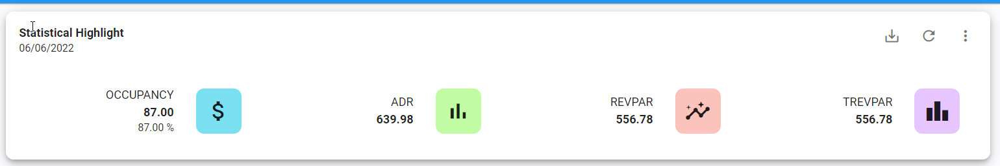
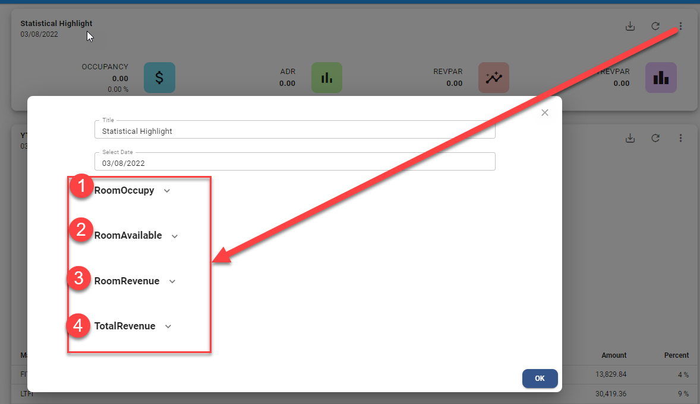
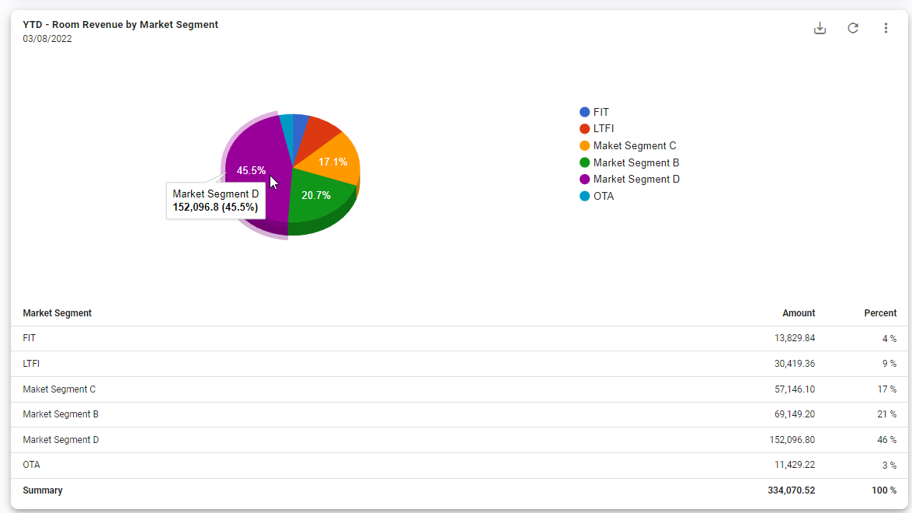
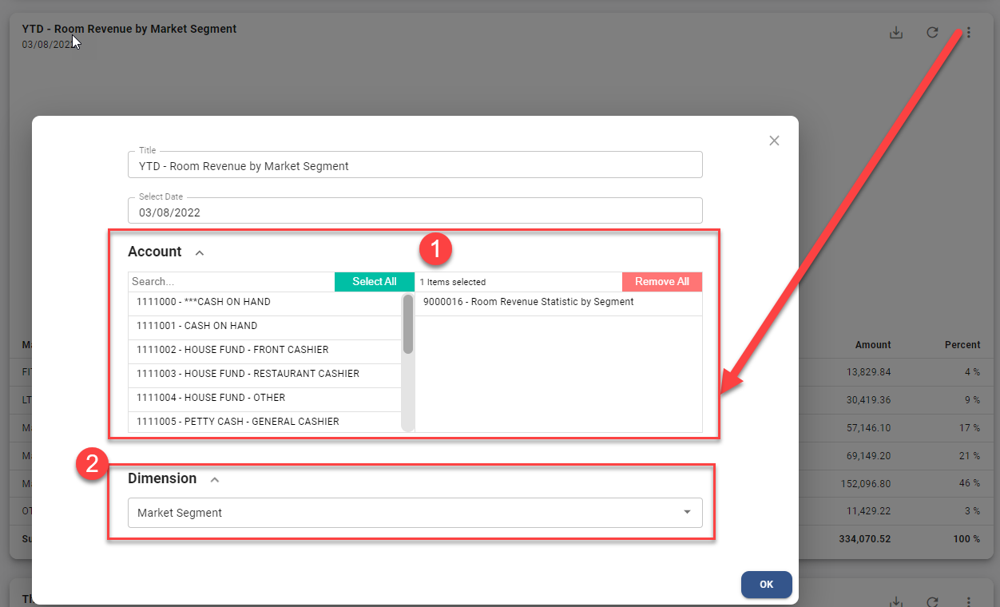
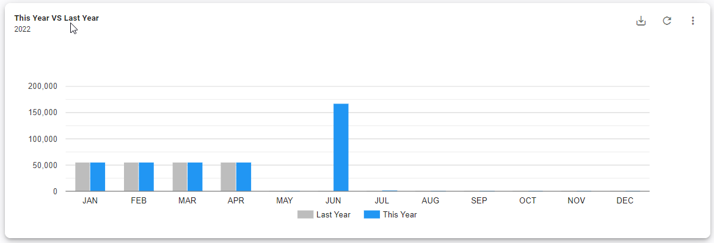
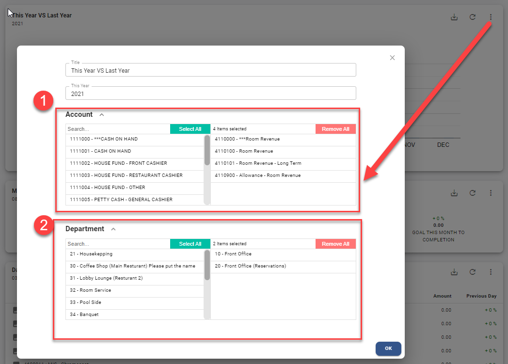
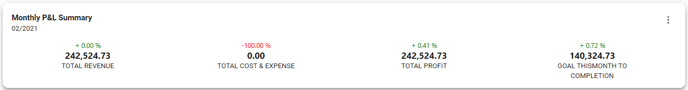
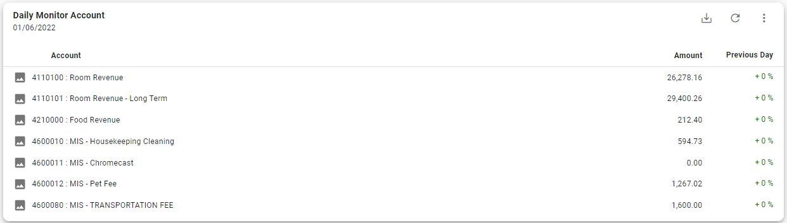
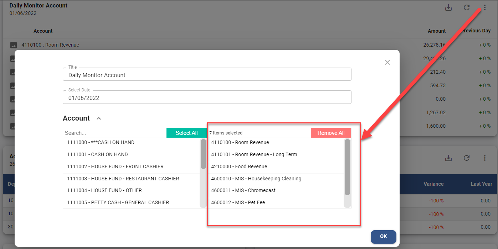

# Dashboard

Dashboard จะนำข้อมูลที่มีการบันทึกใน JV มาแสดงผล

## Statistical Highlight

ข้อมูลทางสถิติการเข้าพักของแขกและแสดงรายได้เฉลี่ยการขายห้องพักในแต่ละวัน
โดยจะแสดงข้อมูลดังต่อไปนี้

- OCCUPANCY แสดง % อัตราการเข้าพัก

- ADR Average Daily Rate รายได้ค่าห้องพักเฉลี่ยต่อห้องพักที่ขายได้

- REVPAR, Revenue Per Available Room <u>**รายได้ค่าห้อง**</u> เฉลี่ยต่อห้องพักทั้งหมด(ที่สามารถขายได้)

- TREVPAR, Total Revenue Per Available Room <u>**รายได้ทั้งหมด**</u> เฉลี่ยต่อห้องพักทั้งหมด(ที่สามารถขายได้)

โดยระบบจะ Default ข้อมูลของเมื่อวานให้ หรือผู้ใช้งานสามารถเลือกวันที่
ที่ต้องการจะดูข้อมูลได้

**วิธีการตั้งค่าเพื่อแสดงข้อมูล**

1.  นำเม้าคลิกที่ปุ่ม  ด้านหลังของ Dashboard

2.  กำหนดข้อมูลดังต่อไปนี้

1.  Room Occupy คลิกเลือก Account Code ที่ใช้ในการบันทึกข้อมูล<u>**สถิติของห้องพักที่ขายได้**</u>

2.  Room Available คลิกเลือก Account Code ที่ใช้ในการบันทึกข้อมูล<u>**สถิติของห้องพักทั้งหมดมีไว้เพื่อขาย**</u>

3.  Room Revenue คลิกเลือก Account Code ที่ใช้ในการบันทึก<u>**รายได้ห้องพัก**</u>

4.  Total Revenue คลิกเลือก Account Code ที่ใช้ในการบันทึก<u>**รายได้ทั้งหมด**</u>

5.  กดปุ่ม **OK** เพื่อบันทึกข้อมูล

## Dimension Analysis

ข้อมูลรายได้ห้องพัก **โดยแยกตาม Market Segment** ซึ่งในระบบจะแยกการบันทึกบัญชี โดยใช้ Dimension filed เป็นตัวแยก

และแสดงยอดรวมตาม Year to Date คือยอดรวมตั้งแต่วันแรกของปี
จนถึงวันปัจจุบัน หรือวันที่ ที่กำหนดไว้ โดยจะแสดงข้อมูลดังต่อไปนี้

- แผนภูมิวงกลมแสดงอัตราส่วนรายได้ค่าห้องพักของแต่ละ Market Segment

- Market Segment แสดงคำอธิบายรายการ ของแต่ละ Market Segment

- Amount แสดง<u>**ยอดรวม**</u>ของแต่ละ Market Segment

- Percent แสดงเปอร์เซ็นต์ของ<u>**รายได้**</u>แต่ละ Market Segment
  > ตามอัตตาส่วนของรายได้ค่าห้องพักทั้งหมด

**วิธีการตั้งค่าเพื่อแสดงข้อมูล**

1.  นำเม้าคลิกที่ปุ่ม  ด้านหลังของ Dashboard

2.  กำหนดข้อมูลดังต่อไปนี้

1.  Account คลิกเลือก Account Code ที่ใช้ในการบันทึก <u>**รายได้ห้องพัก**</u>

2.  Dimension เลือก Dimension ที่ใช้ระบุ Market Segment

3.  กดปุ่ม **OK** เพื่อบันทึกข้อมูล

## This Year VS Last Year

กราฟแท่งแสดงยอดรวม เปรียบเทียบข้อมูลระหว่าง <u>**ยอด Actual ปีปัจจุบัน**</u>
กับ <u>**ยอด Actual ของปีที่แล้ว**</u> 12 เดือน
ทั้งนี้ยังสามารถเลือกดูข้อมูลย้อนหลังของปีที่ผ่านมาแล้วได้ด้วย
โดยจะแสดงข้อมูลดังต่อไปนี้

- แท่งสีเทา แสดง ยอด Actual ของปีที่แล้ว หรือปีก่อนหน้า

- แท่งสีฟ้า แสดง ยอด Actual ปีปัจจุบัน หรือ ปีที่กำหนดไว้

**วิธีการตั้งค่าเพื่อแสดงข้อมูล**

1.  นำเม้าคลิกที่ปุ่ม  ด้านหลังของ Dashboard

2.  กำหนดข้อมูลดังต่อไปนี้

1.  Account คลิกเลือก Account Code ที่ต้องการให้ระบบแสดงผลรวม

2.  Department คลิกเลือก Department ที่ต้องการให้ระบบแสดงผลรวม

3.  กดปุ่ม **OK** เพื่อบันทึกข้อมูล

## Monthly P&L Summary

ผลรวมกำไรขาดทุนในแต่ละเดือน สำหรับไม่ต้องตั้งค่าระบบจะแสดงผลรวม
โดยจะแสดงข้อมูลดังต่อไปนี้

- TOTAL REVENUE แสดงยอดรวมของรายได้

- TOTAL COST & EXPENSE แสดงยอดรวมของต้นทุนและค่าใช้จ่าย

- TOTAL PROFIT แสดงผลรวมกำไร/ขาดทุน

- GOAL THIS MONTH TO COMPLETION แสดงส่วนต่างระหว่าง Net Profit Actual
  > กับ budget Profit

**วิธีการตั้งค่าเพื่อแสดงข้อมูล**

ไม่ต้องตั้งค่า

## Daily Monitor Account

แสดงยอดรวมของรหัสบัญชี (ตามที่เดตอัพไว้) เป็นแบบรายวัน
โดยจะแสดงข้อมูลดังต่อไปนี้

- Account แสดงรหัสและชื่อของ Account Code

- Amount แสดงยอดรวมของวันที่ที่เรียกดู

- Previous Day แสดงการเปรียบเทียบผลต่างขอวันที่เรียกดูข้อมูลและวันก่อนหน้าเป็นแบบ %

**วิธีการตั้งค่าเพื่อแสดงข้อมูล**

1.  นำเม้าคลิกที่ปุ่ม  ด้านหลังของ Dashboard

2.  กำหนดข้อมูลดังต่อไปนี้

1.  Account คลิกเลือก Account Code ที่ต้องการให้ระบบแสดงผลรวม

2.  กดปุ่ม **OK** เพื่อบันทึกข้อมูล
