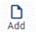
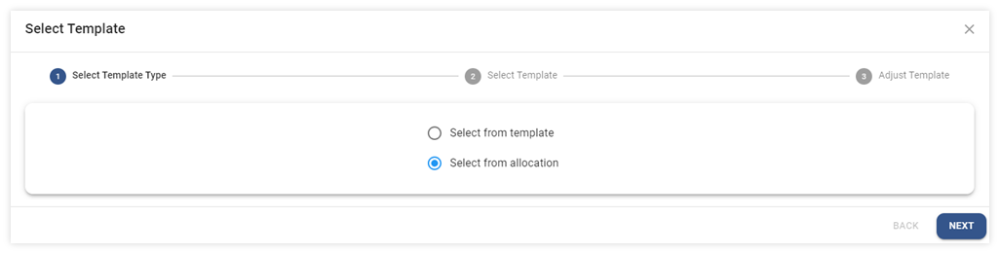

# Allocation Voucher

Function นี้ใช้เพื่อสร้างแม่แบบเอกสารเพื่อปันส่วนค่าใช้จ่าย ให้แต่ละแผนกโดยอัตโนมัติ เช่น ค่าน้ำ ค่าไฟ ค่าอาหาร Canteen

## การสร้าง Allocation Voucher

1.1. Click เข้าสู่ General Ledger Module

1.2. Click เลือก Allocation Voucher

1.3. กดปุ่ม 

1.4. ระบบจะแสดงหน้า Allocation Voucher ให้กำหนดค่าดังต่อไปนี้

**หมายเหตุ** เครื่องหมาย \*
(สัญลักษณ์ \* ช่องที่จำเป็นต้องระบุ)

- \* Prefix กำหนดประเภทสมุดบัญชีที่ต้องการสร้าง Template
- Description รายละเอียดเอกสารที่จะทำการปันส่วน
- \* Amount to Amortize มูลค่ารวมทั้งหมดที่จะใช้ปันส่วน
- \* Allocate Unit จำนวนสัดส่วนทั้งหมดที่จะใช้ปันส่วน

1.5. กดปุ่ม + เพื่อเพิ่มรายการที่จะใช้บันทึกบัญชี ระบบจะแสดงหน้าต่าง ดังภาพด้านล่าง ให้ระบุข้อมูลดังต่อไปนี้

**หมายเหตุ** เครื่องหมาย \*
(สัญลักษณ์ \* ช่องที่จำเป็นต้องระบุ)

- \* Department กำหนด Department Code
- \* Account # กำหนด Account code
- Comment คำอธิบายรายการ
- \* Currency กำหนดสกุลเงิน
- \* Rate กำหนดค่าเงิน
- \* Allocation Unit Debit ระบุจำนวนที่นำมาถัวเฉลี่ยรายได้ค่าใช้จ่ายในส่วนเดบิต
- Amount Debit มูลค่าที่ถูกถัวเฉลี่ยฝั่งเดบิต
- \* Allocation Unit Debit ระบุจำนวนที่นำมาถัวเฉลี่ยได้รายค่าใช้จ่ายในส่วนเครดิต
- Amount Credit มูลค่าที่ถูกถัวเฉลี่ยฝั่งเครดิต
- Base Debit มูลค่ารวมที่คำนวณรายได้ค่าใช้จ่ายฝั่งเดบิต
- Base Credit มูลค่ารวมที่คำนวณรายได้หรือค่าใช้จ่ายฝั่งเครดิต
- Dimension ข้อมูลในส่วนของรายละเอียดขอมูลแยกประเภทรายได้หรือค่าใช้จ่าย

---

1.6. ระบุข้อมูลเรียบร้อยแล้ว กด **OK**

1.7. เมื่อเพิ่มรายการจนครบตามที่ต้องการแล้วให้กดปุ่ม **SAVE** เพื่อบันทึก Allocation Template

1.8. กด **OK** เพื่อเสร็จสิ้นขั้นตอน

    

1.9. เมนูคำสั่งอื่นที่เกี่ยวข้อง

 สร้างเอกสารแม่แบบ

 แก้ไขเอกสารแม่แบบ

 การยกเลิกเอกสารแม่แบบ

 คัดลอกเอกสารแม่แบบ สามารถคัดลอกได้เป็น 4 ประเภท

    

## การใช้ Allocation Voucher Template

2.1. Click เข้าสู่ General Ledger Module

2.2. Click เลือก Allocation

2.3. กดปุ่ม 

2.4. ระบบจะแสดงหน้าจอการสร้าง Journal Voucher

2.5. กดปุ่ม  เพื่อนำ Allocation Voucher มาใช้

2.6. ระบบจะแสดงหน้าต่าง Select Template ให้ Click เลือก Select from allocation และกด **NEXT**

2.7. ระบบจะนำ Allocation Template ที่สร้างไว้มาแสดง

2.8. Click เลือก ☑️ Template ที่ต้องการนำไปบันทึกบัญชี และกด **NEXT**

2.9. ระบบแสดงรายละเอียดการบันทึกบัญชีของ Allocation Template ที่เลือกและสามารถแก้ไขข้อมูลได้ (สามารถเปลี่ยนแปลง Amount to be allocated และ Allocate Unit ได้ ตามตัวเลขจริงที่อาจะแตกต่างกันได้ในแต่ละเดือน)

2.10. แก้ไขเสร็จสิ้นแล้วกด **FINISH**

2.11. ระบบสร้าง JV ที่ได้จาก Allocation Template ให้ผู้ใช้งานตรวจสอบข้อมูล หรือเปลี่ยนแปลงแก้ไขข้อมูลได้ตามที่ต้องการแล้วทำการ **SAVE**

2.12. กด **OK** เพื่อเสร็จสิ้นขั้นตอน

    

การใช้งานปุ่มอื่น ๆ บนหน้าจอ

3.1 กดปุ่ม  เพื่อค้นหา Allocation Voucher

3.2 กดปุ่ม  เพื่อ Export ข้อมูลออกจากระบบเป็น .csv

3.3 กดปุ่ม  เพื่อพิมพ์ข้อมูล
