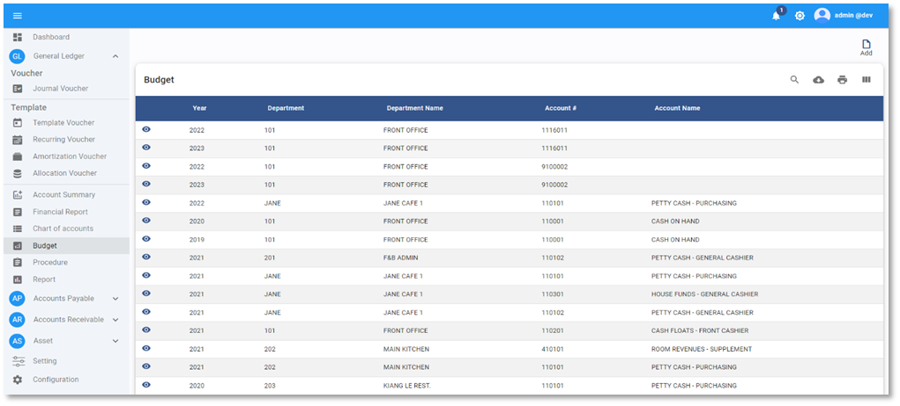

# Budget

**Budget Forecast** คือ การประมาณการงบประมาณทั้งรายได้และค่าใช้จ่ายที่จะเกิดขึ้นทั้งปี เพื่อบริหารจัดการรายได้ให้ได้ตามเป้าหมายที่วางไว้ และเป็นการควบคุมค่าใช้จ่ายให้ได้ตามที่กำหนดไว้ตามแผนการบริหาร

## การบันทึก Budget ในระบบ

1.1. Click เข้าสู่ General Ledger Module

1.2. เลือกฟังก์ชัน Budget

1.3. กดปุ่ม 

1.4. ระบบจะแสดงหน้า Budget ให้กำหนดค่าดังต่อไปนี้

**หมายเหตุ** เครื่องหมาย \*
(สัญลักษณ์ \* ช่องที่จำเป็นต้องระบุ)

- \* Department กำหนดแผนกที่ต้องการป้อนข้อมูล
- \* Account# กำหนดรหัสบัญชีที่ต้องการป้อนข้อมูล
- Period รอบปีงบประมาณ
- Number กำหนดจำนวน Budget ต่อเดือน และบันทึกเป็นรายปี

---

1.5. กดปุ่ม  เพื่อ copy ตัวเลข Budget จากปีก่อนหน้า

1.6. กดปุ่ม **SAVE** เพื่อบันทึกข้อมูลเข้าระบบ

## การบันทึก Revision Budget

ใช้บันทึกในกรณีที่มีการปรับปรุง Budget แตกต่างจาก Budget หลัก โดยสามารถบันทึกได้สุงสุด 4 Revision

เมนูคำสั่งอื่นที่เกี่ยวข้อง

 สร้าง Budget

 แก้ไข Budget

 การลบ Budget
