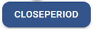
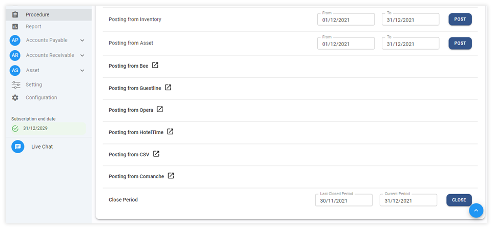
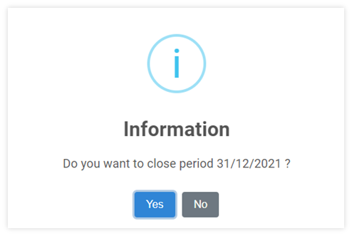

# Close Period for General Ledger Module

เมื่อเสร็จสิ้นการทำงานในแต่ละรอบบัญชี ผู้ใช้งานได้มีการตรวจสอบข้อมูลเรียบร้อยแล้วเพื่อป้องกันการแก้ไขข้อมูลในระบบ ให้ดำเนินการปิดรอบบัญชี (Close Period) โดยมีขั้นตอนดำเนินการ ดังต่อไปนี้

## การปิดรอบบัญชี

1. Click เข้าสู่ General Ledger Module

2. เลือกฟังก์ชัน Procedure

3. ไปที่ Close Period 

4. ระบบจะแสดงหน้าต่างให้ยืนยันการปิด Period

    

- กด “Yes” เพื่อยืนยัน
- กด “No เพื่อยกเลิก

**หมายเหตุ**

1. จำเป็นต้องปิด Period Module ทั้งหมด ที่ใช้งาน ก่อนปิด Period GL

2. การปิดรอบบัญชีจะทำให้ไม่สามารถแก้ไขข้อมูลในเดือนที่ปิดไปแล้วได้อีก

3. เมื่อปิด Period เดือน 12 ในแต่ละรอบปี บัญชี ระบบจะทำการ Year End ให้อัตโนมัติ

   3.1. ยกยอดเข้า Account code กำไร – ขาดทุน ตามที่ได้ตั้งค่าไว้ใน GL configuration

   3.2. เคลียร์ยอด Account code Type I (Income) รายได้ ค่าใช้จ่ายให้เป็น 0

4. ในขั้นตอนการปิดปี ระบบจะสร้างเอกสาร JV ด้วย Prefix YE

5. ข้อมูลใน Prefix YE จะแสดงข้อมูลใน Period 13

6. การปิดบัญชีนี้ เป็นการปิดรอบบัญชีในส่วนของ General Ledgers Module เท่านั้น

7. หากต้องการเปิด Period ให้ FC, Account Manger หรือผู้มีอำนาจส่ง E-Mail ถึง Support เพื่อทำการขอเปิด Period
