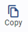

# Journal Voucher

Journal Voucher คือ สมุดบัญชีรายวัน มีชื่อคำย่อว่า JV มีไว้สำหรับบันทึกรายการบัญชี รวมถึง Transaction ที่ Post มาจาก Module อื่น ๆ เช่นกัน

## การสร้าง Journal Voucher แบบ Manual

1.1 Click เข้าสู่ General Ledger Module

1.2 เลือกเมนู Journal Voucher

1.3 กดปุ่ม 

1.4 ระบบจะแสดงหน้า Journal Voucher ให้กำหนดข้อมูลดังต่อไปนี้

- Prefix > กำหนด Prefix ของ Journal Voucher
- Date > กำหนดวันที่ของ Journal Voucher
- Description > กำหนดคำอธิบายที่ต้องการให้แสดงในหน้า JV

---

1.5 กดปุ่ม + เพื่อเพิ่มรายการที่จะใช้บันทึกบัญชี

1.6 ระบบจะแสดงหน้าต่างการบันทึกบัญชี ให้ระบุข้อมูลดังต่อไปนี้

**หมายเหตุ** เครื่องหมาย \*
(สัญลักษณ์ \* ช่องที่จำเป็นต้องระบุ)

- \* Department > กำหนด Department Code
- \* Account # > กำหนด Account code
- Comment คำอธิบายรายการ
- \* Currency > กำหนด Currency Code
- \* Rate > กำหนด Currency Rate
- \* Amount Dr / Amount Cr > ใส่ยอดที่ต้องการบันทึก
- Dimension > ใส่ข้อมูล Dimension (ถ้ามี)

---

1.7 ระบุข้อมูลเรียบร้อยแล้ว กด **OK** เพื่อยืนยัน หรือกด Cancel เพื่อยกเลิก
ถ้าต้องการเพิ่มรายการใน Detail ให้ทำตามขั้นตอน 1.5 และ 1.6 จนครบ

**หมายเหตุ**

- การบันทึกบัญชีจะต้องสร้างรายการบัญชีขึ้นมาอย่างน้อย 2 บรรทัด เพื่อบันทึกรายการ Dr. และ Cr. เสมอ
- Total Dr. Amount และ Total Cr. Amount จะต้องมีจำนวนเท่ากันจึงจะ save ได้

---

1.8 เมื่อเพิ่มรายการจนครบตามที่ต้องการแล้วให้กดปุ่ม **SAVE** เพื่อบันทึกข้อมูลเข้าระบบ

1.9 กด **OK** เพื่อเสร็จสิ้นขั้นตอน

    

## การสร้าง Journal Voucher โดย Copy

2.1 Click เข้าสู่ General Ledger Module

2.2 เลือกเมนู Journal Voucher

2.3 Click สัญลักษณ์  ใน JV ที่ต้องการจะทำการคัดลอก

2.4 ระบบจะเปิด JV ที่เลือกมา
2.5 Click เมนูคำสั่ง  เพื่อทำการคัดลอก JV ใบนั้น

2.6 โดยมีรูปแบบการคัดลอกข้อมูลอยู่ 4 ประเภท ดังนี้

- Copy to new Journal Voucher > คือ การคัดลอก JV พร้อมรายละเอียดเพื่อสร้างเป็นเอกสารสมุดบัญชีขึ้นมาใหม่
- Copy and reverse transaction > คือ การคัดลอก JV ขึ้นใหม่พร้อมกลับขาบัญชีให้อัตโนมัติ
- Copy to new Journal Voucher with zero amount > คือ การคัดลอก JV โดยปรับ Dr. Amount และ Cr. Amount ให้เป็น 0
- Copy to Template > คือ การคัดลอก JV ไปสร้างเป็นเอกสารแม่แบบ

    

## การ Copy JV แบบ Copy to new Journal Voucher

ใช้ในกรณีต้องการสร้าง JV ขึ้นใหม่โดยรายละเอียดใน JV มีข้อมูลใกล้เคียงกับเอกสารต้นฉบับ เพื่อลดขั้นตอนในการทำงาน

เปิดเอกสาร JV ที่ต้องการ copy

2.6.1.2 Click เลือก  และเลือก Copy to new Journal Voucher

2.6.1.3 Click **OK** เพื่อยืนยันการคัดลอก

    

2.6.1.4 ทำการแก้ไขข้อมูลในส่วน Description และ Click เพื่อเข้าไปแก้ไขข้อมูลของแต่ละ Detail

2.6.1.5 สามารถแก้ไขข้อมูลได้ดังนี้

- Department
- Account#
- Comment
- Currency
- Rate
- Amount Debit
- Amount Credit

## การ Copy JV แบบ Copy and reverse transaction

ใช้ในกรณีต้องการกลับขาบัญชีเนื่องจากการบันทึกบัญชีผิดพลาด หรือเป็นการเป็นการกลับขาบัญชีค่าใช้จ่ายที่เกิดขึ้นในงวดบัญชีปัจจุบันแล้ว แต่กิจการยังไม่ได้จ่ายเงินจึงยังไม่ได้บัญชีทึกบัญชี (Accrued Expenses)

2.6.1.6 เปิดเอกสาร JV ที่ต้องการคัดลอก

2.6.1.7 Click เลือก  และเลือก Copy and reverse transaction

2.6.1.8 Click **OK** เพื่อยืนยันการคัดลอก

    

2.6.1.9 ระบบจะสร้างเอกสาร JV ขึ้นใหม่ โดยมีข้อมูลเดิมจากเอกสารต้นฉบับแต่จะกลับขาบัญชี Debit และ Credit ที่ต่างจากเอกสารต้นฉบับ

2.6.1.10 หากแก้ไขข้อมูลส่วนอื่นเสร็จเรียบร้อยแล้วให้กด **SAVE**

2.6.1.11 กด **OK** เพื่อเสร็จสิ้นขั้นตอนการทำงาน

    

## การ Copy JV แบบ Copy to new Journal Voucher with zero amount

ใช้ในกรณีที่ต้องการคัดลอก JV แต่ไม่ต้องการจำนวนเงินในช่องเดบิต และเครดิต

2.6.1.12 Click เลือก  และเลือก Copy to new Journal Voucher with zero amount

    

 
2.6.1.13 Click **OK**   เพื่อยืนยันการคัดลอก ระบบจะสร้างเอกสาร JV ขึ้นใหม่ โดยมีข้อมูลเดิมจากเอกสารต้นฉบับแต่จะเปลี่ยนจำนวนเงินในช่องเดบิต และเครดิต ให้เป็นศูนย์

2.6.1.14 กรอกข้อมูลตัวเลขที่ถูกต้องทั้งเดบิต และเครดิต แล้วกด **SAVE** เพื่อบันทึกข้อมูล (หากไม่กรอกตัวเลขใหม่จะไม่สามารถบันทึกข้อมูลได้)

    

## การสร้าง Journal Voucher จาก Template

3.1 Click เข้าสู่ General Ledger Module

3.2 Click เลือกเมนู Journal Voucher

3.3 กดปุ่ม  ระบบจะแสดงหน้าต่างการสร้าง Journal Voucher

3.4 กดปุ่ม  เพื่อเลือก Template

3.5 ระบบจะแสดงหน้าต่าง Select Template ให้Click เลือก Select from template และกด **NEXT**

3.6 ระบบจะนำ Template ที่ได้ถูกสร้างไว้มาแสดง

3.7 Click เลือก ☑️ Template ที่ต้องการนำไปบันทึกบัญชี และกด **NEXT**

3.8 ระบบแสดงรายละเอียดการบันทึกบัญชีของ Template ที่เลือกและสามารถแก้ไขข้อมูลได้อีกครั้ง เมื่อเสร็จแล้วให้กด **FINISH**

3.9 ระบบสร้าง JV ที่ได้จาก Template ให้ผู้ใช้งานตรวจสอบข้อมูล หรือเปลี่ยนแปลงแก้ไขข้อมูลได้ตามที่ต้องการแล้วกด **SAVE**

3.10 Click **OK** เพื่อยืนยันการคัดลอก ระบบจะสร้างเอกสาร JV ขึ้นเป็นแม่แบบ

    

## การใช้งานปุ่มอื่น ๆ หน้าจอ

1.1. กดปุ่ม  เพื่อแก้ไขเอกสาร JV ที่เปิดขึ้นมา

1.2. กดปุ่ม  เพื่อยกเลิกเอกสาร JV ที่เปิดขึ้นมา

1.3. กดปุ่ม  เพื่อพิมพ์เอกสาร Journal Voucher
