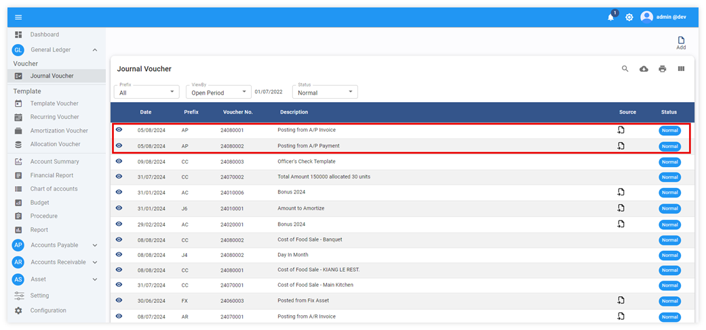

# Posting Account Payable to GL

การดึงข้อมูล AP Invoice และ AP Payment จากระบบ Account Payable มาลงบันทึกเป็นสมุดบัญชีรายวันซื้อ และสมุดบัญชีรายวันจ่ายในระบบบัญชีแยกประเภท โดยมีขั้นตอนดังต่อไปนี้

## การ Post ข้อมูล AP Invoice และ Payment เข้า GL

1. Click เข้าสู่ General Ledger Module

2. เลือกฟังก์ชัน Procedure

3. ไปที่ Posting from Account Payable กำหนดวันที่ที่ต้องการดึงข้อมูลได้จากช่อง From – To

4. กด **POST** เพื่อให้ระบบดึงข้อมูลมาบันทึกบัญชีใน GL

5. เมื่อระบบทำการดึงข้อมูลเรียบร้อยแล้วระบบจะหน้าต่างแสดงข้อความ Post A/P Success และจำนวน JV ที่ถูกโพสเข้าไปในระบบ ตัวอย่างตามภาพด้านล่าง

    

6. การตรวจสอบข้อมูลหลังจากทำการ Posting from Account Payable

6.1 Click General Ledger Module

6.2 Click Journal Voucher

ตัวอย่างการบันทึกบัญชีใน A/P Invoice

รายละเอียดคำอธิบายของข้อมูลจาก Invoice (Journal Voucher Detail)

คำอธิบายเพิ่มเติมในส่วนของ Journal Detail Comment ของ Invoice

S = Sequence S:74 คือ invoice sequence เลขที่ 74

V = Vendor Code V: A004 คือ รหัสร้านค้า ตามด้วยชื่อร้านค้า AMATI INVOCATION CO., LTD (HEAD OFFICE)

I = Invoice No. I: IV2408001 คือเลขที่ใบแจ้งหนี้

D = Details D: รายละเอียดสินค้า LG Android TV 55”

## ตัวอย่างการบันทึกบัญชีใน A/P Payment

รายละเอียดคำอธิบายของข้อมูลจาก Payment (Journal Voucher Detail)

คำอธิบายเพิ่มเติมในส่วนของ Journal Detail Comment ของ Payment

Pay = Payment Sequence Pay:190 คือ payment sequence เลขที่ 190

V = Vendor Code V: A004 คือ รหัสร้านค้า ตามด้วยชื่อร้านค้า AMATI INVOCATION CO., LTD (HEAD OFFICE)

Chq = Invoice No. Chq: 2408001 คือ เช็คเลขที่ 240801

D = Payment Description D: คือ description ของ Payment

