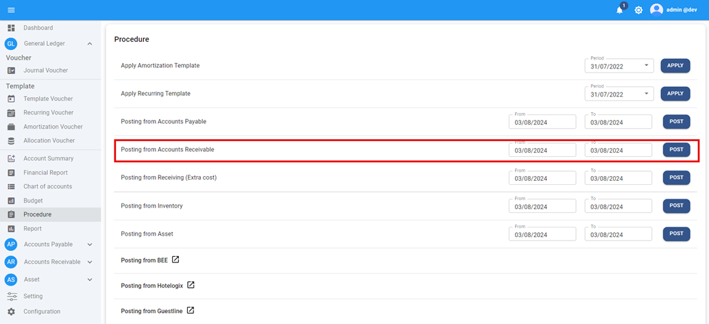
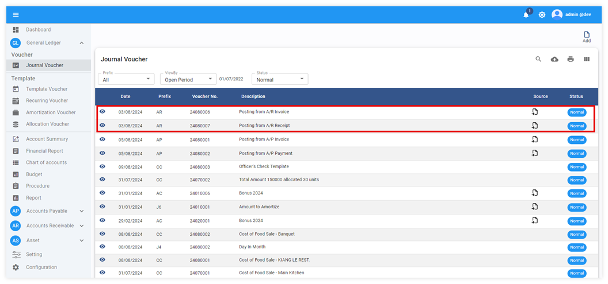
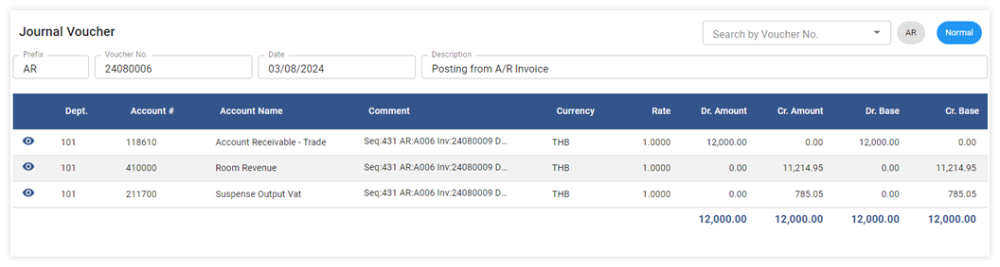
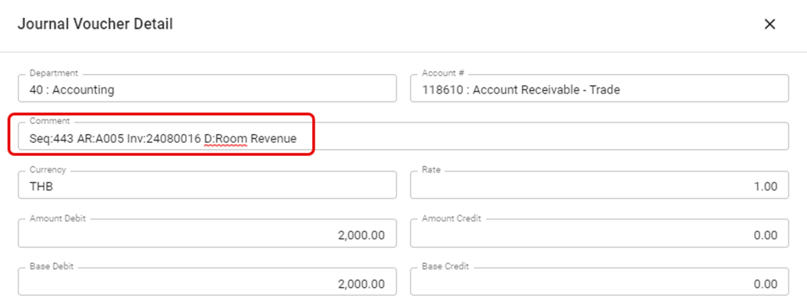
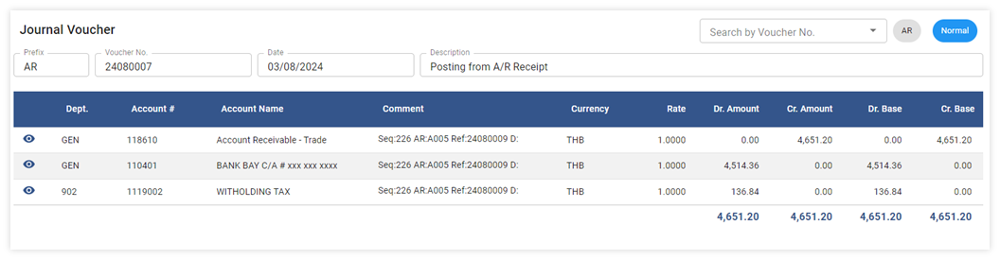
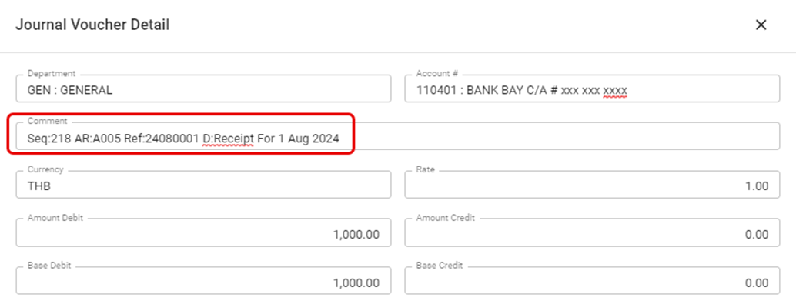

# Posting Account Receivable to GL

การดึงข้อมูล AR Invoice และ AR Receipt จากระบบ Account Receivable มาลงบันทึกเป็นสมุดบัญชีรายวันขาย และสมุดบัญชีรายวันรับในระบบบัญชีแยกประเภท โดยมีขั้นตอนดังต่อไปนี้
การ Post ข้อมูล AR Invoice และ Receipt เข้า GL

1. คลิกเข้าสู่ General Ledger Module

2. เลือกฟังก์ชัน Procedure

3. ไปที่ Posting from Account Receivable กำหนดวันที่ที่ต้องการดึงข้อมูลได้จากช่อง From – To

4. กด **POST** เพื่อให้ระบบดึงข้อมูลมาบันทึกบัญชีใน GL

5. เมื่อระบบทำการดึงข้อมูลเรียบร้อยแล้วระบบจะหน้าต่างแสดงข้อความ Post A/R Success และจำนวน JV ที่ถูกโพสเข้าไปในระบบ ตัวอย่างตามภาพด้านล่าง

    

6. การตรวจสอบข้อมูลหลังจากทำการ Posting from Account Receivable

6.1 Click General Ledger Module

6.2 Click Journal Voucher

## ตัวอย่างการบันทึกบัญชีใน JV A/R Invoice

รายละเอียดคำอธิบายของข้อมูลจาก Invoice (Journal Voucher Detail)

คำอธิบายเพิ่มเติมในส่วนของ Journal Detail Comment ของ Invoice

Seq = Sequence S:443 คือ invoice sequence เลขที่ 443

AR = AR No. AR: A005 คือ รหัสลูกหนี้

Inv = Invoice No. Inv: 24080016 คือเลขที่ใบแจ้งหนี้

D = Description D: Room Revenue คือ Description ของ Invoice

## ตัวอย่างการบันทึกบัญชีใน JV A/R Receipt

รายละเอียดคำอธิบายของข้อมูลจาก Receipt (Journal Voucher Detail)

คำอธิบายเพิ่มเติมในส่วนของ Journal Detail Comment ของ Invoice

Seq = Sequence Seq:218 คือ Receipt sequence เลขที่ 218

AR = AR No. AR: A005 คือ รหัสลูกหนี้

Ref = Invoice No. Inv: 24080001 คือเลขที่ใบแจ้งหนี้

D = Description D: Receipt For 1 Aug 2024 คือ Description ของ Receipt

