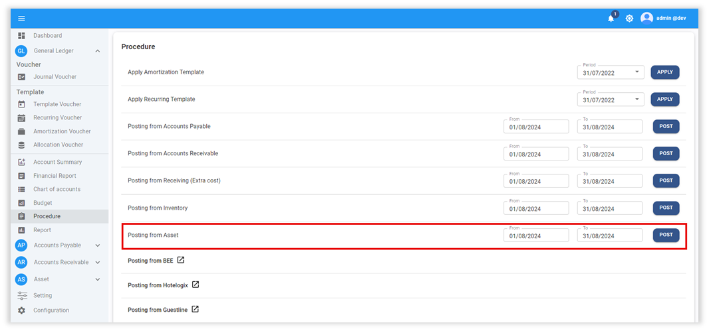
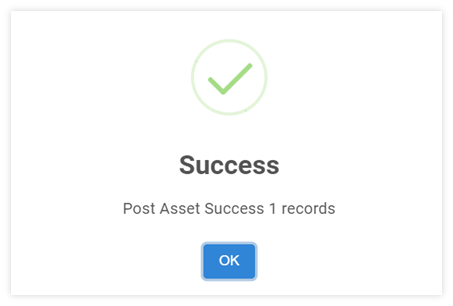
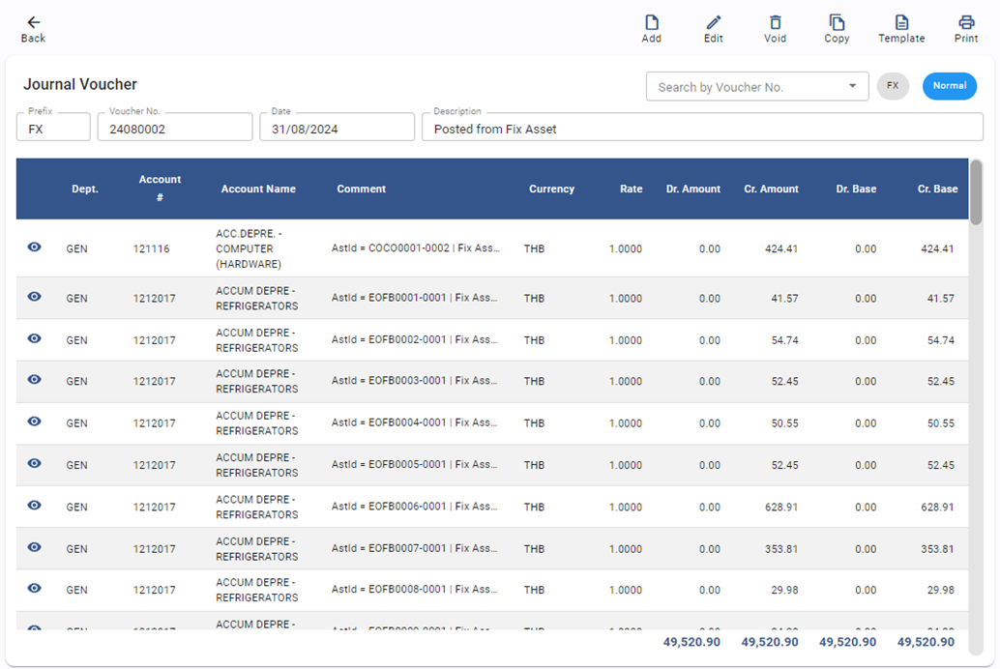
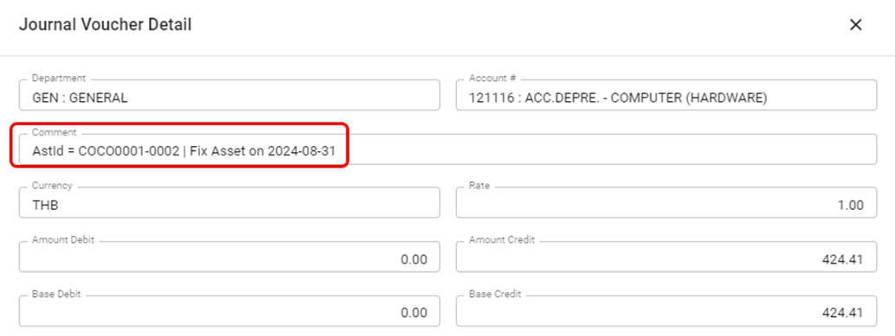
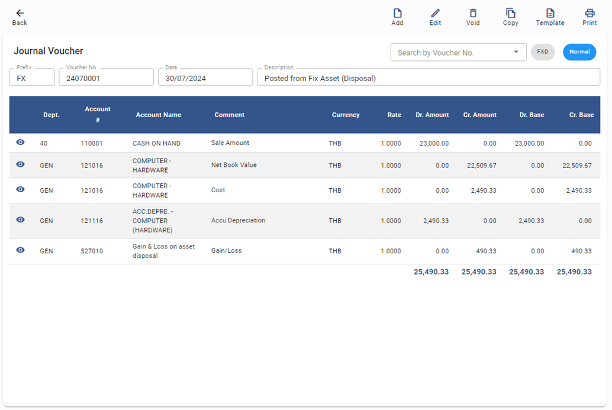

# Posting Account Payable to GL

การดึงข้อมูลค่าเสื่อมราคา และการขาย (Disposal) สินทรัพย์ Fixed Assets มาลงบันทึกเป็นสมุดบัญชีในระบบบัญชีแยกประเภท โดยมีขั้นตอนดังต่อไปนี้

## การ Post ข้อมูลค่าเสื่อมราคาและการขาย

1. คลิกเข้าสู่ General Ledger Module

2. เลือกฟังก์ชัน Procedure

3. ไปที่ Posting from Asset กำหนดวันที่ที่ต้องการดึงข้อมูลได้จากช่อง From – To

4. กด **POST** เพื่อให้ระบบดึงข้อมูลมาบันทึกบัญชีใน GL

5. เมื่อระบบทำการดึงข้อมูลเรียบร้อยแล้วระบบจะหน้าต่างแสดงข้อความ Post Asset Success และจำนวน JV ที่ถูกโพสเข้าไปในระบบ ตัวอย่างตามภาพด้านล่าง

    

6. การตรวจสอบข้อมูลหลังจากทำการ Posting from Asset

6.1 Click General Ledger Module

6.2 Click Journal Voucher

## ตัวอย่างการบันทึกบัญชีค่าเสื่อมราคาใน JV Fix Asset

รายละเอียดคำอธิบายของข้อมูลจากการบันทึกค่าเสื่อมราคา (Journal Voucher Detail)

คำอธิบายเพิ่มเติมในส่วนของ Journal Detail Comment ของค่าเสื่อมราคา

AstId = รหัสสินทรัพย์	AstId = COCO0001-0002 คือ รหัสสินทรัพย์

2024-08-31 = เดือนที่คำนวณค่าเสื่อมราคา	Fix Asset on 2024-08-31 คือค่าเสื่อมราคาของเดือน Aug 2024

## ตัวอย่างการบันทึกบัญชีการขายสินทรัพย์ (Disposal) ใน JV Fix Asset

